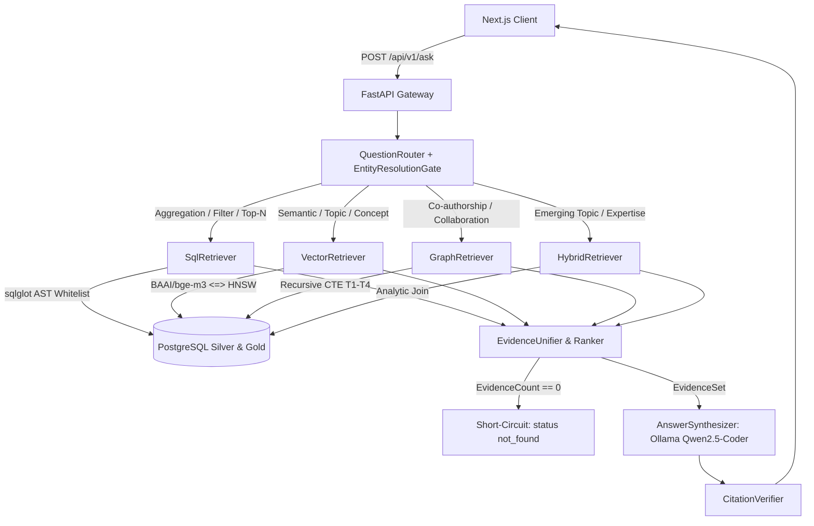

# Repository Guidelines

## Project Overview

**AI-Bibliometrics** is an evidence-grounded research intelligence and Science, Technology & Innovation (STI) policy assistant for Scopus scientific publications. It enables researchers, policy analysts, and institution leaders to query publication data in Indonesian and English (ID/EN) and receive answers strictly verified against real database records.

The system strictly eliminates hallucinations through a deterministic dual-track retrieval architecture:
- **Zero-Hallucination Invariant**: If no evidence is found in the database, the query short-circuits to `status: not_found` within 200ms without invoking the LLM.
- **Strict Grounding**: The LLM synthesizes responses solely from structured `EvidenceSet` context using delimited blocks (`=== BEGIN/END RETRIEVED EVIDENCE ===`) and untrusted data framing.
- **Post-Hoc Verification**: All output citations (`[Title, Year, DOI]` or `[Title, Year, no-doi]`) are cross-checked via regex against retrieved records; unverified citations are stripped into `unverified_citations`.
- **Session Isolation Invariant**: Conversation state (`research_sessions`, `research_messages`, `research_session_summaries`) lives in a separate PostgreSQL schema `app` under a separate role `app_session`, and is **never** part of the bibliometric canonical source of truth. No session lifecycle operation may alter or delete canonical bibliometric data. Every bibliometric fact and metric must still come from retrieval against schema `public`.

  Session context (summary + last N messages) may only help *interpret* a follow-up question, by filling filters the current question left unspecified. `question` is never rewritten, so routing, Text-to-SQL, `EvidenceSet.query` and citation verification are unchanged. A number quoted by a previous assistant turn must be re-queried, never trusted.

---

## Architecture & Data Flow



### Key Modules & Layers

1. **API Gateway (`backend/app/routers/` & `backend/app/core/`)**:
   - `ask.py`: Handles `POST /api/v1/ask` with request tracing (`X-Request-ID`), routing, synthesis, and latency timing.
   - `health.py`: Evaluates DB pool, pgvector extension, and Ollama connectivity (`GET /api/v1/health`).
   - `models/`: Pydantic v2 schemas (`AskRequest`, `AskResponse`, `EvidenceObject`, `EvidenceSourceRef`).

2. **Routing & Entity Resolution (`backend/app/services/router.py`)**:
   - `QuestionRouter`: Classifies user intent into one of 4 deterministic routes (`SQLRoute`, `VectorRoute`, `GraphRoute`, `HybridRoute`) using keyword/regex heuristics with LLM fallback.
   - `EntityResolutionGate`: Normalizes entities (institution/author names) via exact and `ILIKE` matching. Disambiguates multiple matches by returning `status: needs_clarification`.

3. **Retrievers (`backend/app/services/retrievers/`)**:
   - `SqlRetriever`: Text-to-SQL generation validated through a multi-tier `sqlglot` AST security gate (enforces `Select` root, table whitelist, aggregate integrity, single-hop joins, and `LIMIT 50`).
   - `VectorRetriever`: Generates dense embeddings (1024-d via `BAAI/bge-m3`), performs pgvector HNSW cosine search (`<=>`), applies cosine gate ($\ge 0.65$), and deduplicates by `publication_id`.
   - `GraphRetriever`: Executes parameterized recursive CTEs across precomputed edge tables (`institution_collaboration`, `author_collaboration`) with bounded hop depth (`max_hops = 3`).
   - `HybridRetriever`: Combines semantic chunk retrieval with Gold analytics tables (`topics`, `topic_evolution`, `researcher_expertise`).

4. **Evidence & Verification (`backend/app/services/evidence/` & `synthesizer/`)**:
   - `EvidenceUnifier`: Maps heterogeneous database rows, chunks, and graph edges into a unified `EvidenceSet`.
   - `AnswerSynthesizer`: Invokes CPU-optimized `qwen2.5-coder:7b-instruct` via Ollama with untrusted context delimiters.
   - `CitationVerifier`: Regex-validates inline citations against the `EvidenceSet`, isolating unverified citations.

---

## Key Directories

```
.
├── backend/                  # FastAPI Application & Retrieval Pipeline
│   ├── app/
│   │   ├── core/             # Configuration, DB connection pools, security, errors
│   │   ├── models/           # Pydantic v2 schemas (requests, responses, evidence, routes)
│   │   ├── routers/          # API endpoints (ask, health, topics, researchers)
│   │   └── services/         # Router, Retrievers (SQL, Vector, Graph, Hybrid), Synthesizer
│   └── Dockerfile            # Container definition for backend service
├── frontend/                 # Next.js 14+ UI Application
│   ├── src/
│   │   ├── components/       # 2-panel dense layout, source cards, SQL debug drawer
│   │   ├── hooks/            # SWR/React Query data fetching and UI state hooks
│   │   └── lib/              # API client, citation parsing, formatting utilities
│   ├── package.json          # Frontend dependency specifications
│   └── scripts/
│       └── free-port.mjs     # Kills whatever holds port 3000; backs `npm run dev:reset`
├── scripts/                  # Offline Ingestion, Embedding & Graph Builders
│   ├── verify_schema.py      # Task 0: Validates PostgreSQL schema against specs
│   ├── embed_chunks.py       # Task 1: Batch chunk embedding via BAAI/bge-m3
│   ├── build_edges.py        # Task 8: Materializes collaboration graph edge tables
│   ├── build_topics.py       # Task 8.5: BERTopic clustering & topic evolution
│   └── score_expertise.py    # Task 8.5: Multi-factor researcher scoring
├── tests/                    # Test Suite
│   ├── unit/                 # Router, sqlglot AST validator, vector & evidence unifier tests
│   ├── integration/          # API endpoints, read-only DB pool, Ollama integration tests
│   └── e2e/                  # 12-query end-to-end benchmark test suite
├── data/                     # 9 Canonical Cleaned CSV Datasets (Silver prototype)
└── docs/                     # 01-12 Normative Blueprint Specifications (v3.6.0)
```

---

## Development Commands

### Backend (Python 3.11+)

```bash
# Setup virtual environment
python -m venv .venv
source .venv/bin/activate       # Linux/macOS
.venv\Scripts\activate          # Windows

# Install dependencies
pip install -r requirements.txt
# or with uv: uv pip install -r requirements.txt

# Run FastAPI development server
uvicorn backend.app.main:app --host 0.0.0.0 --port 8000 --reload

# Code quality & formatting
ruff check backend/ scripts/ tests/
ruff format backend/ scripts/ tests/
mypy backend/ scripts/
```

### Data Pipeline & Offline Tasks

```bash
# Verify database schema against specifications (Task 0)
python scripts/verify_schema.py

# Generate dense embeddings for chunks (Task 1)
python scripts/embed_chunks.py --model BAAI/bge-m3 --batch-size 32 --resume

# Build collaboration edge tables (Task 8)
python scripts/build_edges.py

# Build Gold analytics tables: topics & expertise scores (Task 8.5)
python scripts/build_topics.py && python scripts/score_expertise.py
```

### Frontend (Next.js / Node.js 18+)

```bash
cd frontend
npm install              # or pnpm install / bun install
npm run dev:reset        # Start dev server, freeing port 3000 first (PREFERRED)
npm run dev              # Start dev server as-is; fails if port 3000 is held
npm run build            # Build production bundle
npm run start            # Serve the production build (judge perf with this, not dev)
npm run verify           # lint + typecheck + test (145 tests)
```

#### Why `dev:reset` and not `dev`

`npm run dev` fails with `EADDRINUSE` whenever a previous `next dev` still holds port 3000. The usual cause is closing the terminal without `Ctrl+C`, which leaves the `next dev` process orphaned and still listening. Because Next compiles the route lazily, the process burns 9–21 s of CPU *before* crashing at bind time, so the failure looks like a broken build rather than a port conflict.

`dev:reset` runs `scripts/free-port.mjs` first, which finds and kills whatever holds the port, then starts the server. Safe to run repeatedly — if a server is already up it is simply replaced.

Manual equivalent when the script is unavailable:

```bash
netstat -ano | findstr :3000        # note the PID
taskkill /PID <pid> /T /F
```

### Docker Services

```bash
# Start backend and Ollama CPU services
# backend now waits for `ollama: service_healthy`, so this returns only once the
# model server actually answers instead of racing it on a cold boot.
docker compose up -d --build

# Container health / readiness
docker compose ps
curl -s http://localhost:8000/api/v1/health
curl -s http://localhost:8000/metrics | grep aibiblio_synthesis

# Offline scripts (verify_schema, migrate, build_edges, embed_chunks, ...)
# do NOT run inside the backend container: the image ships backend/ only, and
# it deliberately excludes psycopg + the offline-only ML/plotting deps, which
# live in requirements-dev.txt. Run them from the host venv instead:
python scripts/verify_schema.py
python scripts/migrate.py up --dry-run
```

---

## Code Conventions & Common Patterns

### 1. Immutability & Schema Validation
- Use **Pydantic v2** (`BaseModel`, `ConfigDict(frozen=True)`) for request/response bodies and domain entities.
- Treat data transfer objects (DTOs) and `EvidenceObject` records as immutable collections.

```python
from pydantic import BaseModel, ConfigDict, Field

class EvidenceObject(BaseModel):
    model_config = ConfigDict(frozen=True)
    
    evidence_id: str
    source_type: str  # 'publication' | 'chunk' | 'graph_edge' | 'metric'
    title: str | None = None
    year: int | None = None
    doi: str | None = None
    content: str
    confidence: float = Field(ge=0.0, le=1.0)
```

### 2. Database Security & AST Whitelisting
- Database access uses an unprivileged read-only role (`app_readonly`) with `statement_timeout = '10s'`.
- Text-to-SQL outputs **must** pass `sqlglot` AST validation before execution:
  - Root expression must be `exp.Select`.
  - Tables restricted to whitelist: `publications`, `authors`, `institutions`, `keywords`, `funding`, `pub_author`, `pub_institution`, `publication_references`, `chunks`, `institution_collaboration`, `author_collaboration`, `topics`, `topic_evolution`, `researcher_expertise`.
  - Prohibit DDL/DML, system catalog access, dynamic comments, and subquery file functions.
  - Automatically enforce `COUNT(DISTINCT publication_id)` on joins to prevent cardinality blowup.

### 3. Async Database & HTTP Patterns
- Use asynchronous connection pools (`asyncpg` / `psycopg3`).
- Wrap external services (Ollama, PostgreSQL) with explicit timeouts (Ollama generation: 8s, DB query: 3s).
- Propagate `X-Request-ID` across all service boundaries and log lines.

### 4. Prompt Engineering & Grounding Invariants
- Context is always wrapped in strict security boundaries to prevent prompt injection from indexed scientific text:
  ```
  === BEGIN RETRIEVED EVIDENCE (UNTRUSTED DATA) ===
  {serialized_evidence_set}
  === END RETRIEVED EVIDENCE ===
  ```
- The prompt instructs the model to state `"Data tidak ditemukan dalam database"` if context is insufficient.

---

## Important Files

| File Path | Description |
|---|---|
| `.env` | Active environment configurations (Supabase DB URL, Ollama endpoints, model IDs) |
| `docs/04 Database Schema.md` | Authoritative DDL for 9 Silver tables, 2 Edge tables, 3 Gold tables, and HNSW index |
| `docs/05 Retrieval Rag Design.md` | Routing rules, SQL AST validation spec, vector cosine gates, and synthesis prompt |
| `docs/06 Api Design.md` | REST API specifications for `/api/v1/ask` and `/api/v1/health` |
| `docs/10 Implementation Plan.md` | Linear execution sequence from Task 0 to Task 12 |
| `scripts/verify_schema.py` | Schema audit entrypoint validating PostgreSQL constraints |
| `scripts/embed_chunks.py` | Embedding generation worker using `BAAI/bge-m3` |
| `data/*_cleaned.csv` | 9 prototype datasets ready for ingestion and testing |

---

## Runtime & Tooling Preferences

- **Backend Runtime**: Python 3.11+
- **Python Tooling**: `pip` / `uv` for package management; `ruff` for linting/formatting; `mypy` for static typing.
- **Frontend Runtime**: Node.js 18+ (or Bun 1.1+) with `pnpm` / `npm`.
- **Database Engine**: PostgreSQL 15+ with `pgvector` extension enabled (`vector(1024)` for BGE-M3).
- **LLM Engine**: Ollama running `qwen2.5-coder:7b-instruct` (Q4_K_M GGUF, CPU-optimized thread allocation).
- **Framework Boundaries**: Pure FastAPI + custom retrievers. Heavy frameworks (e.g., LangChain, LlamaIndex) are explicitly forbidden to preserve sub-second latency and deterministic AST control.

---

## Git Workflow & Commit Convention

Conventional Commits. Format: `<type>(<scope>): <subject>` — subject in imperative mood, lowercase, no trailing period, max ~72 chars. One logical change per commit. Body (optional) explains *why*, not *what*.

| Type | Use for |
|---|---|
| `feat` | New feature / Task implementation (`backend/`, `frontend/`, `scripts/`) |
| `fix` | Bug fix |
| `docs` | `docs/01–12`, `README.md`, `AGENTS.md` only (no code) |
| `test` | `tests/` additions or updates |
| `refactor` | Code restructuring, no behavior change |
| `chore` | Maintenance, deps, `docker/`, config |
| `ci` | CI pipelines, hooks, workflow automation |

Scopes for this repo: `docs`, `backend`, `frontend`, `scripts`, `tests`, `database`, `docker`, `data`, `api`, `router`, `retriever`, `synthesizer`, `security`, `ui`.

Examples (matching existing history):

```text
docs: sync progress v3.5.0 dan Bahasa Indonesia v3.6.0 untuk README + docs 01-12
feat(router): add HybridRoute entity gate with needs_clarification
fix(retriever): enforce COUNT(DISTINCT publication_id) on junction joins
test(sql): add AST validator injection-attempt cases
```

Rules:
- Never commit secrets: `.env` stays untracked (see `.gitignore`); only `.env.example` is committed.
- Docs version bumps (`docs/01–12` vX.Y.Z) ride along in the same `docs:` commit that changes them; note the version in the subject or body.
- Branch names: `feat/<task>-<short-desc>`, `fix/<short-desc>`, `docs/<short-desc>` (e.g. `feat/task-5-sql-retriever`).
- `main` stays deployable; merge feature branches via PR, never force-push shared history.

---

## Testing & QA

### Test Frameworks & Suites

- **Framework**: `pytest` with `pytest-asyncio` and `pytest-mock`.
- **Coverage**: `pytest-cov` targeting $\ge 80\%$ statement coverage on core routers, retrievers, and security gates.

### Test Directory Layout

```
tests/
├── unit/
│   ├── test_router.py          # 4-route classification and entity resolution tests
│   ├── test_sql_security.py    # sqlglot AST validator, table whitelisting, injection attempts
│   ├── test_vector_search.py   # Embedding dimensions, HNSW query shape, cosine thresholds
│   ├── test_evidence.py        # EvidenceUnifier & EvidenceSet serialization
│   └── test_citation.py        # Regex CitationVerifier and citation pruning
├── integration/
│   ├── test_ask_endpoint.py    # FastAPI /api/v1/ask endpoint contracts and status codes
│   ├── test_health_endpoint.py # /api/v1/health component status reporting
│   └── test_db_pool.py         # Read-only role permission checks & timeout enforcement
└── e2e/
    └── test_e2e_12_queries.py  # Canonical 12-query acceptance benchmark against prototype DB
```

### Running Tests

```bash
# Run entire test suite
pytest

# Run tests with coverage report
pytest -v --cov=backend/app --cov-report=term-missing tests/

# Run specific unit test suites
pytest tests/unit/test_sql_security.py
pytest tests/unit/test_router.py

# Run E2E query verification suite
pytest tests/e2e/test_e2e_12_queries.py
```

### Acceptance & Quality Invariants
1. **Security Guardrails**: 100% pass on SQL AST validation and read-only enforcement.
2. **Zero-Hallucination Gate**: `0` evidence items must short-circuit in $<200\text{ms}$ with `status: not_found`.
3. **Citation Integrity**: Final synthesized answers must contain 0 unverified citations; any citation not matched in `EvidenceSet` must be stripped to `unverified_citations`.

## Jev Decision Engine

This project has a custom OpenCode tool called `jev_decide`.

### When to use Jev

Use `jev_decide` when the user is asking for help making a decision between two or more concrete alternatives.

Typical cases include:
- choosing between technical approaches
- choosing between architectures
- choosing between libraries or frameworks
- choosing between implementation strategies
- deciding which workflow or pipeline should be used
- deciding which option better fits the project's stated requirements
- situations where the user explicitly expresses uncertainty, such as "I'm confused", "which one should I use", or "should I choose A or B"

When a decision can reasonably be represented as discrete alternatives, prefer using `jev_decide` rather than making the decision solely from the conversational model's own judgment.

### How to use Jev

Call the `jev_decide` tool with:

- `state`: the relevant project context and decision context
- `question`: the exact decision that needs to be evaluated
- `criteria_json`: a JSON object containing the available alternatives and a concise description of each alternative

Example:

{
  "option_a": "Use RAG over research papers",
  "option_b": "Use Text-to-SQL over the project database"
}

### Interpreting Jev results

Jev returns:
- `decision`
- `probabilities`
- `confidence`

Do not treat the highest-probability option as an absolute truth.

If the probabilities are close, explicitly describe the decision as uncertain and explain the competing probabilities.

Use the Jev result as decision evidence, while still considering the user's actual requirements and project context.

### When NOT to use Jev

Do not use `jev_decide` for:
- normal conversation
- simple factual questions
- straightforward coding tasks with no meaningful alternative
- summarization
- translation
- writing or rewriting
- tasks where the user is not actually making a decision
- decisions that have no clear discrete alternatives
