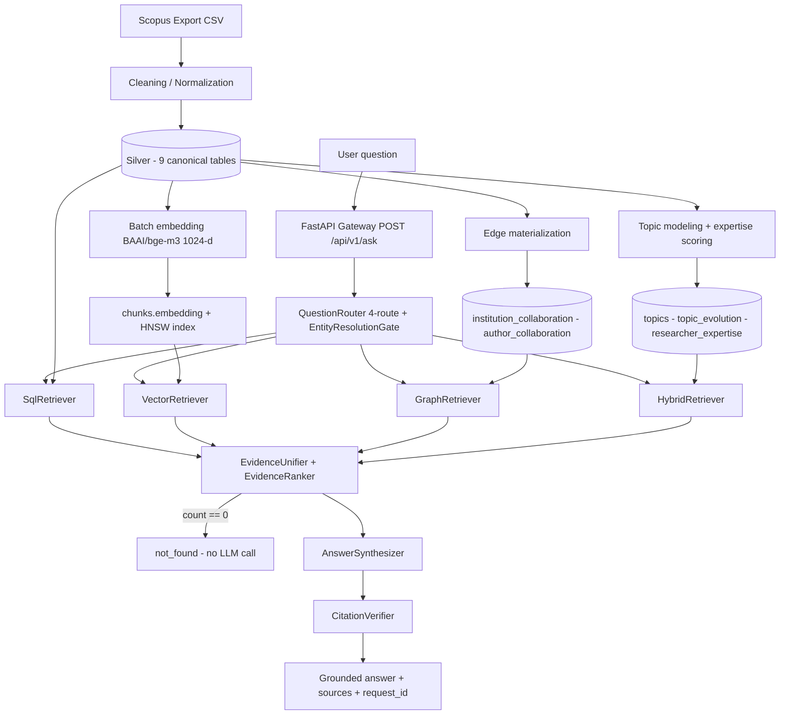

# Scopus Research Intelligence Prototype

> **Evidence-grounded research intelligence over Scopus publications.** Ask in natural language (ID/EN) — get factual, semantic, network, and policy answers grounded in real database records with verified `[Title, Year, DOI]` citations. Hallucination-free by design.

| Meta | Value |
|---|---|
| **Architecture** | Bronze → Silver (9 canonical tables) → Gold (pgvector + 2 edge tables + 3 analytics tables) → 4-route FastAPI RAG |
| **API Contract** | `POST /api/v1/ask` + `GET /api/v1/health` (see `docs/06 Api Design.md`). Legacy `POST /api/query` is **SUPERSEDED** and must not be implemented |
| **Doc Status** | `docs/06` and `docs/08` bumped to **v3.8.0** (CORS via `CORS_ORIGINS`, rate limit 60 rpm, proxy trust model, synthesis fallback counters + `GET /metrics`; 2026-10-03). `docs/03`, `docs/05`, `docs/10`, `docs/11` synced to **v3.7.2** and `docs/02`, `docs/04`, `docs/09` to **v3.6.3** (ANN/index hardening sync, 2026-10-03); `docs/12` remains at v3.7.1 |
| **Implementation Status** | **Phase 0–7 DONE — VERIFIED.** 4-route retrieval + evidence layer + deterministic synthesis (+ opt-in LLM) live on `POST /api/v1/ask`; 14/14 live E2E queries pass. **Frontend IMPLEMENTED** (Next.js 14 workspace UI wired to the live API contract; formal UI sign-off pending Fase 8) |

**Contents:** [Overview](#overview) · [Problem](#problem) · [Solution](#solution) · [Key Capabilities](#key-capabilities) · [Architecture](#architecture) · [End-to-End Data Flow](#end-to-end-data-flow) · [Tech Stack](#tech-stack) · [Project Structure](#project-structure) · [Implementation Progress](#implementation-progress) · [Frontend](#frontend) · [Backend API](#backend-api) · [Data and Database](#data-and-database) · [RAG Architecture](#rag-architecture) · [Security and Grounding](#security-and-grounding) · [Quick Start](#quick-start) · [Testing](#testing) · [Prototype Dataset](#prototype-dataset) · [Current Limitations](#current-limitations) · [Roadmap](#roadmap) · [Documentation](#documentation) · [Development Notes](#development-notes) · [License](#license)

---

## Overview

This repository is a **technical prototype** that turns raw Scopus bibliometric exports into a research-intelligence system built on:

- **PostgreSQL + pgvector** as the single source of truth (Silver) with derived vector, graph, and analytics structures (Gold)
- **FastAPI** gateway with deterministic multi-route retrieval (SQL, Vector, Graph, Hybrid)
- **Evidence layer** that normalizes every retrieval result into structured, ranked evidence before any language generation
- **Local LLM** (`Qwen2.5-Coder-7B-Instruct` via Ollama) as an **opt-in** synthesis refinement with deterministic fallback
- **Next.js frontend** that renders grounded answers, evidence, sources, and retrieval status

No raw database row, vector chunk, or graph edge ever reaches the LLM. Everything passes through `EvidenceUnifier` → `EvidenceSet` → deterministic `EvidenceRanker` → synthesis → post-hoc `CitationVerifier`. Zero evidence short-circuits to `status: not_found` with no LLM call.

---

## Problem

- Scopus data arrives as **raw tabular exports** — hard to query in natural language.
- Keyword search **misses semantic similarity** (e.g. concept-level discovery across ID/EN abstracts).
- Author/institution relationships need **graph traversal**, not flat filtering.
- Trends and expertise need an **analytical layer** (topic evolution, researcher scoring), not just retrieval.
- An LLM without grounding **invents numbers and citations** that never came from the database.

## Solution

```text
Scopus Data
    ↓
Cleaning / Normalization
    ↓
PostgreSQL Silver Layer (9 canonical tables)
    ↓
Vector (pgvector HNSW) + Graph (edge tables) + Analytics (Gold tables)
    ↓
FastAPI Gateway
    ↓
QuestionRouter + EntityResolutionGate
    ↓
Retrieval (SQLRoute / VectorRoute / GraphRoute / HybridRoute)
    ↓
Evidence Layer (EvidenceUnifier + EvidenceRanker)
    ↓
LLM Synthesis (opt-in, Qwen2.5-Coder, fallback deterministic)
    ↓
Citation Verification (post-hoc pruning)
    ↓
Next.js Frontend
```

---

## Key Capabilities

- **Bibliometric Q&A (SQLRoute):** top-N rankings, aggregations, and time filters over 9 Silver tables, guarded by a `sqlglot` AST validator (SELECT-only, table whitelist, aggregate-shape check, `COUNT(DISTINCT publication_id)` on junction joins, `LIMIT 50`).
- **Semantic discovery (VectorRoute):** multilingual ID/EN search over `chunks.embedding vector(1024)` (`BAAI/bge-m3`, HNSW `m=16, ef_construction=64`), `DISTINCT ON (publication_id) LIMIT 8`, cosine gate `>= 0.65`.
- **Collaboration networks (GraphRoute):** parameterized templates T1–T4 over `institution_collaboration` / `author_collaboration` edge tables, `max_hops = 3`, every edge carrying `via_publication_ids` provenance. No LLM-generated graph SQL.
- **Topic & expertise analytics (HybridRoute):** Gold tables `topics`, `topic_evolution`, `researcher_expertise` (weighted `ExpertiseScore = 0.30·Relevance + 0.25·Productivity + 0.25·Impact + 0.20·Recency`, range 0–100).
- **Grounded synthesis:** deterministic renderer by default; `llm_synthesis: true` opts into Qwen refinement with automatic fallback (`synthesis_backend: deterministic-fallback`) — a request never fails because of synthesis.
- **Citation integrity:** canonical `[Title, Year, DOI]` / `[Title, Year, no-doi]` tags; `CitationVerifier` strips anything not matched in the `EvidenceSet` into `unverified_citations`. Benchmark: 0 unverified citations reach the final response.

---

## Architecture

Consistent with `docs/03 System Architecture.md`. Status of each component reflects the implementation audit (all DONE — VERIFIED unless noted).

```text
Next.js Frontend
        ↓
FastAPI Gateway (request_id, rate limit 60/min/IP, Pydantic validation)
        ↓
QuestionRouter + EntityResolutionGate
        ↓
┌──────────────┬──────────────┬──────────────┬──────────────┐
│ SQLRoute     │ VectorRoute  │ GraphRoute   │ HybridRoute  │
│ SqlRetriever │ VectorRetr.  │ GraphRetr.   │ HybridRetr.  │
│ sqlglot AST  │ bge-m3+HNSW  │ Templ. T1–T4 │ Gold+Silver  │
└──────────────┴──────────────┴──────────────┴──────────────┘
        ↓
EvidenceUnifier → EvidenceSet (dedup on publication_id)
        ↓
EvidenceRanker (deterministic)
        ↓
Context Construction (=== BEGIN/END RETRIEVED EVIDENCE, UNTRUSTED DATA ===)
        ↓
AnswerSynthesizer (deterministic default, LLM opt-in)
        ↓
CitationVerifier (post-hoc prune → unverified_citations)
        ↓
Grounded Response (status: ok | not_found | needs_clarification | error)
```

### End-to-End Data Flow



---

## Tech Stack

| Layer | Choice (locked) | Notes |
|---|---|---|
| **Language / Framework** | Python 3.11+, FastAPI 0.141.1, Pydantic v2, `asyncpg` 0.31.0 | Async gateway; frozen Pydantic schemas for request/response/evidence |
| **LLM (self-hosted, CPU)** | `Qwen2.5-Coder-7B-Instruct` via Ollama | Opt-in synthesis refinement, 8s timeout, deterministic fallback |
| **Embedding** | `BAAI/bge-m3`, 1024-dim (`sentence-transformers` 6.1.0) | Multilingual ID/EN; local-first with Ollama embedding fallback |
| **Database & Search** | PostgreSQL 15+ + `pgvector` 0.8.2, HNSW (`m=16, ef_construction=64`, `vector_cosine_ops`) | 9 Silver tables; HNSW on `chunks.embedding` |
| **SQL Guard** | `sqlglot` 30.20.0 AST validator | SELECT root, whitelist, blacklist, aggregate-shape, double-count, `LIMIT 50` |
| **Analytics (offline)** | `build_topics.py` / `score_expertise.py` | Topic clustering, YoY growth/acceleration, weighted expertise scoring |
| **Graph exploration** | `networkx` + `matplotlib` (`scripts/visualize_graph.py`) | Offline visualization only; serving path is parameterized SQL T1–T4 |
| **Frontend** | Next.js 14.2.18, React 18, TypeScript 5, `lucide-react`, `motion` | Workspace UI wired to `POST /api/v1/ask` |
| **Deployment** | Docker Compose (`backend` + `ollama`) | No Postgres service — prototype DB is external (see `DB_URL`) |

Heavy frameworks (LangChain, LlamaIndex) are intentionally excluded to keep latency deterministic and AST control explicit. `celery`/`redis`, Apache AGE, and `supabase-py` are explicitly deferred or rejected per `docs/09`.

---

## Project Structure

Actual tree (audited):

```text
.
├── backend/app/              # FastAPI gateway
│   ├── main.py               # App factory, CORS, rate-limit + tracing middleware
│   ├── core/                 # Settings, logging, middleware, error handlers, http client
│   ├── db/                   # asyncpg pool (app_readonly, search_path=public, 10s timeout)
│   ├── models/ask.py         # AskRequest / AskResponse / EvidenceObject / DebugInfo
│   ├── routers/              # ask.py (4-route wiring), health.py
│   └── services/
│       ├── router.py         # QuestionRouter + EntityResolutionGate
│       ├── embedding.py      # Online bge-m3 query embedding (local + Ollama fallback)
│       ├── ollama.py         # Ollama client + health
│       ├── retrievers/       # sql_retriever, sql_security, vector_retriever,
│       │                     # graph_retriever (T1–T4), hybrid_retriever
│       ├── evidence/         # unifier, ranker, models, formatting
│       └── synthesizer/      # answer.py, citation.py, llm.py (opt-in Qwen)
├── frontend/                 # Next.js 14 workspace UI (app/, components/, lib/, hooks/)
├── database/migrations/      # 001 vector+chunks, 002 collaboration edges, 003 gold analytics
├── scripts/                  # verify_schema.py, embed_chunks.py, build_edges.py,
│                             # build_topics.py, score_expertise.py, visualize_graph.py,
│                             # grant_readonly.py, backfill_r1_r2.py, db.py
├── tests/                    # unit/ (12 files), integration/ (9 files),
│                             # e2e/test_e2e_12_queries.py, test_phase1_validation.py
├── data/*_cleaned.csv        # 9 cleaned prototype datasets
├── docs/01–12                # Normative specs (03/05/06/10/11/12 at v3.7.1)
├── reports/fase7_closeout.md # Fase 7 verification evidence (2026-10-03)
├── docker-compose.yml        # backend + ollama services
└── .env.example              # Placeholder-only env contract (never commit .env)
```

---

## Implementation Progress

| Phase | Focus | Status |
|---|---|---|
| Phase 0 | Repository & Infrastructure | **DONE — VERIFIED** |
| Phase 1 | Data & Vector Indexing | **DONE — VERIFIED** |
| Phase 2 | API Gateway | **DONE — VERIFIED** |
| Phase 3 | SQL Vertical Slice | **DONE — VERIFIED** |
| Phase 4 | Semantic Retrieval | **DONE — VERIFIED** |
| Phase 5 | Evidence Layer | **DONE — VERIFIED** |
| Phase 6 | Graph & Analytics | **DONE — VERIFIED** |
| Phase 7 | Answer Synthesis & E2E | **DONE — VERIFIED** |
| Frontend | Next.js UI | **IMPLEMENTED** (formal UI sign-off pending Fase 8) |

Evidence: `reports/fase7_closeout.md` — 333 tests collected (319 unit+integration pass, incl. 13 `test_llm_synthesizer.py` + 4 `test_fase7_gaps.py`), 12 mock E2E pass (+2 live-only skipped), **14/14 live E2E pass** (DB + Ollama).

### Phase 0 — Repository, Environment & Infrastructure — DONE

Delivered and verified: directory layout (`backend/app`, `database/`, `scripts/`, `tests/`, `docker/`), `.env.example` placeholder contract, Docker Compose (`backend` + `ollama`), `scripts/verify_schema.py` against the 9 canonical tables, pinned `requirements.txt`.

### Phase 1 — Data Preparation, Vector Indexing & Graph Preparation — DONE

Delivered and verified live (2026-10-03): 9 Silver tables loaded, `chunks.embedding vector(1024)` 100% filled (40/40, 0 NULL) via `BAAI/bge-m3`, HNSW index (`idx_chunks_embedding_hnsw`, `m=16, ef_construction=64`) plus `idx_chunks_pub_id` active, edge tables materialized idempotently (`institution_collaboration`: 254, `author_collaboration`: 484, `CHECK (a < b)`, non-empty `via_publication_ids`).

### Phase 2 — FastAPI Gateway & API Foundation — DONE

Delivered and verified: FastAPI + Pydantic v2, `asyncpg` pool, UUIDv4 `X-Request-ID` tracing, 60 req/min/IP rate limiting, structured JSON logging, standardized errors, `GET /api/v1/health` (DB/pgvector/Ollama checks) and `POST /api/v1/ask`. `/api/query` remains superseded.

### Phase 3 — Structured Query Vertical Slice — DONE

Delivered and verified: `QuestionRouter` (deterministic regex/keyword rules first, Graph > Hybrid > SQL > Vector priority, route fallback — not an LLM classifier fallback) → `EntityResolutionGate` (exact → ILIKE; 0 hits → `not_found`, >1 → `needs_clarification`) → `SqlRetriever` (schema-grounded generation + `sqlglot` AST gate + 1 retry with AST error context; persistent failure → HTTP 422 `sql_generation_failed`) → deterministic synthesis.

### Phase 4 — Semantic Retrieval — DONE

Delivered and verified: `VectorRetriever` (online bge-m3 query embedding with dim/finite guards, pgvector `<=>` search, `DISTINCT ON (publication_id) LIMIT 8`, cosine gate `>= 0.65`, `filters_ignored` reporting) + `VectorAnswerSynthesizer` + vector-scoped `CitationVerifier`, wired as `VectorRoute` in `POST /api/v1/ask`. Known behavior: embedding cold-start (~14s model load) is a one-time cost; warm queries pass the ≤1.5s NFR.

### Phase 5 — Evidence Layer — DONE

Delivered and verified: canonical `EvidenceObject` / `EvidenceSourceRef` / `EvidenceSet` schemas, `EvidenceUnifier.from_sql / from_vector / from_graph / from_hybrid / from_analytics` + multi-source `unify()` (dedup on `publication_id`, provenance merge), deterministic `EvidenceRanker`, serializers including the `=== BEGIN/END RETRIEVED EVIDENCE (UNTRUSTED DATA) ===` block. No raw-row-to-LLM path remains in production code. Covered by 21 unit + 9 integration + 12 mock E2E tests.

### Phase 6 — Graph Retrieval & Analytics — DONE

Delivered and verified, split as audited:

- **Graph Retrieval — DONE:** `GraphRetriever` templates T1 (institution collaborators), T2 (co-authors), T3 (topic→institution composition), T4 (bounded recursive-CTE path search), hard-clamped `max_hops = 3` / `LIMIT 50`, `via_publication_ids` provenance, `GraphAnswerSynthesizer` + verifier, full `GraphRoute` wiring.
- **Gold Analytics — DONE:** `topics` (5), `topic_evolution` (25), `researcher_expertise` (140) materialized via `build_topics.py` + `score_expertise.py` (migration `003`), consumed by `HybridRetriever`.

### Phase 7 — Answer Synthesis, Citation Verification & E2E — DONE

Delivered and verified: unified `AnswerSynthesizer` (deterministic default), opt-in Qwen synthesis (`llm_synthesis: true`, `OLLAMA_TIMEOUT_S=8s`, every failure → `deterministic-fallback` flag, request never fails on synthesis), `CitationVerifier` post-hoc pruning, deterministic `not_found` short-circuit on empty evidence, full 4-route wiring in `POST /api/v1/ask`, adversarial live probe (injected instructions and fictitious citations ignored, `unverified=[]`), and the 14/14 live E2E benchmark.

---

## Frontend

**Status: IMPLEMENTED** — functional workspace UI wired to the live API contract. Formal UI/E2E sign-off is NEXT (Fase 8).

- **Stack (verified in `frontend/package.json`):** Next.js 14.2.18, React 18.3.1, TypeScript 5.6.3, `lucide-react`, `motion`. No Tailwind — styling is `app/globals.css` + motion tokens (`lib/motion-tokens.ts`, `lib/motion-config.ts`).
- **Entry:** `app/page.tsx` → `components/Workspace.tsx` (2-panel dense layout: `Sidebar`, `TopBar`, `AnswerBrief`, `ExploreView`, `InspectorBar`).
- **API integration (`lib/api.ts`):** typed `AskResponse` client posting to `${NEXT_PUBLIC_API_BASE}/api/v1/ask` with `{ question, filters, developer_mode }`, typed routes/statuses/sources/candidates, `unverified_citations` + `debug` (SQL, route reasoning, latency breakdown) surfaced in the Dev-Mode inspector.
- **Views:** `PublicationDetailView`, `ResearchHero`, loading (`LoadingCard`), animated counters (`CountUp`), reveal transitions (`Reveal`), `use-media-query` / `use-reduced-motion` hooks, plus `app/prototypes/` design variants.
- **Concept:** clean, minimal, dense-but-readable research workspace (Notion/Linear-inspired) for submitting a research question and inspecting the grounded answer, evidence, sources, citations, and retrieval status.
- **Config:** `frontend/.env.example` contains only `NEXT_PUBLIC_API_BASE=http://localhost:8000`.
- **Performance:** judge the UI with `npm run build && npm start`, never `npm run dev`. A cold `next dev` compiles `/` on demand (1,445–1,474 modules, **9–21 s** measured) and is not representative; warm dev TTFB is ~80 ms and production TTFB ~15 ms. Production initial load is ~164 kB First Load JS, ~284 kB total transfer, LCP ~1.2–1.5 s, CLS ≈0, and issues **zero** `/api/` requests before you submit a question. Web Vitals are reported by `components/WebVitals.tsx`: console-only in development, and forwarded only when `NEXT_PUBLIC_VITALS_ENDPOINT` is set, so the default adds no network request and never couples the frontend to a backend route. `lib/assets.test.ts` guards the icon/asset invariants (no duplicate asset in both `app/` and `public/`, no oversized preloaded logo).

---

## Backend API

Contract: `docs/06 Api Design.md` v3.7.1. Two endpoints: `GET /api/v1/health`, `POST /api/v1/ask`.

```http
POST /api/v1/ask
Content-Type: application/json
```

```json
{
  "question": "Top 5 most productive authors after 2020?",
  "filters": { "year_from": 2020 },
  "developer_mode": true,
  "llm_synthesis": false
}
```

- `question`: 3–1000 chars (trimmed; shorter → HTTP 422).
- `filters`: `year`, `year_from`/`year_to`, `country`, `author_name`, `institution_name`, `topic_name`, `document_type`, `keyword`.
- `developer_mode`: includes `debug` (`sql_executed`, `route_reasoning`, `latency_breakdown_ms`, `embedding_backend`, `synthesis_backend`, `evidence_set`).
- `llm_synthesis`: opt-in Qwen narrative refinement (default `false` = deterministic).

Response envelope (`AskResponse`):

```json
{
  "request_id": "uuid-v4",
  "status": "ok",
  "route": "SQLRoute",
  "answer": "grounded narrative with [Title, Year, DOI] citations...",
  "evidence_objects": [],
  "sources": [],
  "candidates": null,
  "filters_ignored": [],
  "answered_via_fallback": false,
  "unverified_citations": [],
  "debug": null
}
```

`status` is one of `ok | not_found | needs_clarification | error` — there is no fifth status (`insufficient_evidence` maps to `not_found`). Ambiguous entities return `needs_clarification` with `candidates`. Health: `GET /api/v1/health` reports DB/pgvector/Ollama component status including the DB role.

---

## Data and Database

Medallion layout: **Bronze** (raw Scopus landing) → **Silver** (9 canonical tables, source of truth) → **Gold** (derived read-only: pgvector + 2 edge tables + 3 analytics tables).

Silver (all DONE, live-verified 2026-10-03):

| Table | Rows (live) | Role |
|---|---|---|
| `publications` | 20 | Core entity (title, abstract, doi, eid, year, citation_count, …) |
| `authors` | 138 | Author entity + `author_name_normalized` for GROUP BY |
| `institutions` | 107 | Affiliation entity + normalized column, `country` indexed |
| `keywords` | 344 | 1:N keywords (`author keyword` / `index keyword`) |
| `funding` | 33 | 1:N funding + normalized agency |
| `pub_author` | 138 | Junction + `author_order` |
| `pub_institution` | 108 | Junction |
| `publication_references` | 4120 | Raw 1:N citation strings (unlinked in MVP) |
| `chunks` | 40 | Semantic units (`title_abstract`) + `embedding vector(1024)` |

Derived (all DONE): `institution_collaboration` (254), `author_collaboration` (484); Gold `topics` (5), `topic_evolution` (25), `researcher_expertise` (140). Migrations: `database/migrations/001–003`. Cleaning pipeline and exports: `data/*_cleaned.csv` (9 files).

---

## RAG Architecture

| Route | Engine | Gate |
|---|---|---|
| `SQLRoute` | `SqlRetriever` + `sqlglot` AST over 9 Silver tables | SELECT-only, whitelist, aggregate-shape, double-count check, `LIMIT 50` |
| `VectorRoute` | `VectorRetriever`, bge-m3 1024-d + HNSW `<=>` | `DISTINCT ON (publication_id) LIMIT 8`, cosine `>= 0.65` |
| `GraphRoute` | `GraphRetriever` templates T1–T4 | `max_hops = 3`, `LIMIT 50`, `via_publication_ids` provenance |
| `HybridRoute` | `HybridRetriever`: 4 sequential parameterized templates (Gold trends, expertise, ILIKE topic resolution + centroid-vector fallback gate `>= 0.50`, supporting publications) | Pydantic operator whitelist (`YearOp` literal) — operator strings never reach SQL |

Router priority is deterministic: Graph > Hybrid > SQL > Vector fallback (locked by test). `HybridRoute` with an unknown `topic_name` falls back to the nearest topic centroid and labels the answer as related topics — so it practically never returns `not_found` on topic filters (documented in `docs/05 §5.4`, locked by test).

---

## Security and Grounding

Architectural invariants (`docs/03 §0.3`, `docs/05`, `docs/08`):

- **Source of truth:** Silver PostgreSQL is canonical; pgvector, edge tables, and Gold analytics are derived read-only structures.
- **Runtime role:** pool connects with `SET search_path = public` + `statement_timeout = '10s'`; design target is the `app_readonly` role (known gap R1 below).
- **Untrusted data:** retrieved publication text is framed as `UNTRUSTED DATA` and cannot override system instructions (verified by live adversarial probe).
- **LLM is a synthesis engine, not a database:** it narrates exclusively from the provided `EvidenceSet`.
- **Zero-hallucination:** 0 evidence → deterministic `not_found`, zero LLM calls. Vector-route zero-evidence measured at ~274ms (embedding-bound; the <200ms target is a recorded Fase 8 baseline item, not a gate).
- **Citation integrity:** regex `CitationVerifier` (`[Title, Year, DOI]` / `[Title, Year, no-doi]`) prunes hallucinations into `unverified_citations`; benchmark result 0 unverified citations in final responses.

---

## Quick Start

Prerequisites: Python 3.11+, Node 18+, Docker + Compose, Ollama, `psql`, access to the prototype PostgreSQL.

```bash
git clone https://github.com/CodeByAbi/AI-Bibliometrics.git
cd AI-Bibliometrics

# Environment (placeholders only — never commit real secrets)
copy .env.example .env        # Windows
# cp .env.example .env        # Linux/macOS

# Backend
python -m venv .venv
.venv\Scripts\activate          # Windows
# source .venv/bin/activate     # Linux/macOS
pip install -r requirements.txt
uvicorn backend.app.main:app --host 0.0.0.0 --port 8000 --reload
```

```bash
# Frontend (http://localhost:3000)
cd frontend
npm install
npm run dev                     # iterate locally; NOT a perf baseline
npm run build && npm run start  # use this to judge real load performance
```

```bash
# Docker (backend + Ollama; DB is external via DB_URL)
docker compose up -d --build
```

```bash
# Database verification + offline pipeline (Tasks 0/1/8/8.5)
python scripts/verify_schema.py
python scripts/embed_chunks.py --model BAAI/bge-m3 --batch-size 32 --resume
python scripts/build_edges.py
python scripts/build_topics.py && python scripts/score_expertise.py
```

Try the API:

```bash
curl -X POST http://localhost:8000/api/v1/ask -H "Content-Type: application/json" -d "{\"question\": \"Top 5 most productive authors after 2020?\", \"filters\": {\"year_from\": 2020}, \"developer_mode\": true}"
curl http://localhost:8000/api/v1/health
```

### Environment Configuration

Variable names only (see `.env.example` / `frontend/.env.example`):

```text
DB_URL                      # live PostgreSQL (runtime role per docs/08)
DB_URL_OWNER                # owner role for DDL/migrations only
OLLAMA_HOST                 # default http://host.docker.internal:11434 (native host Ollama)
LLM_MODEL                   # qwen2.5-coder:7b-instruct
EMBEDDING_MODEL             # BAAI/bge-m3
EMBEDDING_DIMENSION         # 1024
VECTOR_SCHEMA               # extensions (Supabase) or public (vanilla)
DB_STATEMENT_TIMEOUT_MS     # 10000
OLLAMA_TIMEOUT_S            # 8
NEXT_PUBLIC_API_BASE        # frontend → backend base URL
```

---

## Testing

```bash
pytest                                   # full suite (testpaths = tests)
pytest -v --cov=backend/app tests/       # with coverage (gate formalized in Fase 8)
pytest tests/unit/test_sql_security.py   # AST validator + injection attempts
pytest tests/unit/test_router.py         # 4-route classification + entity gate
pytest tests/e2e/test_e2e_12_queries.py  # 12-query benchmark (mock; E2E_LIVE=1 for live)
```

Verified results (`reports/fase7_closeout.md`, 2026-10-03):

| Suite | Result |
|---|---|
| `tests/unit` + `tests/integration` | **319 passed** (incl. 13 `test_llm_synthesizer.py` + 4 `test_fase7_gaps.py`) |
| `tests/e2e` (mock) | 12 passed + 2 live-only skipped |
| `tests/e2e` live (`E2E_LIVE=1`, DB + Ollama) | **14/14 passed** |
| Guardrails | 100% SQL AST checks pass; 0 unverified citations in final E2E responses |

Live NFR baseline (CPU): SQL aggregate 414ms (≤500ms PASS) · Vector warm 274ms (≤1.5s PASS) · Hybrid trends 119ms / experts 254ms (≤1.0s PASS) · graph-clarification 122ms (PASS) · vector cold-start 22.1s (one-time model load, KNOWN) · LLM synthesis needs GPU (raw 64-token CPU generation ~14.7s vs 5–10s target).

---

## Prototype Dataset

Small, intentional, E2E-validation-sized — not production scale:

```text
~20 publications · 40 chunks · 138 authors · 107 institutions
344 keywords · 33 funding rows · 4120 raw references
5 topics · 25 topic_evolution rows · 140 researcher_expertise rows
254 institution edges · 484 author edges
```

Source: `data/*_cleaned.csv` (9 files) loaded into the 9 Silver tables. Production-scale Scopus ingestion (>100K publications, automated batch pipeline, async workers) is explicitly a post-MVP target (Fase 10–11).

---

## Current Limitations

- **Prototype dataset is intentionally small** — validates the E2E pipeline, not scale.
- **DB role gap (R1, accepted risk):** live `.env` uses the `postgres` owner role, not `app_readonly` — write-rejection is not enforced at role level. Primary guards are the AST whitelist + parameterized templates. Owner action: switch `.env` to the `app_readonly` URL and re-verify `/health.role`.
- **CPU latency baselines (R2, accepted):** zero-evidence vector path (~274ms) misses the <200ms target (embedding-bound); local Qwen synthesis (~14.7s/64 tokens) misses the 5–10s NFR — LLM synthesis needs GPU. Both are Fase 8 baseline items, not gates.
- **Vector cold-start:** first query after deploy pays ~14s local model load (one-time).
- **LLM runs locally** (`llm_synthesis` defaults OFF); deterministic synthesis is the default path.
- **Frontend:** implemented and wired, but formal UI/E2E sign-off is pending Fase 8.
- **Doc hygiene:** `docs/03/05/06/10/11/12` are synced to v3.7.1; older status labels linger in `docs/01/02/04/07/08/09` (recorded as out of Fase 7 close-out scope).
- No streaming endpoint yet (`POST /api/v1/ask/stream` is Fase 10); single-tenant, no auth (internal prototype).

---

## Roadmap

```text
Phase 0 ──> Phase 1 ──> Phase 2 ──> Phase 3 ──> Phase 4
                                                  │
Phase 5 ──> Phase 6 ──> Phase 7 ──> Fase 8 (MVP gate, NEXT)
                                          │
Fase 9 (AGE eval, retrieval quality) ──> Fase 10 (streaming, GPU, async) ──> Fase 11 (production)
```

- **Fase 8 — NEXT:** formal verification + latency baselines + frontend sign-off + MVP gate.
- **Fase 9 — POST-MVP:** retrieval quality tuning, semantic entity resolution, Apache AGE evaluation, automated eval harness.
- **Fase 10 — POST-MVP/FUTURE:** async workers, query caching, `/api/v1/ask/stream` (SSE), GPU inference.
- **Fase 11 — FUTURE:** multi-tenant production hardening, continuous Scopus ingestion (>100K).

Full detail: `docs/11 Roadmap.md`.

---

## Documentation

| Doc | Defines |
|---|---|
| `docs/01 PRD.md` | Product requirements, MVP goals, success metrics |
| `docs/02 SRD.md` | FR0–FR7 + NFR1–NFR6 (validation, routing, retrieval, synthesis, UI) |
| `docs/03 System Architecture.md` | Component topology, data flows, invariants |
| `docs/04 Database Schema.md` | Silver/edge/Gold DDL, HNSW, ERD |
| `docs/05 Retrieval Rag Design.md` | 4-route retrieval, EvidenceObject, prompts, CitationVerifier |
| `docs/06 Api Design.md` | `POST /api/v1/ask` + `GET /api/v1/health` contracts |
| `docs/07 Ui Spec.md` | Dense 2-panel layout, tokens, route badges, Dev-Mode |
| `docs/08 Security.md` | `app_readonly`, AST validation, untrusted-data framing |
| `docs/09 Tech Stack.md` | Locked choices + explicit rejections |
| `docs/10 Implementation Plan.md` | Build order Task 0–12 |
| `docs/11 Roadmap.md` | Phase 0–11 status, MVP boundary, risks |
| `docs/12 Data Pipeline.md` | Ingestion, cleaning/casing matrix, embedding, edge materialization |
| `reports/fase7_closeout.md` | Fase 7 verification evidence (tests, benchmarks, contract resolutions F-1–F-9) |

---

## Development Notes

- Follow `docs/10` build order; do not skip ahead of the current phase gate.
- Conventional Commits: `<type>(<scope>): <subject>` — imperative, lowercase, no trailing period (scopes: `backend`, `frontend`, `retriever`, `router`, `synthesizer`, `database`, `scripts`, `tests`, `docs`, `api`, `docker`, …).
- `main` stays deployable; feature branches merge via PR, never force-push shared history.
- `.env` is never committed (see `.gitignore`); only `.env.example` / `frontend/.env.example` are tracked.
- Lint/format: `ruff check` + `ruff format backend/ scripts/ tests/`; types: `mypy backend/ scripts/`; frontend: `npm run lint`.

---

## License

No license file is specified yet — this is an internal research prototype. Add a `LICENSE` before any public distribution.
