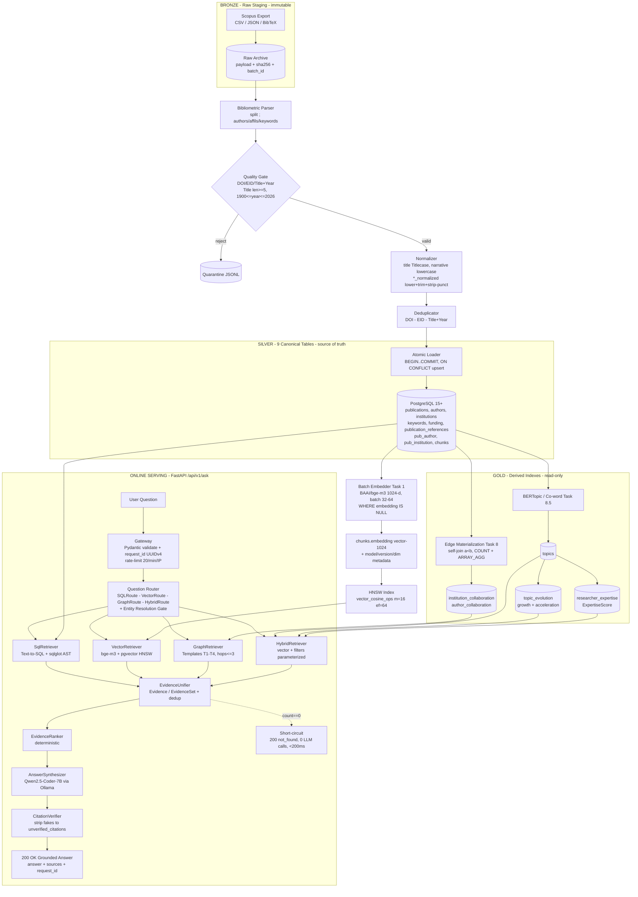

# Scopus Research Intelligence & STI Policy Intelligence Platform

> **AI-Bibliometrics — Evidence-Grounded Research Intelligence Assistant over Scopus Publications**
>
> Ask in natural language (ID/EN) — get factual, statistical, semantic, network, and policy-level answers grounded to real database evidence with verified `[Title, Year, DOI]` citations. Zero hallucination by design.
>
> | Meta | Value |
> |---|---|
> | **Architecture** | Hybrid Master: Bronze → Silver (9 canonical tables) → Gold (pgvector + 2 edge tables + 3 analytics tables) → FastAPI 4-Route RAG |
> | **API Contract** | `POST /api/v1/ask` + `GET /api/v1/health` (see `docs/06 Api Design.md`). Legacy `POST /api/query` is **SUPERSEDED** and must not be implemented. |
> | **Doc Status** | Consolidated Hybrid Master Blueprint · Last aligned: **2026-09-28** (`docs/03` v3.0.0, `docs/04` v3.2.0, `docs/05` v3.1.0, `docs/06` v3.0.0, `docs/07` v3.1.0, `docs/11` v3.0.0, `docs/12` v1.0.0) |
> | **Implementation Status** | **Documentation-only. PLANNED / NOT IMPLEMENTED.** No `backend/`, `frontend/`, `database/`, `scripts/`, `docker/`, `tests/` in repo yet. 9 Silver tables reported in external Supabase but **Task 0 schema audit not run**. `chunks.embedding`, 2 edge tables, 3 Gold analytics tables **do not exist yet**. |

**Contents:** [1. Executive Summary](#1-executive-summary) · [2. Key Capabilities](#2-key-capabilities--features) · [3. Architecture](#3-end-to-end-system-architecture) · [4. Tech Stack](#4-technology-stack) · [5. Database & Pipeline](#5-database--data-pipeline-summary) · [6. Repo & Docs Index](#6-repository-structure--documentation-index) · [7. Getting Started](#7-getting-started--setup-guide) · [8. Roadmap & Status](#8-roadmap--implementation-status) · [Security](#9-security--zero-hallucination-guarantees) · [API Quick Ref](#10-api-contract-quick-reference)

---

## 1. Executive Summary

### Vision

Build a **Scopus Research Intelligence & STI (Science, Technology & Innovation) Policy Intelligence Platform** that lets non-technical users — researchers, analysts, and research directors / policymakers — interrogate a Scopus publication corpus through a single chat surface, and receive answers that are:

1. **Factually exact** (counts, rankings, distributions verified against SQL),
2. **Semantically deep** (conceptual discovery via multilingual vector search),
3. **Relationally aware** (collaboration networks via graph traversals), and
4. **Policy-ready** (emerging-topic detection, expertise ranking, trend synthesis).

### Dual-Path + Evidence Architecture

The system fuses three complementary intelligence paths behind one deterministic serving path:

```text
Structured Data (PostgreSQL Silver)  +  Semantic AI (pgvector bge-m3 HNSW)  +  Network/Policy Analytics (Gold)
                                         ──────────────────────────────────────────────────────────────────────────
                                                                                      │
                                                                          Evidence Object (canonical grounding)
                                                                                      │
                                                                         Evidence-based LLM (Qwen2.5-Coder-7B, CPU)
```

| Path | Question type | Engine |
|---|---|---|
| **Structured / Factual** | *"Top 5 most productive authors in 2023?"*, *"Total citations of institution X?"* | `SQLRoute` → `SqlRetriever` (Text-to-SQL + `sqlglot` AST validation) over Silver Layer |
| **Semantic / Discovery** | *"Papers on oxidative stress in Wharton's jelly?"* | `VectorRoute` → `VectorRetriever` (`bge-m3` 1024-d + pgvector `<=>` HNSW, `DISTINCT ON (publication_id) LIMIT 8`) |
| **Network / Relational** | *"Which institutions collaborate with AI researchers?"*, *"Co-authors of Author X?"* | `GraphRoute` (= `relational` in v2 docs) → `GraphRetriever` (parameterized templates T1–T4 over SQL edge tables, `max_hops=3`) |
| **Policy / Trend Synthesis** | *"Stem-cell papers by Indonesian institutions after 2020 — what's emerging, who are the experts?"* | `HybridRoute` → `HybridRetriever` (vector + structured filters in one parameterized query) + Gold analytics (`topics`, `topic_evolution`, `researcher_expertise`) |

**Non-negotiable invariant:** no raw row / chunk / edge ever reaches the LLM. Everything is normalized to a strict **Evidence Object** (`Evidence` / `EvidenceSet`), ranked deterministically, framed as `UNTRUSTED DATA`, synthesized, then **post-hoc citation-verified**. Empty evidence short-circuits to `status: not_found` in <200 ms with **zero LLM calls** (`docs/03 §0.3`, `docs/05 §9–§12`).

---

## 2. Key Capabilities & Features

### 2.1 Bibliometric Intelligence (Factual / Statistical) — `SQLRoute`

- Top-N rankings, aggregations, distributions, time filters over Silver Layer (`publications`, `authors`, `institutions`, `keywords`, `funding` + junctions).
- Guardrails: `sqlglot` AST parse → `SELECT`-only root → table/column whitelist (`docs/04`) → destructive-keyword blacklist → **Aggregate-Shape Check** (aggregate intent must contain `COUNT/SUM/AVG/GROUP BY`) → **Double-Count Check** (`COUNT(DISTINCT publication_id)` on junction joins) → `LIMIT 50` on non-aggregates (`docs/05 §6.1`, `docs/02 FR3`).
- 1x retry with AST error context; persistent failure → `HTTP 422 { error_type: sql_generation_failed }`, never raw DB errors.

### 2.2 Semantic & AI Discovery (Vector Search & RAG) — `VectorRoute`

- Multilingual (ID/EN) conceptual search over `chunks.embedding vector(1024)` (`BAAI/bge-m3`), HNSW `vector_cosine_ops` (`m=16, ef_construction=64`).
- Deduplication guarantee: `DISTINCT ON (p.publication_id)` so `LIMIT 8` = **8 unique publications**, not overlapping chunks. Similarity-threshold gate; below-threshold → `not_found` (`docs/05 §6.2–§7`, `docs/02 FR4`).

### 2.3 Collaboration Network Analysis (SQL-Based Edge Tables) — `GraphRoute`

- Knowledge-Graph **minimum surface as derived PostgreSQL edge tables** (no standalone graph DB in MVP):
  - `institution_collaboration(institution_a, institution_b, weight, via_publication_ids)` with `CHECK (a < b)`
  - `author_collaboration(author_a, author_b, weight, via_publication_ids)` with `CHECK (a < b)`
- Zero LLM-generated graph SQL. Four parameterized templates only: **T1** institution collaborators, **T2** co-authors, **T3** topic→institution composition, **T4** bounded recursive-CTE path search (`max_hops=3`, `LIMIT 50`). Every edge carries `via_publication_ids` provenance (`docs/04 §6`, `docs/05 §6.3/§8`).
- Graph engine decision (Apache AGE vs Kùzu) is **PENDING**; Neo4j/Memgraph are **OUT-OF-SCOPE** for MVP. AGE/Kùzu deferred to Phase 9 (`docs/09 §8`, `docs/11 Phase 6`).

### 2.4 Emerging-Topic & Expertise Engine (Director's Analytics) — Gold Layer + `HybridRoute`

- **`topics`**: BERTopic / co-word clusters — `topic_name`, `cluster_keywords[10]`, `representation_vector vector(1024)` (HNSW), `total_publications`, `total_citations` (`docs/04 §7.1`).
- **`topic_evolution`**: annual time-series per topic — `publication_count`, `citation_count`, `growth_score` (YoY), `citation_acceleration` (d²C/dt²), `recency_weight`, `is_emerging` flag (`docs/04 §7.2`).
- **`researcher_expertise`**: multi-dimensional weighted expertise per (author, topic) — `ExpertiseScore` with components `relevance`, `productivity`, `impact`, `recency` + `h_index_topic`, `publication_count_topic`, `citation_count_topic`, `coauthor_network_size` (`docs/04 §7.3`):

  $$\text{ExpertiseScore} = w_1\cdot\text{Relevance} + w_2\cdot\text{Productivity} + w_3\cdot\text{Impact} + w_4\cdot\text{Recency}$$

  Defaults: `w1=0.30` (semantic similarity to `representation_vector`), `w2=0.25` (log-scaled volume `log2(1+N)`), `w3=0.25` (field-weighted citation impact), `w4=0.20` (last-3-year activity decay). Score range `[0–100]`.
- Powers trend acceleration queries, expert-finder ranking, and policy synthesis via `HybridRoute` joins across Gold + Silver + Vector.

### 2.5 Evidence-Based AI Copilot (Zero-Hallucination) — All Routes

- Typed **Question Router**: deterministic regex/keyword rules first (<50 ms); schema-light LLM fallback only on uncertainty (~1.5 s). Emits validated Pydantic `RouterOutput(route, reasoning, entities)` with `YearFilter(op ∈ {eq,gt,gte,lt,lte,between})`. **Entity Resolution Gate**: `lower+trim → exact → ILIKE`; 0 hits → `not_found`, >1 → `needs_clarification` + candidates, 1 → bind canonical ID. Out-of-slot fields → `filters_ignored`. Router JSON failure → safe fallback to `semantic` + `answered_via_fallback: true` (`docs/05 §5`, `docs/02 FR2`).
- **Evidence normalization** (`EvidenceUnifier`): SQL rows + vector chunks + graph edges → canonical `EvidenceSet`; dedup on `publication_id`; deterministic `EvidenceRanker` (`0.7·cosine + 0.2·recency + 0.1·graph`, cross-encoder deferred).
- **Grounded synthesis** (Qwen2.5-Coder-7B-Instruct via Ollama, CPU): prompt-isolated context (`=== BEGIN/END RETRIEVED EVIDENCE ===`), mandatory `[Title, Year, DOI]` citations, contradiction surfacing.
- **Post-hoc `CitationVerifier`**: regex-extract citations, match against `EvidenceSet` (DOI + normalized title/year); hallucinations stripped to `unverified_citations` (`docs/05 §11–§12`).

---

## 3. End-to-End System Architecture

### 3.1 Data Flow: Bronze → Silver → Gold (Offline) + Serving (Online)



Text fallback (if Mermaid unsupported):

```text
OFFLINE: Scopus files → Parse → Quality Gate → Normalize → Dedup → 9 Silver tables
            → (a) Embed chunks (bge-m3) → HNSW index  |  (b) Build 2 edge tables  |  (c) BERTopic → topics → evolution + expertise
ONLINE:  Question → POST /api/v1/ask → validate + request_id → Router (4 routes + entity gate)
            → Retriever (SQL/Vector/Graph/Hybrid, app_readonly, 10s timeout)
            → EvidenceUnifier → Ranker → Synthesizer (Ollama) → CitationVerifier → Grounded JSON
            → if 0 evidence: deterministic not_found, no LLM call
```

### 3.2 Architectural Invariants (must never be violated)

| # | Invariant | Source |
|---|---|---|
| 1 | **Source-of-Truth**: PostgreSQL Silver is canonical. pgvector + edge tables + Gold analytics are derived read-only indexes. | `docs/03 §0.3`, `docs/04 §1` |
| 2 | **Evidence Normalization**: no raw row/chunk/edge reaches the LLM; all pass through `EvidenceUnifier` → `EvidenceSet`. | `docs/03 §0.3`, `docs/05 §9` |
| 3 | **Security**: `app_readonly` (SELECT-only) + `SET search_path=public` + `statement_timeout='10s'` per pooled connection; retrieved text = `UNTRUSTED DATA`. | `docs/08 §1–§2` |
| 4 | **Zero-Hallucination**: 0 evidence → deterministic `not_found`/`insufficient_evidence`, no synthesis call. | `docs/03 §0.3`, `docs/05 §11.2` |

Deployment (MVP): single CPU VM (8 vCPU / 16 GB: ~6 GB Qwen-7B-Q4 + ~2 GB bge-m3 + OS/pool headroom) running Docker Compose (`backend` + `ollama`) against managed Supabase PostgreSQL; Next.js frontend on Vercel. Concurrency target 1–2 req within 15 s budget. No Redis/Celery/SSE until Phase 7 baseline proves a bottleneck (`docs/03 §7–§9`, `docs/09 §6`).

---

## 4. Technology Stack

| Layer | Choice (pinned) | Rationale / Trade-off |
|---|---|---|
| **Language / Framework** | Python 3.11+, FastAPI (async), Pydantic v2, `asyncpg`/`psycopg3` | Mature RAG/SQL-AST/embedding ecosystem; async I/O for Ollama + PG; strict schema boundary. Split from Next.js to avoid `child_process.spawn` anti-pattern (`docs/03 §3`, `docs/09 §4`). |
| **LLM (self-hosted, CPU)** | `Qwen2.5-Coder-7B-Instruct` (GGUF Q4_K_M) via Ollama | Best-in-class 7B for Text-to-SQL + structured JSON on CPU (~25–35 tok/s, 5–10 s synthesis). Llama-3.1-8B / Mistral-7B / Phi-mini rejected on SQL reliability (`docs/09 §2`). GPU upgrade (32B/70B) is a model-swap only. |
| **Embedding** | `BAAI/bge-m3`, 1024-dim float32 (revision + `sentence-transformers` version + batch-size 32–64 pinned) | Multilingual ID/EN; CPU-viable batch-offline + single-query-online. `all-MiniLM-L6-v2` rejected (English-only). Deterministic re-runs require pinning (`docs/09 §3`). |
| **Database & Search** | PostgreSQL 15+ (Supabase) + `pgvector` HNSW (`m=16, ef_construction=64`, `vector_cosine_ops`) | Existing 9-table corpus; HNSW chosen over IVFFlat (no retraining). `DISTINCT ON (publication_id)` dedup; threshold gate (`docs/04 §5`, `docs/05 §7`). |
| **SQL Guardrail** | `sqlglot` AST validator | Parse → SELECT-root → table/column whitelist → destructive blacklist → aggregate-shape → double-count → LIMIT/timeout (`docs/05 §6.1`). |
| **Analytics & NLP** | BERTopic / TF-IDF + scikit-learn, Pandas, NetworkX (offline); `rapidfuzz` deferred to Phase 9 | Topic clustering, YoY growth/acceleration, weighted expertise scoring; fuzzy alias resolution post-MVP (`docs/04 §7`, `docs/11 Phase 9`). |
| **Frontend** | Next.js (React) on Vercel — Clean White, Dense, Notion/Linear-style | Tabular monospace data, collapsible sources, honest `ok/not_found/needs_clarification/error` states, Dev-Mode SQL viewer (`docs/07`). |
| **Deploy** | Docker Compose (`backend` + `ollama`) on 1 VPS; no LangChain/LlamaIndex | LangChain/LlamaIndex rejected for MVP (indirection hides 7B failure modes; direct Ollama-HTTP + raw SQL is debuggable) (`docs/09 §5`). |

---

## 5. Database & Data Pipeline Summary

Full DDL, cleaning rules, and acceptance checklist: `docs/04` (+ pipeline narrative `docs/12`).

### 5.1 Silver Layer — 9 Canonical Relational Tables (`CURRENT` in Supabase, pending Task 0 audit)

| Table | Role | Key columns / Rules |
|---|---|---|
| `publications` | Core entity (18 cols) | `publication_id PK`, `title` (Titlecase), `abstract` (lowercase), `doi` (indexed, `10.xxxx/...`), `eid` (unique), `year SMALLINT NOT NULL indexed`, `citation_count INT DEFAULT 0`, `document_type/stage/open_access/language/publisher/source` (lowercase), `volume/issue/art_no/page_*` (raw) |
| `authors` | Author entity | `author_id PK`, `author_name` (display case), `author_name_normalized` (`lower+strip-punct+trim`, indexed — **mandatory for GROUP BY**) |
| `institutions` | Affiliation entity | `institution_id PK`, `institution_name` (display), `institution_name_normalized` (indexed), `city` + `country` (lowercase, `country` indexed) |
| `keywords` | 1:N keyword | `keyword_id BIGSERIAL PK`, `publication_id FK`, `keyword` (pure lowercase), `keyword_type` (`author keyword` / `index keyword`) |
| `funding` | 1:N funding | `funding_id BIGSERIAL PK`, `funding_agency` (display), `funding_agency_normalized` (indexed), `grant_number`, `funding_text` (lowercase) |
| `pub_author` | Junction | `PK(publication_id, author_id)`, `author_order SMALLINT` |
| `pub_institution` | Junction | `PK(publication_id, institution_id)` |
| `publication_references` | 1:N raw cites | `reference_id BIGSERIAL PK`, `reference_order INT`, `reference_text TEXT` — **unlinked strings in MVP** (`CITES` resolution → Phase 9) |
| `chunks` | 1:N semantic unit | `chunk_id BIGSERIAL PK`, `publication_id FK CASCADE`, `chunk_text TEXT`, `section DEFAULT 'title_abstract'` + vector columns below |

**Vector columns on `chunks`** (`PLANNED`, Task 1): `embedding vector(1024)`, `embedding_model DEFAULT 'BAAI/bge-m3'`, `embedding_version DEFAULT 'v1.0'`, `embedding_dimension DEFAULT 1024` + `idx_chunks_embedding_hnsw USING hnsw (embedding vector_cosine_ops) WITH (m=16, ef_construction=64)` + `idx_chunks_pub_id`.

### 5.2 Derived Graph Layer — 2 Edge Collaboration Tables (`PLANNED`, Task 8)

Idempotent `TRUNCATE + INSERT … SELECT` self-joins (`a < b` canonical, `COUNT(DISTINCT pub)` weight, `ARRAY_AGG(pub)` provenance), B-Tree indexes on `(a)`, `(b)`, `(weight DESC)`; re-`GRANT SELECT TO app_readonly` after creation (`docs/04 §6`, `docs/12 §14`).

### 5.3 Gold Layer — 3 Director Analytics Tables (`PLANNED`, Task 8.5)

| Table | Purpose | Key fields |
|---|---|---|
| `topics` | BERTopic clusters | `topic_id`, `topic_name` + `topic_name_normalized`, `cluster_keywords TEXT[10]`, `representation_vector vector(1024)` (HNSW), `total_publications`, `total_citations`, `first/latest_publication_year` |
| `topic_evolution` | Annual trend acceleration | `(topic_id, year) UNIQUE`, `publication_count`, `citation_count`, `growth_score NUMERIC(6,4)` (YoY), `citation_acceleration NUMERIC(6,4)`, `recency_weight`, `is_emerging BOOL` + partial/emerging/growth indexes |
| `researcher_expertise` | Weighted expert ranking | `(author_id, topic_id) UNIQUE`, `expertise_score NUMERIC(8,4) [0–100]`, `relevance/productivity/impact/recency NUMERIC(6,4)`, `h_index_topic`, `publication_count/citation_count_topic`, `coauthor_network_size` + `(topic_id, expertise_score DESC)` rank index |

### 5.4 Route → Layer Mapping (`/api/v1/ask`)

| RAG Route | Layers hit | Query pattern | Evidence output |
|---|---|---|---|
| `SQLRoute` (`structured`) | Silver | Parameterized `SELECT`/aggregation + `sqlglot` AST | Factual stats, productivity rankings, funding tables |
| `VectorRoute` (`semantic`) | Silver vector (`chunks.embedding` ⨝ `publications`) | `embedding <=> :qv`, `DISTINCT ON (pub) LIMIT 8` | Relevant abstracts + `[Title, Year, DOI]` |
| `GraphRoute` (`graph` = v2 `relational`) | Edge Layer | Templates T1–T4, recursive CTE `max_hops=3` | Collaboration lists + `via_publication_ids` |
| `HybridRoute` (`hybrid`) | Gold + Silver + Vector | Topic-cluster + trend + expertise joins with vector distance + `year/country/author/institution/keyword` filters | Emerging-topic briefs, expert rankings, policy synthesis |

### 5.5 Pipeline Stages (Bronze → Serving)

1. **Bronze staging**: immutable Scopus archive + `batch_id/sha256/ingested_at/record_count` (`docs/12 §5`).
2. **Cleaning**: casing/normalization matrix (identifiers preserved; display preserved; narrative lowercase; title Titlecase; `*_normalized` for aggregation) (`docs/12 §8`, `docs/04`).
3. **Bulk loading**: atomic `BEGIN…COMMIT` per batch, `ON CONFLICT` upserts, full `ROLLBACK` on integrity failure (`docs/12 §11`).
4. **Embedding generation**: `Title: …\nAbstract: …` → `bge-m3` batch 32–64, idempotent `WHERE embedding IS NULL`, OOM → batch-halving + backoff (`docs/12 §12`).
5. **Graph materialization**: edge rebuild + provenance arrays + re-grant (`docs/12 §14`).
6. **Quality gates**: pub↔chunk reconciliation, `WHERE embedding IS NULL = 0`, 0 orphan junctions, edge counts non-empty (`docs/12 §19`).

Offline (write/DDL, `service_role`, minutes/hours) and online (read-only `app_readonly`, ms/seconds) are strictly separated (`docs/12 §20`).

---

## 6. Repository Structure & Documentation Index

### 6.1 File Tree (actual + target)

```text
AI-Bibliometrics/
├── README.md                    ← this file (Hybrid Master landing page)
├── docs/                        ← normative specifications (only committed content today)
│   ├── 01 PRD.md
│   ├── 02 SRD.md
│   ├── 03 System Architecture.md
│   ├── 04 Database Schema.md
│   ├── 05 Retrieval Rag Design.md
│   ├── 06 Api Design.md
│   ├── 07 UI Spec.md
│   ├── 08 Security.md
│   ├── 09 Tech Stack.md
│   ├── 10 Implementation Plan.md
│   ├── 11 Roadmap.md
│   └── 12 Data Pipeline.md
├── backend/app/                 ← PLANNED (Task 2+): routers/, services/, models/, db/, core/
├── database/                    ← PLANNED: migrations/ (Silver DDL, vector col, HNSW, edges, Gold)
├── scripts/                     ← PLANNED: verify_schema.py (T0), embed_chunks.py (T1), build_edges.py (T8)
├── frontend/                    ← PLANNED (Task 11): Next.js chat UI per docs/07
├── docker/ + docker-compose.yml ← PLANNED: backend + ollama services
├── tests/                       ← PLANNED: router/SQL/vector/graph/evidence/answer/API suites
└── .env.example                 ← PLANNED: DB URL, Ollama host, model IDs, timeouts (never commit .env)
```

> Note: the old README referenced `docs/00 Readme.md` reading order. **No `docs/00` file exists in this repo** — the canonical reading order is `README.md → docs/01 … docs/12` below. Do not treat `00` as a real file until one is authored.

### 6.2 Documentation Index (`docs/01`–`docs/12`)

| Doc | Title | What it normatively defines |
|---|---|---|
| `01 PRD.md` | Product Requirements | Background (SQLite→PG transition, blockers), MVP end-to-end goal, internal-only scope, success metrics, risk table |
| `02 SRD.md` | System Requirements | FR0–FR7 (validation, routing, SQL/vector/synthesis/UI/relational) + NFR1–N6 (15 s latency, groundedness, observability fields, security) + constraints C1–C5 |
| `03 System Architecture.md` | End-to-End Architecture v3.0.0 | Vertical slice, layer I/O table, invariants, component topology, 5 data flows, offline/online split, graph ADR (AGE vs Kùzu pending), deployment, latency budget, Phase 0–7 map |
| `04 Database Schema.md` | Hybrid Master Blueprint v3.2.0 | Medallion (Bronze/Silver/Edge/Gold), 9-table Silver DDL + cleaning rules, `chunks.embedding` + HNSW (`m=16, ef=64`), 2 edge DDLs, 3 Gold DDLs + `ExpertiseScore` formula, ERD, route mapping, Task-0 checklist AC-DB-1…9 |
| `05 Retrieval Rag Design.md` | RAG Design v3.1.0 | 6-stage RAG, current-vs-target matrix, seq diagram, router (rules-first + entity gate + `filters_ignored` + fallback), Sql/Vector/Graph/Hybrid retrievers, vector/HNSW spec, T1–T4 templates, `Evidence`/`EvidenceSet`/`Unifier`/`Ranker`, prompt skeleton, short-circuit, verifier regex, failure matrix |
| `06 Api Design.md` | API Contract v3.0.0 (`/api/v1`) | Boundary principles, endpoint table (`/api/v1/ask` + `/api/v1/health` planned; `/api/query` superseded; stream/papers/authors/graph deferred), URI versioning, status/envelope conventions, 4 response variants, Pydantic v2 schemas, error `error_type` enum, rate-limit/CORS, observability JSON, AC-API-1…8 |
| `07 UI Spec.md` | UI Spec v3.1.0 | Notion/Linear dense 2-panel layout, design tokens (`#FFFFFF/#F7F7F5/#2563EB/#B45309`, Inter + JetBrains Mono), route badges, collapsible sources, Dev-Mode inspector, 6 honest states (loading/ok/not_found/clarify/error/unreachable), a11y + AC-UI-1…9 |
| `08 Security.md` | Internal-MVP Security | `app_readonly` DDL + `search_path` + re-grant rule, timeouts/pooling, `.env` isolation, prompt-vs-SQL injection layers (code guardrails, whitelist/blacklist, operator `Literal`s, no-LLM-SQL graph path), rate-limit/CORS/no-auth risk, logging without secrets, go-live checklist |
| `09 Tech Stack.md` | Stack Rationale | Lock table (PG+pgvector / FastAPI / Qwen-7B / bge-m3 / sqlglot / Next.js / Compose), LLM + embedding + backend-split + no-LangChain rationales, dev/prod topology (8 vCPU/16 GB, 1–2 concurrent), GPU swap path, graph ADR (Pending) |
| `10 Implementation Plan.md` | Build Order (Tasks 0–12) | Status matrix, Phase 0–7 map, test-plan categories, linear Task 0–3 blockers + Task 4 entity-contract prerequisite chain, per-task steps + checkpoints, Task-12 E2E gate |
| `11 Roadmap.md` | Phased Roadmap v3.0.0 (Phases 0–11) | State audit (docs-only), MVP definition, invariants diagram, status labels, Phase 0…11 goals/deliverables/acceptance, MVP-boundary table, dependency DAG, risk register, next step Milestone 0.1 |
| `12 Data Pipeline.md` | Pipeline Design v1.0.0 | Scopus→canonical mapping, Bronze archive, nested-structure parsing, quality gates, cleaning matrix, multi-tier dedup (DOI→EID→Title+Year), ingestion-vs-resolution boundary, atomic loader SQL, embedding/HNSW spec, edge materialization SQL, lineage/provenance, idempotency, incremental strategy, quarantine handling, quality-gate SQL, offline/online + security/perf, AC-PIPE-1…10 |

---

## 7. Getting Started & Setup Guide

All steps are **TO-DO** (no code committed yet). Follow `docs/10` linearly for Tasks 0–3; do not skip.

### 7.1 Prerequisites & Environment Setup

- **Infra**: Supabase PostgreSQL 15+ project (or local PG 15+ with `pgvector`), 1 dev VM / Docker host (8 vCPU / 16 GB recommended), Node 18+ (frontend later), Vercel account (frontend deploy).
- **Tools**: Python 3.11+, Docker + Compose, Ollama binary, `psql`, Git.
- **Models (pinned at setup)**: `qwen2.5-coder:7b-instruct` (Ollama), `BAAI/bge-m3` (+ record commit + `sentence-transformers` version + batch size in lockfile per `docs/09 §3`).
- **Repo bootstrap** (Phase 0 / Milestone 0.1):

  ```bash
  mkdir -p backend/app/{routers,services,models,db,core} database/migrations scripts tests docker data/raw
  touch backend/app/main.py .env.example docker-compose.yml
  # .env (NEVER commit): SUPABASE_DB_URL=postgresql://... , OLLAMA_HOST=http://localhost:11434,
  #   LLM_MODEL=qwen2.5-coder:7b-instruct, EMBED_MODEL=BAAI/bge-m3, STATEMENT_TIMEOUT=10s
  ```

### 7.2 Database Migration & Schema Initialization (Task 0)

1. Run the schema-introspection audit **before any feature code** (`docs/04 §10`, `docs/10 Task 0`):

   ```bash
   python scripts/verify_schema.py  # SELECT table_name,column_name,data_type FROM information_schema.columns WHERE table_schema='public'
   ```

   Reconcile output against `docs/04 §4`; fix `docs/04` if names/types differ (AC-DB-1…4).
2. Apply Silver DDL + extensions in `database/migrations/` order: `CREATE EXTENSION vector` → 9 Silver tables (+ `*_normalized` indexes) → create `app_readonly` role + `GRANT SELECT` + verify writes fail (`docs/08 §1`, AC-DB-9):

   ```sql
   CREATE ROLE app_readonly LOGIN PASSWORD '...';
   GRANT USAGE ON SCHEMA public TO app_readonly;
   GRANT SELECT ON ALL TABLES IN SCHEMA public TO app_readonly;
   ALTER DEFAULT PRIVILEGES IN SCHEMA public GRANT SELECT ON TABLES TO app_readonly;
   -- every pooled connection: SET search_path = public; SET statement_timeout = '10s';
   ```
3. Verify chunk granularity before embedding: `SELECT COUNT(*), COUNT(DISTINCT publication_id) FROM chunks;` (`docs/05 §7.2`).

### 7.3 Ingestion Pipeline Execution (Tasks 1 + 8 + 8.5)

```bash
# 1. Cleaning → Bulk load (Bronze → Silver), atomic per batch
python scripts/ingest_scopus.py --input data/raw/scopus_export_*.csv --batch-size 1000
# validates DOI/EID/Title+Year, Titlecase/lowercase/*_normalized rules, ON CONFLICT upserts (docs/12 §7-§11)

# 2. Embedding generation (Task 1) — chunks.embedding vector(1024) + metadata
python scripts/embed_chunks.py --model BAAI/bge-m3 --batch-size 32 --resume
# check: SELECT COUNT(*) - COUNT(embedding) AS missing FROM chunks;  -- must be 0

# 3. HNSW index (after backfill)
psql "$SUPABASE_DB_URL" -c "CREATE INDEX IF NOT EXISTS idx_chunks_embedding_hnsw ON chunks USING hnsw (embedding vector_cosine_ops) WITH (m=16, ef_construction=64); ANALYZE chunks;"

# 4. Graph materialization (Task 8) — 2 edge tables, then re-grant
python scripts/build_edges.py   # TRUNCATE + INSERT ... SELECT a<b + via_publication_ids
psql "$SUPABASE_DB_URL" -c "GRANT SELECT ON ALL TABLES IN SCHEMA public TO app_readonly;"

# 5. Gold analytics (Task 8.5) — BERTopic → topics → topic_evolution + researcher_expertise
python scripts/build_topics.py && python scripts/score_expertise.py
# quality gates: docs/12 §19 (pub↔chunk counts, 0 orphans, edge counts)
```

### 7.4 Running the FastAPI App & API Verification (Tasks 2–4, 10)

```bash
docker compose up --build          # backend (uvicorn :8000) + ollama
ollama pull qwen2.5-coder:7b-instruct

# health (must not leak secrets)
curl -s http://localhost:8000/api/v1/health | jq

# ask — structured example (expect route=structured)
curl -s http://localhost:8000/api/v1/ask \
  -H 'Content-Type: application/json' \
  -d '{"question":"Who are the top 5 most productive authors in 2023?","developer_mode":true}' | jq '{status,route,answer: .answer[0:200], sources: (.sources|length)}'

# ask — semantic example (expect 8 unique pubs after Task 1)
curl -s http://localhost:8000/api/v1/ask \
  -H 'Content-Type: application/json' \
  -d '{"question":"Papers about oxidative stress in Wharton jelly?"}' | jq

# ask — graph example (after Task 8)
curl -s http://localhost:8000/api/v1/ask \
  -H 'Content-Type: application/json' \
  -d '{"question":"Which institutions collaborate with AI researchers?"}' | jq

# negative checks: malformed → 422; empty topic → 200 not_found (<200ms, no LLM); "J. Wang" → 200 needs_clarification + candidates
```

Full E2E gate (12 queries), adversarial SQL suite, latency baseline (1–2 concurrent, record `validation+routing+embedding+retrieval+evidence+synthesis+verification` breakdown): `docs/10 Task 12`, `docs/11 Phase 8`.

---

## 8. Roadmap & Implementation Status

Transparent current-vs-target. Nothing is marked done without code + measured evidence in repo.

### 8.1 Build Tasks 0–12 (`docs/10`)

| Task | Scope | Status | Blocks |
|---|---|---|---|
| **Task 0 — Schema Check** | `verify_schema.py` vs `information_schema`; fix `docs/04`; chunk-ratio check | ⬜ NOT STARTED (next) | Everything (SQL prompt, role, embeddings, edges) |
| **Task 1 — Embedding Pipeline** | `ALTER chunks ADD embedding vector(1024)` + bge-m3 batch + HNSW (`m=16, ef=64`) + 3–5 query relevance check | ⬜ BLOCKED (needs T0) | Semantic + Hybrid routes |
| **Task 2 — Backend Skeleton + DB Layer** | FastAPI layout, `app_readonly` + `search_path`/timeout pool, `GET /api/v1/health` | ⬜ PLANNED | API + all retrievers |
| **Task 3 — Ollama Setup** | `qwen2.5-coder:7b-instruct` pull, isolated LLM client, health integration | ⬜ PLANNED | Router fallback, SQL gen, synthesis |
| **Task 4 — Router + Entity Gate** | 4-class routing, Pydantic entity contract, `filters_ignored`, ILIKE gate, `needs_clarification`, 12-query unit test | ⬜ PLANNED | Tasks 5, 6, 7, 8 |
| **Task 5 — SQL Generator + Validator** | Schema-complete prompt, `sqlglot` 7-layer check, 1x retry, 12 adversarial tests | ⬜ PLANNED | Structured slice |
| **Task 6 — Vector Retriever** | Query-embed + `<=>` + `DISTINCT ON` + threshold tuning | ⬜ PLANNED (needs T1) | Semantic slice |
| **Task 7 — Hybrid Path** | Conditional joins + `Literal` operator whitelist + parameterized filters | ⬜ PLANNED (needs T4–T6) | Combined queries |
| **Task 8 — Relational/Graph Path** | Build 2 edge tables + re-grant + T1–T4 templates + hop/limit/timeout clamps | ⬜ PLANNED (needs T0+T4) | Network queries |
| **Task 8.5 — Gold Analytics** *(from `docs/04 §7`)* | `topics` + `topic_evolution` + `researcher_expertise` + `ExpertiseScore` weights | ⬜ PLANNED (needs T1+T8) | Policy/expert synthesis |
| **Task 9 — Answer Synthesizer** | Grounding prompt + `CitationVerifier` + empty-result short-circuit + `filters_ignored` notes | ⬜ PLANNED | Grounded answers |
| **Task 10 — Full API** | `POST /api/v1/ask` wiring, `error_type` map, NFR4 logging, rate-limit | ⬜ PLANNED | Frontend + E2E |
| **Task 11 — Frontend** | Next.js 2-panel UI, badges, all 6 states, Dev-Mode inspector | ⬜ PLANNED | Demo |
| **Task 12 — E2E Verification** | 12-query gate (structured/semantic/hybrid/relational/ambiguity/empty/adversarial/unreachable) + latency baseline | ⬜ PLANNED | **MVP sign-off** |

Task 0–3 strictly linear; Task 4 precedes 5–8; Task 9 needs 5/6/7/8; Tasks 10–11 need 4–9 (`docs/10` sequencing).

### 8.2 Phases 0–11 (`docs/11`)

`Phase 0 NEXT` (baseline + Task 0) → `Phase 1 BLOCKED` (embeddings + edges) → `Phase 2–7 PLANNED` (gateway → SQL slice → vector → evidence → graph → hybrid/synthesis) → `Phase 8 PLANNED` (**MVP gate**) → `Phase 9 POST-MVP` (fuzzy `rapidfuzz`, eval harness, FTS, `CITES` resolution) → `Phase 10 POST-MVP/FUTURE` (SSE stream, Redis cache, Celery/arq, GPU-32B, resource APIs) → `Phase 11 FUTURE` (Supabase Auth + RLS, CDC/outbox ingestion, OTel audit). See `docs/11 §4–§6` for deliverables, acceptance criteria, and dependency DAG.

### 8.3 Post-MVP Highlights

- **Quality**: fuzzy entity resolution, golden-set eval harness (100+ pairs), threshold recalibration, `tsvector`/BM25 hybrid, citation-graph expansion.
- **Performance**: streaming `/api/v1/ask/stream` (SSE), semantic cache, worker queues, GPU inference (<3 s perceived).
- **Production**: multi-user auth/RLS/rate-limits, continuous ingestion + CDC, distributed tracing.

---

## 9. Security & Zero-Hallucination Guarantees

- **DB least privilege**: `app_readonly` SELECT-only; `search_path` + 10 s timeout per checkout; re-grant after every new table/column; write-attempt integration test (`docs/08 §1`).
- **Code-level guardrails, not prompt promises**: AST + whitelist + blacklist + shape + double-count + `Literal` operator enums; graph path takes no LLM SQL; hybrid uses bound parameters (`docs/08 §2`).
- **Untrusted-data framing**: `SYSTEM ≠ QUESTION ≠ EVIDENCE`; `=== BEGIN/END EVIDENCE ===` delimiters; injection-in-abstract treated as data (`docs/05 §10`, `docs/08 §2.2`). *Acknowledged limit*: synthesis framing is prompt-only — acceptable for trusted internal MVP, hardened pre-public (`docs/08 §2.3`).
- **Citation integrity**: post-hoc verifier strips fakes to `unverified_citations`; 0-row short-circuit never calls the LLM (`docs/05 §11–§12`).
- **Boundary hygiene**: Pydantic `extra="forbid"`, `question[3..1000]`, malformed-filter 422, `X-Request-ID` correlation, sanitized `error_type` envelope (no stacks/SQL/conn-strings), 20 req/min/IP rate-limit, restrictive CORS, Ollama on internal network only, `.env` never in git (`docs/06 §9–§11`, `docs/08 §3–§6`).

---

## 10. API Contract Quick Reference

**Base**: `http://localhost:8000/api/v1` · `Content-Type: application/json`

```json
// POST /api/v1/ask — request
{ "question": "Top 5 authors in 2023?", "filters": { "year_start": 2023, "year_end": 2023 }, "developer_mode": false }
```

```json
// 200 ok | 200 not_found | 200 needs_clarification  (422/500/503 → {status:"error", error_type, message})
{
  "request_id": "uuid",
  "status": "ok",
  "route": "structured",
  "answer": "… [Title, 2023, 10.xxxx/…] …",
  "sources": [{ "source_id": "row_1", "publication_id": "pub_1", "title": "…", "year": 2023, "doi": "10.xxxx/…", "snippet": "…", "source_type": "sql" }],
  "filters_ignored": [],
  "answered_via_fallback": false,
  "unverified_citations": [],
  "candidates": null,
  "debug": null
}
```

Canonical Evidence Object carried internally (never raw DB text to LLM):

```python
class Evidence(BaseModel):
    source_id: str
    source_type: Literal["sql", "vector", "graph"]
    snippet: str
    score: float = 1.0
    publication_id: Optional[str] = None
    title: Optional[str] = None
    authors: list[str] = []
    year: Optional[int] = None
    doi: Optional[str] = None
    provenance_ids: list[str] = []   # via_publication_ids for graph edges
```

Full envelopes (4 variants), Pydantic schemas, `error_type` enum, latency budgets, and sequence diagrams: `docs/06` (+ RAG internals `docs/05`, UI mapping `docs/07 §2`).

---

## Reading Order

`README.md` (this overview) → `01 PRD` (why) → `02 SRD` (what) → `03 Architecture` (how it fits) → `04 Schema` (data truth) → `12 Pipeline` (how data gets in) → `05 RAG` (how answers are built) → `06 API` (how clients call it) → `08 Security` (how it stays safe) → `09 Stack` (why these tools) → `07 UI` (what users see) → `10 Plan` (build order) → `11 Roadmap` (what's next).

*Removed from the previous README: legacy `/api/query` endpoint references (now marked superseded), `relational`-vs-`graph` terminology ambiguity (now `GraphRoute` = v2 `relational`), the phantom `docs/00` file entry (no such file exists), and any implication that embeddings/edge tables/API/UI already exist — all are PLANNED per the 2026-09-28 audit.*
