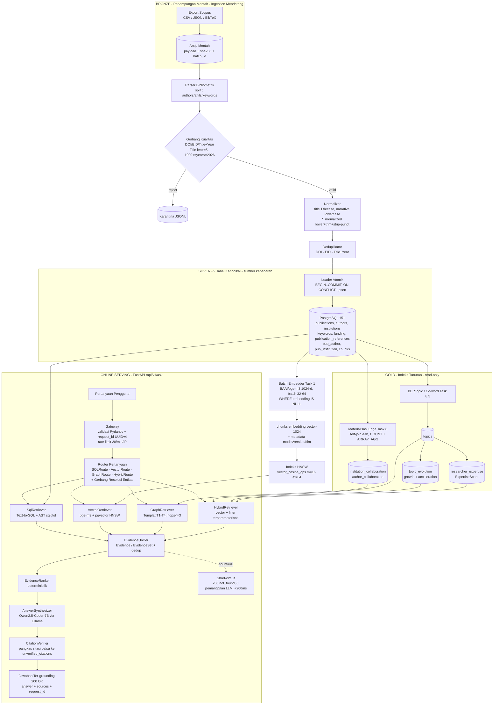

# Platform Riset Intelijen Scopus & Intelijen Kebijakan STI

> **AI-Bibliometrics — Asisten Riset Intelijen berbasis bukti (evidence-grounded) di atas publikasi Scopus**
>
> Bertanya dalam bahasa natural (ID/EN) — dapatkan jawaban faktual, statistik, semantik, jaringan, dan kebijakan yang ter-grounding pada bukti database nyata dengan sitasi `[Title, Year, DOI]` terverifikasi. Tanpa halusinasi sejak dari desain.
>
> | Meta | Nilai |
> |---|---|
> | **Arsitektur** | Hybrid Master: Bronze → Silver (9 tabel kanonikal) → Gold (pgvector + 2 tabel edge + 3 tabel analitik) → RAG 4-Rute FastAPI |
> | **Kontrak API** | `POST /api/v1/ask` + `GET /api/v1/health` (lihat `docs/06 Api Design.md`). `POST /api/query` versi lama berstatus **SUPERSEDED** dan tidak boleh diimplementasikan. |
> | **Status Dok** | Consolidated Hybrid Master Blueprint · Disinkronkan: **2026-09-27** (`docs/01`–`docs/12` v3.6.0) |
> | **Status Implementasi** | **Fase 0, Fase 1 & Fase 2 DONE.** Basis data PostgreSQL memuat 9 tabel relasional kanonikal, 40 chunk ber-embedding vector(1024) `BAAI/bge-m3` dengan indeks HNSW aktif, tabel edge kolaborasi termaterialisasi, serta kerangka gateway FastAPI (`POST /api/v1/ask` & `GET /api/v1/health`) dengan async DB pool, middleware tracing, rate limiting, dan structured logging telah terverifikasi (23 tests pass). **NEXT: Fase 3 (Irisan Vertikal QueryRouter & Text-to-SQL).** |

**Daftar Isi:** [1. Ringkasan Eksekutif](#1-ringkasan-eksekutif) · [2. Kemampuan Utama](#2-kemampuan-utama--fitur) · [3. Arsitektur](#3-arsitektur-sistem-end-to-end) · [4. Tumpukan Teknologi](#4-tumpukan-teknologi) · [5. Database & Pipeline](#5-ringkasan-database--pipeline-data) · [6. Struktur Repo & Indeks Dok](#6-struktur-repositori--indeks-dokumentasi) · [7. Panduan Memulai](#7-panduan-memulai--setup) · [8. Roadmap & Status](#8-roadmap--status-implementasi) · [9. Matriks Konsistensi](#9-matriks-konsistensi-keputusan-lintas-dokumen) · [10. Keputusan Kanonikal](#10-keputusan-arsitektur-kanonikal) · [11. Riwayat Perubahan](#11-riwayat-perubahan)

---

## 1. Ringkasan Eksekutif

### Visi

Membangun sebuah **Platform Riset Intelijen Scopus & Intelijen Kebijakan STI (Sains, Teknologi & Inovasi)** yang memungkinkan pengguna non-teknis — peneliti, analis, serta direktur riset / pengambil kebijakan — menelusuri korpus publikasi Scopus melalui satu permukaan chat, dan menerima jawaban yang:

1. **Tepat secara faktual** (hitungan, pemeringkatan, distribusi terverifikasi terhadap SQL di atas tabel Silver kanonikal),
2. **Mendalam secara semantik** (penemuan konseptual via pencarian vector multibahasa pada `chunks.embedding`),
3. **Sadar relasi** (jaringan kolaborasi via traversal graf di atas tabel edge turunan), dan
4. **Siap kebijakan** (deteksi topik berkembang, pemeringkatan kepakaran, sintesis tren via analitik Gold).

### Arsitektur Jalur Ganda + Bukti

Sistem memadukan tiga jalur intelijen yang saling melengkapi di belakang satu jalur serving yang deterministik:

```text
Data Terstruktur (PostgreSQL Silver)  +  AI Semantik (pgvector bge-m3 HNSW)  +  Analitik Jaringan/Kebijakan (Gold)
                                          ──────────────────────────────────────────────────────────────────────────
                                                                                       │
                                                                           Objek Bukti (grounding kanonikal)
                                                                                       │
                                                                          LLM berbasis bukti (Qwen2.5-Coder-7B, CPU)
```

| Jalur | Jenis pertanyaan | Mesin |
|---|---|---|
| **Terstruktur / Faktual** | *"5 penulis paling produktif tahun 2023?"*, *"Total sitasi institusi X?"* | `SQLRoute` → `SqlRetriever` (Text-to-SQL + validasi AST `sqlglot`) pada 9 tabel Silver |
| **Semantik / Penemuan** | *"Paper tentang stres oksidatif pada Wharton's jelly?"* | `VectorRoute` → `VectorRetriever` (`bge-m3` 1024-d + pgvector `<=>` HNSW pada `chunks`, `DISTINCT ON (p.publication_id) LIMIT 8`, gerbang $\ge 0.65$) |
| **Jaringan / Relasional** | *"Institusi mana yang berkolaborasi dengan peneliti AI?"*, *"Co-author dari Penulis X?"* | `GraphRoute` → `GraphRetriever` (templat terparameterisasi T1–T4 pada tabel edge SQL, `max_hops=3`) |
| **Kebijakan / Sintesis Tren** | *"Paper stem-cell dari institusi Indonesia setelah 2020 — apa yang berkembang, siapa pakarnya?"* | `HybridRoute` → `HybridRetriever` (vector + filter terstruktur dalam satu kueri) + analitik Gold (`topics`, `topic_evolution`, `researcher_expertise`) |

**Invariant yang tidak dapat ditawar:** tidak ada baris / chunk / edge mentah yang mencapai LLM. Semuanya dinormalisasi menjadi **Objek Bukti** (`Evidence` / `EvidenceSet`) yang ketat, diberi peringkat deterministik, dibingkai sebagai `UNTRUSTED DATA`, disintesis, lalu **diverifikasi sitasinya secara post-hoc**. Bukti kosong melakukan short-circuit ke `status: not_found` dalam <200 ms dengan **nol pemanggilan LLM** (`docs/03 §0.3`, `docs/05 §9–§12`).

---

## 2. Kemampuan Utama & Fitur

### 2.1 Intelijen Bibliometrik (Faktual / Statistik) — `SQLRoute`

- Pemeringkatan Top-N, agregasi, distribusi, filter waktu pada Lapisan Silver (`publications`, `authors`, `institutions`, `keywords`, `funding`, `pub_author`, `pub_institution`, `publication_references`, `chunks`).
- Guardrail: parse AST `sqlglot` → root wajib `SELECT` → daftar putih (whitelist) tabel/kolom (`docs/04`) → daftar hitam (blacklist) kata kunci destruktif → **Pemeriksaan Bentuk Agregat (Aggregate-Shape Check)** (maksud agregat wajib memuat `COUNT/SUM/AVG/GROUP BY`) → **Pemeriksaan Hitung Ganda (Double-Count Check)** (`COUNT(DISTINCT publication_id)` pada join junction) → `LIMIT 50` untuk non-agregat (`docs/05 §5.1`, `docs/02 FR3`).
- 1x percobaan ulang (retry) dengan konteks error AST; kegagalan menetap → `HTTP 422 { error_type: sql_generation_failed }`, tidak pernah membocorkan error DB mentah.

### 2.2 Penemuan Semantik & AI (Pencarian Vector & RAG) — `VectorRoute`

- Pencarian konseptual multibahasa (ID/EN) pada `chunks.embedding vector(1024)` (`BAAI/bge-m3`), HNSW `vector_cosine_ops` (`m=16, ef_construction=64`).
- Jaminan deduplikasi: `DISTINCT ON (p.publication_id)` sehingga `LIMIT 8` = **8 publikasi unik**, bukan chunk yang tumpang tindih. Gerbang ambang batas similaritas ($\ge 0.65$); di bawah ambang → `status: not_found` (`docs/05 §5.2`, `docs/02 FR4`).

### 2.3 Analisis Jaringan Kolaborasi (Tabel Edge Berbasis SQL) — `GraphRoute`

- Knowledge-Graph **permukaan minimum (minimum surface) berupa tabel edge PostgreSQL turunan** (tanpa database graf mandiri di MVP):
  - `institution_collaboration(institution_a, institution_b, weight, via_publication_ids)` dengan `CHECK (institution_a < institution_b)`
  - `author_collaboration(author_a, author_b, weight, via_publication_ids)` dengan `CHECK (author_a < author_b)`
- Nol SQL graf yang digenerate LLM. Hanya empat templat terparameterisasi: **T1** kolaborator institusi, **T2** co-author, **T3** komposisi topik→institusi, **T4** pencarian jalur recursive-CTE terbatas (`max_hops=3`, `LIMIT 50`). Setiap edge membawa provenance `via_publication_ids` (`docs/04 §6`, `docs/05 §5.3`).

### 2.4 Mesin Topik Berkembang & Kepakaran (Analitik Direktur) — Lapisan Gold + `HybridRoute`

- **`topics`**: klaster BERTopic / co-word — `topic_name`, `cluster_keywords[10]`, `representation_vector vector(1024)` (HNSW), `total_publications`, `total_citations` (`docs/04 §7.1`).
- **`topic_evolution`**: deret waktu (time-series) tahunan per topik — `publication_count`, `citation_count`, `growth_score` (YoY), `citation_acceleration` (d²C/dt²), `recency_weight`, flag `is_emerging` (`docs/04 §7.2`).
- **`researcher_expertise`**: kepakaran terbobot multi-dimensi per (penulis, topik) — `ExpertiseScore` dengan komponen `relevance`, `productivity`, `impact`, `recency` + `h_index_topic`, `publication_count_topic`, `citation_count_topic`, `coauthor_network_size` (`docs/04 §7.3`):

  $$\text{ExpertiseScore} = w_1\cdot\text{Relevance} + w_2\cdot\text{Productivity} + w_3\cdot\text{Impact} + w_4\cdot\text{Recency}$$

  Nilai bawaan (default): `w1=0.30`, `w2=0.25`, `w3=0.25`, `w4=0.20`. Rentang skor `[0–100]`.

### 2.5 Kopilot AI Berbasis Bukti (Tanpa Halusinasi) — Semua Rute

- **Router Pertanyaan** bertipe: aturan regex/kata kunci deterministik terlebih dahulu (<50 ms); fallback LLM ringan-skema hanya saat tidak pasti (~1,5 dtk). Mengeluarkan `RouterOutput(route, reasoning, entities)` Pydantic yang tervalidasi dengan `YearFilter(op ∈ {eq,gt,gte,lt,lte,between})`. **Gerbang Resolusi Entitas (Entity Resolution Gate)**: `lower+trim → exact → ILIKE`; 0 hasil → `not_found`, >1 → `needs_clarification` + kandidat, 1 → ikat ke ID kanonikal.
- **Normalisasi bukti** (`EvidenceUnifier`): baris SQL + chunk vector + edge graf → `EvidenceSet` kanonikal; dedup pada `publication_id`; `EvidenceRanker` deterministik.
- **Sintesis ter-grounding** (Qwen2.5-Coder-7B-Instruct via Ollama, CPU): konteks terisolasi dari prompt (`=== BEGIN/END RETRIEVED EVIDENCE ===`), sitasi wajib `[Title, Year, DOI]` / `[Title, Year, no-doi]`, kontradiksi dimunculkan ke permukaan.
- **Post-hoc `CitationVerifier`**: ekstrak sitasi via regex, cocokkan dengan `EvidenceSet` (DOI + judul/tahun ternormalisasi); halusinasi dipangkas ke `unverified_citations` (`docs/05 §7`).

---

## 3. Arsitektur Sistem End-to-End

### 3.1 Aliran Data: Bronze → Silver → Gold (Offline) + Serving (Online)



### 3.2 Invariant Arsitektur (Tidak Boleh Dilanggar)

| # | Invariant | Sumber |
|---|---|---|
| 1 | **Sumber Kebenaran (Source-of-Truth)**: PostgreSQL Silver bersifat kanonikal. pgvector + tabel edge + analitik Gold adalah struktur turunan read-only. | `docs/03 §0.3`, `docs/04 §1` |
| 2 | **Normalisasi Bukti (Evidence Normalization)**: tidak ada baris/chunk/edge mentah yang mencapai LLM; semuanya melewati `EvidenceUnifier` → `EvidenceSet`. | `docs/03 §0.3`, `docs/05 §4` |
| 3 | **Keamanan (Security)**: `app_readonly` (hanya SELECT) + `SET search_path=public` + `statement_timeout='10s'` per koneksi pool; teks hasil retrieval = `UNTRUSTED DATA`. | `docs/08 §1–§2` |
| 4 | **Tanpa Halusinasi (Zero-Hallucination)**: 0 bukti → `not_found`/`insufficient_evidence` deterministik, tanpa pemanggilan sintesis. | `docs/03 §0.3`, `docs/05 §1` |

---

## 4. Tumpukan Teknologi

| Lapisan | Pilihan (terkunci) | Rasional / Kompromi |
|---|---|---|
| **Bahasa / Framework** | Python 3.11+, FastAPI (async), Pydantic v2, `asyncpg`/`psycopg3` | Ekosistem RAG/SQL-AST/embedding yang matang; I/O async untuk Ollama + PG; batas skema yang ketat. |
| **LLM (mandiri, CPU)** | `Qwen2.5-Coder-7B-Instruct` (GGUF Q4_K_M) via Ollama | Kelas 7B terbaik untuk Text-to-SQL + JSON terstruktur di CPU (~25–35 tok/s, sintesis 5–10 dtk). |
| **Embedding** | `BAAI/bge-m3`, 1024-dim float32 (versi/commit terkunci + batch-size 32–64) | Multibahasa ID/EN; batch-offline + single-query-online yang layak di CPU. |
| **Database & Pencarian** | PostgreSQL 15+ + `pgvector` HNSW (`m=16, ef_construction=64`, `vector_cosine_ops`) | 9 tabel kanonikal yang sudah ada; indeks HNSW pada `chunks.embedding`. |
| **Pengaman SQL** | validator AST `sqlglot` | Parse → root SELECT → whitelist tabel/kolom → blacklist destruktif → pemeriksaan bentuk agregat → pemeriksaan hitung ganda → LIMIT 50. |
| **Analitik & NLP** | BERTopic / TF-IDF + scikit-learn, Pandas, NetworkX (offline) | Klasterisasi topik, pertumbuhan/akselerasi YoY, skor kepakaran terbobot. |
| **Frontend** | Next.js (React) di Vercel — Putih Bersih, Padat, gaya Notion/Linear | Data tabular monospace, sumber collapsible, status jujur, penampil SQL Dev-Mode. |
| **Deployment** | Docker Compose (`backend` + `ollama`) di 1 VPS | Sederhana, kokoh, deployment mandiri (self-hosted). |

---

## 5. Ringkasan Database & Pipeline Data

DDL lengkap, aturan pembersihan (cleaning), dan daftar periksa penerimaan: `docs/04` (+ narasi pipeline `docs/12`).

### 5.1 Lapisan Silver — 9 Tabel Relasional Kanonikal

| Tabel | Peran | Kolom kunci / Aturan |
|---|---|---|
| `publications` | Entitas inti (22 kolom) | `publication_id PK`, `title` (Titlecase), `abstract` (lowercase), `doi` (terindeks, `10.xxxx/...`), `eid` (unik), `year SMALLINT NOT NULL terindeks`, `citation_count INT DEFAULT 0`, `document_type/stage/open_access/language/publisher/source` (lowercase), `volume/issue/art_no/page_*` (mentah) |
| `authors` | Entitas penulis | `author_id PK`, `author_name` (casing tampil), `author_name_normalized` (`lower+strip-punct+trim`, terindeks — **wajib untuk GROUP BY**) |
| `institutions` | Entitas afiliasi | `institution_id PK`, `institution_name` (tampil), `institution_name_normalized` (terindeks), `city` + `country` (lowercase, `country` terindeks) |
| `keywords` | Kata kunci 1:N | `keyword_id BIGSERIAL PK`, `publication_id FK`, `keyword` (lowercase murni), `keyword_type` (`author keyword` / `index keyword`) |
| `funding` | Pendanaan 1:N | `funding_id BIGSERIAL PK`, `funding_agency` (tampil), `funding_agency_normalized` (terindeks), `grant_number`, `funding_text` (lowercase) |
| `pub_author` | Junction | `PK(publication_id, author_id)`, `author_order SMALLINT` |
| `pub_institution` | Junction | `PK(publication_id, institution_id)` |
| `publication_references` | Sitasi mentah 1:N | `reference_id BIGSERIAL PK`, `reference_order INT`, `reference_text TEXT` — **string tidak-tertaut (unlinked) di MVP** |
| `chunks` | Unit semantik 1:N | `chunk_id BIGSERIAL PK`, `publication_id FK CASCADE`, `chunk_text TEXT`, `section DEFAULT 'title_abstract'` + kolom vector di bawah |

**Kolom vector pada `chunks`** (`PLANNED`, Task 1): `embedding vector(1024)`, `embedding_model DEFAULT 'BAAI/bge-m3'`, `embedding_version DEFAULT 'v1.0'`, `embedding_dimension DEFAULT 1024` + `idx_chunks_embedding_hnsw USING hnsw (embedding vector_cosine_ops) WITH (m=16, ef_construction=64)` + `idx_chunks_pub_id`.

---

## 6. Struktur Repositori & Indeks Dokumentasi

### 6.1 Pohon File (aktual + target)

```text
AI-Bibliometrics/
├── README.md                    ← file ini (halaman arahan Hybrid Master)
├── docs/                        ← spesifikasi normatif (satu-satunya konten ter-commit saat ini)
│   ├── 01 PRD.md
│   ├── 02 SRD.md
│   ├── 03 System Architecture.md
│   ├── 04 Database Schema.md
│   ├── 05 Retrieval Rag Design.md
│   ├── 06 Api Design.md
│   ├── 07 UI Spec.md
│   ├── 08 Security.md
│   ├── 09 Tech Stack.md
│   ├── 10 Implementation Plan.md
│   ├── 11 Roadmap.md
│   └── 12 Data Pipeline.md
├── backend/app/                 ← PLANNED (Task 2+): routers/, services/, models/, db/, core/
├── database/                    ← PLANNED: migrations/ (DDL Silver, kolom vector, HNSW, edge, Gold)
├── scripts/                     ← PLANNED: verify_schema.py (T0), embed_chunks.py (T1), build_edges.py (T8)
├── frontend/                    ← PLANNED (Task 11): UI chat Next.js per docs/07
├── docker/ + docker-compose.yml ← PLANNED: service backend + ollama
├── tests/                       ← PLANNED: suite router/SQL/vector/graph/evidence/answer/API
└── .env.example                 ← PLANNED: URL DB, host Ollama, ID model, timeout (jangan pernah commit .env)
```

### 6.2 Indeks Dokumentasi (`docs/01`–`docs/12`)

| Dok | Judul | Hal yang didefinisikan secara normatif |
|---|---|---|
| `01 PRD.md` | Kebutuhan Produk | Latar belakang, tujuan MVP end-to-end, cakupan internal-saja, metrik keberhasilan, tabel risiko |
| `02 SRD.md` | Kebutuhan Sistem | FR0–FR7 (validasi, routing, SQL/vector/sintesis/UI/relasional) + NFR1–N6 (latensi, grounding, keamanan) |
| `03 System Architecture.md` | Arsitektur End-to-End v3.6.0 | Topologi komponen, 4 aliran data, invariant, pentahapan Medallion, anggaran latensi |
| `04 Database Schema.md` | Cetak Biru Hybrid Master v3.6.0 | DDL Silver 9-tabel, `chunks.embedding` + HNSW, DDL 2 edge, DDL 3 Gold, ERD |
| `05 Retrieval Rag Design.md` | Desain RAG v3.6.0 | Retrieval 4-rute (SQL, Vector, Graph, Hybrid), `EvidenceObject`, pembingkaian Prompt, CitationVerifier |
| `06 Api Design.md` | Kontrak API v3.6.0 (`/api/v1`) | `POST /api/v1/ask` + `GET /api/v1/health`, skema Pydantic, envelope `AskResponse` |
| `07 UI Spec.md` | Spesifikasi UI v3.6.0 | Tata letak padat 2-panel ala Notion/Linear, token, badge rute, sumber collapsible, Dev-Mode |
| `08 Security.md` | Keamanan MVP Internal | Peran `app_readonly`, validasi AST SQL, parameterisasi, pembingkaian data tidak tepercaya |
| `09 Tech Stack.md` | Rasional Tumpukan Teknologi | PG + pgvector, FastAPI, Qwen2.5-Coder-7B, bge-m3, sqlglot, Next.js, Docker Compose |
| `10 Implementation Plan.md` | Urutan Build (Task 0–12) | Tugas build linier (T0 pemeriksaan skema hingga T12 verifikasi E2E) |
| `11 Roadmap.md` | Roadmap Bertahap v3.6.0 | Deliverable MVP Fase 0–8, roadmap pasca-MVP/masa depan Fase 9–11, register risiko |
| `12 Data Pipeline.md` | Desain Pipeline v3.6.0 | Arsitektur ingestion, matriks cleaning/casing, deduplikasi, batch embedding, materialisasi edge |

---

## 7. Panduan Memulai & Setup

Seluruh langkah berstatus **TO-DO** (belum ada kode ter-commit). Ikuti `docs/10` secara linier untuk Task 0–3; jangan melompat.

### 7.1 Prasyarat & Setup Lingkungan

- **Infra**: database PostgreSQL 15+ (sudah siap pakai, terisi 9 tabel kanonikal), 1 VM dev / host Docker (disarankan 8 vCPU / 16 GB), Node 18+, akun Vercel.
- **Perkakas (Tools)**: Python 3.11+, Docker + Compose, biner Ollama, `psql`, Git.
- **Model (terkunci saat setup)**: `qwen2.5-coder:7b-instruct` (Ollama), `BAAI/bge-m3`.

### 7.2 Verifikasi Database & Inisialisasi Skema (Task 0)

```bash
python scripts/verify_schema.py  # SELECT table_name,column_name,data_type FROM information_schema.columns WHERE table_schema='public'
```

### 7.3 Eksekusi Pipeline Ingestion (Task 1 + 8 + 8.5)

```bash
# 1. Pembuatan embedding pada chunks (Task 1) — chunks.embedding vector(1024)
python scripts/embed_chunks.py --model BAAI/bge-m3 --batch-size 32 --resume

# 2. Indeks HNSW pada chunks
psql "$DB_URL" -c "CREATE INDEX IF NOT EXISTS idx_chunks_embedding_hnsw ON chunks USING hnsw (embedding vector_cosine_ops) WITH (m=16, ef_construction=64); ANALYZE chunks;"

# 3. Materialisasi graf (Task 8) — 2 tabel edge, lalu re-grant
python scripts/build_edges.py
psql "$DB_URL" -c "GRANT SELECT ON ALL TABLES IN SCHEMA public TO app_readonly;"

# 4. Analitik Gold (Task 8.5) — topics, topic_evolution, researcher_expertise
python scripts/build_topics.py && python scripts/score_expertise.py
```

---

## 8. Roadmap & Status Implementasi

### 8.1 Build Task 0–12 (`docs/10`)

Pre-task **DONE** (di luar penomoran Task 0–12, sinkronisasi 2026-09-27): Setup database · Load database/data prototipe · Pembersihan data (cleaning) · Export data bersih (`data/*_cleaned.csv`, 9 file). NEXT eksplisit: siapkan input embedding → generate → simpan ke pgvector → validasi → similarity retrieval → RAG → E2E.

| Task | Cakupan | Status | Memblokir |
|---|---|---|---|
| **Task 0 — Pemeriksaan Skema** | `verify_schema.py` vs 9 tabel kanonikal | ✅ DONE | - |
| **Task 1 — Pipeline Embedding** | `ALTER chunks ADD embedding vector(1024)` + batch bge-m3 + HNSW | ✅ DONE | - |
| **Task 2 — Kerangka Backend + Lapisan DB** | Tata letak FastAPI, pool `app_readonly` + timeout, `GET /api/v1/health` | ✅ DONE | - |
| **Task 3 — Setup Ollama** | pull `qwen2.5-coder:7b-instruct`, klien LLM terisolasi, health check | ✅ DONE | - |
| **Task 4 — Router + Gerbang Entitas** | Routing 4-kelas, kontrak entitas Pydantic, `needs_clarification` | ⬜ NEXT (Fase 3) | Task 5, 6, 7, 8 |
| **Task 5 — Generator + Validator SQL** | Text-to-SQL pada 9 tabel, pemeriksaan `sqlglot`, 1x retry | ⬜ NEXT (Fase 3) | Irisan terstruktur |
| **Task 6 — Retriever Vector** | Embed kueri + `<=>` pada `chunks` + `DISTINCT ON` + ambang $\ge 0.65$ | ⬜ PLANNED (Fase 4) | Irisan semantik |
| **Task 7 — Unifier Lapisan Bukti** | Normalisasi seluruh output ke `EvidenceSet` + peringkat deterministik | ⬜ PLANNED (Fase 5) | Mesin sintesis |
| **Task 8 — Tabel Edge Graf** | Build 2 tabel edge + templat T1–T4 + penjepit hop/limit | ✅ DONE (Tabel Edge) / PLANNED (Templat T1–T4) | Kueri jaringan |
| **Task 8.5 — Analitik Gold** | `topics` + `topic_evolution` + `researcher_expertise` | ⬜ PLANNED (Fase 6) | Sintesis kebijakan/pakar |
| **Task 9 — Sintesis Jawaban** | Prompt grounding + `CitationVerifier` + short-circuit deterministik | ⬜ PLANNED | Jawaban ter-grounding |
| **Task 10 — API Penuh** | wiring `POST /api/v1/ask`, `AskResponse` dengan `evidence_objects` | ⬜ PLANNED | Frontend + E2E |
| **Task 11 — Frontend** | UI Next.js 2-panel, badge, seluruh 6 state, inspektor Dev-Mode | ⬜ PLANNED | Demo |
| **Task 12 — Verifikasi E2E** | Gerbang 12-kueri pada dataset prototipe + baseline latensi | ⬜ PLANNED | **Persetujuan (sign-off) MVP** |

---

## 9. Matriks Konsistensi Keputusan (Lintas Dokumen)

| Area Keputusan | Keputusan Kanonikal | Dokumen Terkait | Status |
|---|---|---|---|
| **Database** | PostgreSQL 15+ (sudah dibuat & siap pakai, kredensial internal aman) | `01`, `02`, `03`, `04`, `08`, `09`, `10`, `11` | ALIGNED |
| **Penyimpanan vector** | `pgvector` HNSW (`m=16, ef_construction=64`, `vector_cosine_ops`) pada `chunks.embedding vector(1024)` (DONE, Task 1) | `02`, `03`, `04`, `05`, `09`, `10`, `12` | ALIGNED |
| **Konvensi penamaan** | 9 tabel relasional kanonikal standar: `publications`, `authors`, `institutions`, `keywords`, `funding`, `pub_author`, `pub_institution`, `publication_references`, `chunks` | `01`, `02`, `03`, `04`, `05`, `06`, `10`, `11`, `12` | ALIGNED |
| **Pembersihan data (cleaning)** | Bronze → Silver via script Python — **DONE** (hasil pembersihan ter-export di `data/*_cleaned.csv`, 9 file; sudah ter-load di 9 tabel Silver) | `01`, `04`, `10`, `12` | ALIGNED |
| **Normalisasi lowercase** | Narasi & kategorikal (`abstract`, `keyword`, `country`, dll.) disimpan full lowercase; tampilan & ID asli dipertahankan; kolom `*_normalized` (`author_name_normalized`, `institution_name_normalized`, `funding_agency_normalized`) disimpan lowercase+trim+strip-punct untuk agregasi/pencarian | `01`, `02`, `04`, `05`, `12` | ALIGNED |
| **Chunking** | Granularitas abstrak per publikasi pada tabel `chunks`, field `chunk_text`, `section = 'title_abstract'` | `03`, `04`, `05`, `12` | ALIGNED |
| **Embedding** | `BAAI/bge-m3` (1024-dim, Float32) via `sentence-transformers`, batch 32–64, dioptimalkan CPU, input `Title: {title}\nAbstract: {abstract}` (DONE, Task 1) | `01`, `02`, `03`, `04`, `05`, `09`, `10`, `12` | ALIGNED |
| **Retrieval** | 4-Rute Dinamis: `SQLRoute` (Silver), `VectorRoute` (`chunks.embedding`), `GraphRoute` (Edge Turunan T1–T4), `HybridRoute` (Analitik Gold + Silver) | `01`, `02`, `03`, `05`, `06`, `10`, `11` | ALIGNED |
| **Gerbang similaritas vector** | Ambang kesamaan kosinus dikunci deterministik $\ge 0.65$ untuk model `BAAI/bge-m3`; kueri di bawah ambang → short-circuit ke `status: not_found` | `02`, `03`, `05`, `06` | ALIGNED |
| **Format sitasi** | Standar deterministik 3-elemen: `[Judul, Tahun, DOI]` jika ada DOI, dan `[Judul, Tahun, no-doi]` jika naskah tanpa DOI | `01`, `05`, `06`, `07` | ALIGNED |
| **Strategi mesin graf** | MVP dikunci menggunakan Recursive CTE Terparameterisasi PostgreSQL (T1–T4); rekomendasi evaluasi pasca-MVP menggunakan Apache AGE pada Fase 9 | `03`, `04`, `09`, `11` | ALIGNED |
| **Konteks RAG** | Pembingkaian `UNTRUSTED DATA`, LLM murni menyintesis narasi & memvalidasi `EvidenceObject`, short-circuit deterministik pada 0 bukti, `CitationVerifier` post-hoc | `02`, `03`, `05`, `06`, `07`, `08` | ALIGNED |
| **Kontrak API** | `POST /api/v1/ask` (`AskRequest` & `AskResponse` dengan `evidence_objects`) + `GET /api/v1/health`. Endpoint `/api/query` resmi SUPERSEDED | `02`, `03`, `05`, `06`, `07`, `10`, `11` | ALIGNED |
| **Dataset prototipe** | Dataset prototipe kecil (~20 publikasi, 40 chunk, 138 author, 107 institusi, 22 kolom naskah) untuk validasi end-to-end lengkap | `01`, `02`, `03`, `04`, `10`, `11`, `12` | ALIGNED |
| **Dataset skala produksi** | Target masa depan untuk ingestion Scopus skala besar (>100K publikasi) dengan pipeline batch otomatis, deduplikasi multi-tier, dan worker async | `01`, `02`, `03`, `04`, `11`, `12` | ALIGNED |

---

## 10. Keputusan Arsitektur Kanonikal

1. **Keputusan Sitasi Tanpa DOI:**
   - *Keputusan:* Format sitasi inline menggunakan pola baku `[Judul, Tahun, DOI]` jika DOI tersedia, dan `[Judul, Tahun, no-doi]` jika publikasi tidak memiliki DOI. Pola ini menjamin regex parser `CitationVerifier` dan parser frontend bekerja deterministik tanpa salah tafsir koma.
2. **Keputusan Ambang Batas Kesamaan Kosinus (`VectorRoute`):**
   - *Keputusan:* Nilai ambang batas kesamaan kosinus dikunci pada $\ge 0.65$ untuk model `BAAI/bge-m3`. Kueri yang menghasilkan nilai $< 0.65$ langsung diarahkan ke `status: not_found`.
3. **Keputusan Mesin Graf Pasca-MVP:**
   - *Keputusan:* MVP menggunakan Recursive CTE Terparameterisasi PostgreSQL (Templat T1–T4) pada tabel edge `institution_collaboration` dan `author_collaboration`. Untuk fase pasca-MVP (Fase 9), sistem menetapkan **Apache AGE** sebagai target evaluasi utama karena terintegrasi langsung sebagai ekstensi PostgreSQL tanpa memerlukan infrastruktur instance database graf terpisah.

---

## 11. Riwayat Perubahan

| Dokumen | Perubahan | Alasan |
|---|---|---|
| `README.md` v3.6.0 | Sinkronisasi Bahasa Indonesia untuk seluruh dokumen; tanpa perubahan keputusan teknis | Penyelarasan bahasa 2026-09-27 |
| `README.md` v3.5.0 | Sinkronisasi progress: cleaning + cleaned export DONE, vector storage PENDING eksplisit; bump `docs/01`–`docs/12` ke v3.5.0 | Sinkronisasi progress aktual 2026-09-27 |
| `README.md` v3.4.0 | Mengembalikan seluruh nama 9 tabel Silver ke nama standar tanpa akhiran `_cleaned` | Penyelarasan format penamaan sesuai instruksi project |
| `README.md` v3.4.0 | Mengunci keputusan format sitasi (`no-doi`), threshold kosinus $\ge 0.65$, dan strategi graf Apache AGE | Menutup open decisions menjadi keputusan kanonikal |
| `README.md` v3.4.0 | Memperbarui Matriks Konsistensi Keputusan dan Riwayat Perubahan | Menjamin konsistensi dokumen di seluruh repository |
