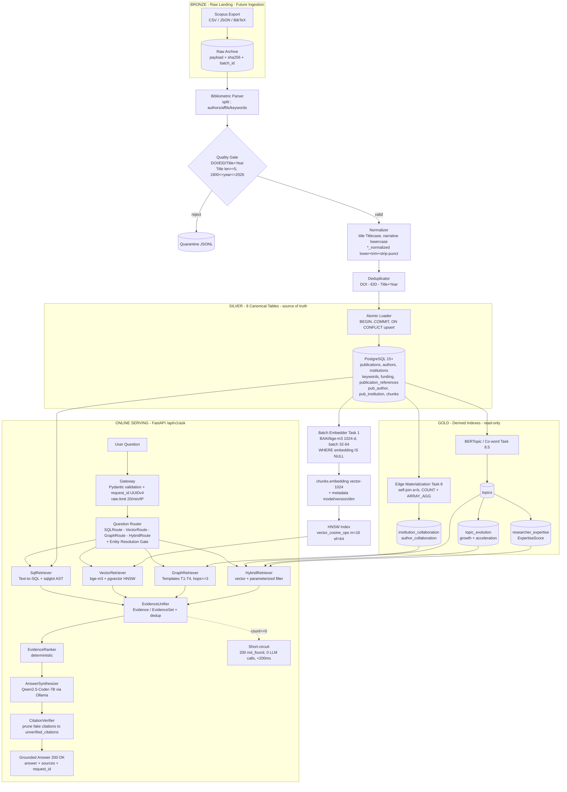

# Scopus Research Intelligence & STI Policy Intelligence Platform

> **AI-Bibliometrics — evidence-grounded Research Intelligence assistant over Scopus publications**
>
> Ask in natural language (ID/EN) — get factual, statistical, semantic, network, and policy answers grounded in real database records with verified `[Title, Year, DOI]` citations. Hallucination-free by design.
>
> | Meta | Value |
> |---|---|
> | **Architecture** | Hybrid Master: Bronze → Silver (9 canonical tables) → Gold (pgvector + 2 edge tables + 3 analytics tables) → 4-Route FastAPI RAG |
> | **API Contract** | `POST /api/v1/ask` + `GET /api/v1/health` (see `docs/06 Api Design.md`). Legacy `POST /api/query` is **SUPERSEDED** and must not be implemented. |
> | **Doc Status** | Consolidated Hybrid Master Blueprint · Synced: **2026-09-27** (`docs/01`–`docs/12` v3.6.0) |
> | **Implementation Status** | **Phase 0, Phase 1 & Phase 2 DONE.** PostgreSQL holds 9 canonical relational tables, 40 embedded chunks vector(1024) `BAAI/bge-m3` with active HNSW index, materialized collaboration edge tables, and a verified FastAPI gateway skeleton (`POST /api/v1/ask` & `GET /api/v1/health`) with async DB pool, tracing middleware, rate limiting, and structured logging (23 tests pass). **IN PROGRESS: Phase 3 (QueryRouter & Text-to-SQL Vertical Slice — green slice on `develop`).** |

**Table of Contents:** [1. Executive Summary](#1-executive-summary) · [2. Key Capabilities](#2-key-capabilities--features) · [3. Architecture](#3-end-to-end-system-architecture) · [4. Tech Stack](#4-tech-stack) · [5. Database & Pipeline](#5-database--data-pipeline-summary) · [6. Repo Structure & Doc Index](#6-repository-structure--documentation-index) · [7. Getting Started](#7-getting-started--setup) · [8. Roadmap & Status](#8-roadmap--implementation-status) · [9. Consistency Matrix](#9-cross-document-decision-consistency-matrix) · [10. Canonical Decisions](#10-canonical-architecture-decisions) · [11. Changelog](#11-changelog)

---

## 1. Executive Summary

### Vision

Build a **Scopus Research Intelligence & STI (Science, Technology & Innovation) Policy Intelligence Platform** enabling non-technical users — researchers, analysts, and research directors / policymakers — to explore the Scopus publication corpus through a single chat surface, and receive answers that are:

1. **Factually accurate** (counts, rankings, distributions verified against SQL over canonical Silver tables),
2. **Semantically deep** (conceptual discovery via multilingual vector search over `chunks.embedding`),
3. **Relation-aware** (collaboration networks via graph traversal over derived edge tables), and
4. **Policy-ready** (emerging-topic detection, expertise ranking, trend synthesis via Gold analytics).

### Dual-Track + Evidence Architecture

The system combines three complementary intelligence tracks behind one deterministic serving track:

```text
Structured Data (PostgreSQL Silver)  +  Semantic AI (pgvector bge-m3 HNSW)  +  Network/Policy Analytics (Gold)
                                          ──────────────────────────────────────────────────────────────────────────
                                                                                       │
                                                                           Evidence Objects (canonical grounding)
                                                                                       │
                                                                          Evidence-grounded LLM (Qwen2.5-Coder-7B, CPU)
```

| Track | Question type | Engine |
|---|---|---|
| **Structured / Factual** | *"Top 5 most productive authors in 2023?"*, *"Total citations for institution X?"* | `SQLRoute` → `SqlRetriever` (Text-to-SQL + `sqlglot` AST validation) over 9 Silver tables |
| **Semantic / Discovery** | *"Papers on oxidative stress in Wharton's jelly?"* | `VectorRoute` → `VectorRetriever` (`bge-m3` 1024-d + pgvector `<=>` HNSW on `chunks`, `DISTINCT ON (p.publication_id) LIMIT 8`, threshold gate $\ge 0.65$) |
| **Network / Relational** | *"Which institutions collaborate with AI researchers?"*, *"Co-authors of Author X?"* | `GraphRoute` → `GraphRetriever` (parameterized SQL templates T1–T4, `max_hops=3`) |
| **Policy / Trend Synthesis** | *"Stem-cell papers from Indonesian institutions after 2020 — what is emerging, who are the experts?"* | `HybridRoute` → `HybridRetriever` (vector + structured filters in one query) + Gold analytics (`topics`, `topic_evolution`, `researcher_expertise`) |

**Non-negotiable invariant:** no raw row / chunk / edge ever reaches the LLM. Everything is normalized into strict **Evidence Objects** (`Evidence` / `EvidenceSet`), deterministically ranked, framed as `UNTRUSTED DATA`, synthesized, then **post-hoc citation-verified**. Empty evidence short-circuits to `status: not_found` in <200 ms with **zero LLM calls** (`docs/03 §0.3`, `docs/05 §9–§12`).

---

## 2. Key Capabilities & Features

### 2.1 Bibliometric Intelligence (Factual / Statistical) — `SQLRoute`

- Top-N ranking, aggregation, distribution, and time filtering over the Silver layer (`publications`, `authors`, `institutions`, `keywords`, `funding`, `pub_author`, `pub_institution`, `publication_references`, `chunks`).
- Guardrails: `sqlglot` AST parse → mandatory `SELECT` root → table/column whitelist (`docs/04`) → destructive-keyword blacklist → **Aggregate-Shape Check** (aggregate intent must contain `COUNT/SUM/AVG/GROUP BY`) → **Double-Count Check** (`COUNT(DISTINCT publication_id)` on junction joins) → `LIMIT 50` for non-aggregates (`docs/05 §5.1`, `docs/02 FR3`).
- 1x retry with AST error context; persistent failure → `HTTP 422 { error_type: sql_generation_failed }`, never leaking raw DB errors.

### 2.2 Semantic Discovery & AI (Vector Search & RAG) — `VectorRoute`

- Multilingual conceptual search (ID/EN) over `chunks.embedding vector(1024)` (`BAAI/bge-m3`), HNSW `vector_cosine_ops` (`m=16, ef_construction=64`).
- Dedup guarantee: `DISTINCT ON (p.publication_id)` so `LIMIT 8` = **8 unique publications**, not overlapping chunks. Similarity threshold gate ($\ge 0.65$); below threshold → `status: not_found` (`docs/05 §5.2`, `docs/02 FR4`).

### 2.3 Collaboration Network Analysis (SQL-based Edge Tables) — `GraphRoute`

- Minimum-surface Knowledge Graph as derived PostgreSQL **edge tables** (no standalone graph DB in MVP):
  - `institution_collaboration(institution_a, institution_b, weight, via_publication_ids)` with `CHECK (institution_a < institution_b)`
  - `author_collaboration(author_a, author_b, weight, via_publication_ids)` with `CHECK (author_a < author_b)`
- Zero LLM-generated graph SQL. Only four parameterized templates: **T1** institution collaborators, **T2** co-authors, **T3** topic→institution composition, **T4** bounded recursive-CTE path search (`max_hops=3`, `LIMIT 50`). Every edge carries `via_publication_ids` provenance (`docs/04 §6`, `docs/05 §5.3`).

### 2.4 Emerging Topic & Expertise Engine (Director Analytics) — Gold Layer + `HybridRoute`

- **`topics`**: BERTopic / co-word clusters — `topic_name`, `cluster_keywords[10]`, `representation_vector vector(1024)` (HNSW), `total_publications`, `total_citations` (`docs/04 §7.1`).
- **`topic_evolution`**: yearly time-series per topic — `publication_count`, `citation_count`, `growth_score` (YoY), `citation_acceleration` (d²C/dt²), `recency_weight`, `is_emerging` flag (`docs/04 §7.2`).
- **`researcher_expertise`**: multi-dimensional weighted expertise per (author, topic) — `ExpertiseScore` with `relevance`, `productivity`, `impact`, `recency` components + `h_index_topic`, `publication_count_topic`, `citation_count_topic`, `coauthor_network_size` (`docs/04 §7.3`):

  $$\text{ExpertiseScore} = w_1\cdot\text{Relevance} + w_2\cdot\text{Productivity} + w_3\cdot\text{Impact} + w_4\cdot\text{Recency}$$

  Defaults: `w1=0.30`, `w2=0.25`, `w3=0.25`, `w4=0.20`. Score range `[0–100]`.

### 2.5 Evidence-Grounded AI Copilot (Hallucination-Free) — All Routes

- **Typed Question Router**: deterministic regex/keyword rules first (<50 ms); lightweight schema-constrained LLM fallback only when uncertain (~1.5s). Emits validated Pydantic `RouterOutput(route, reasoning, entities)` with `YearFilter(op ∈ {eq,gt,gte,lt,lte,between})`. **Entity Resolution Gate**: `lower+trim → exact → ILIKE`; 0 hits → `not_found`, >1 → `needs_clarification` + candidates, 1 → bind to canonical ID.
- **Evidence normalization** (`EvidenceUnifier`): SQL rows + vector chunks + graph edges → canonical `EvidenceSet`; dedup on `publication_id`; deterministic `EvidenceRanker`.
- **Grounded synthesis** (Qwen2.5-Coder-7B-Instruct via Ollama, CPU): context isolated from prompt (`=== BEGIN/END RETRIEVED EVIDENCE ===`), mandatory citations `[Title, Year, DOI]` / `[Title, Year, no-doi]`, contradictions surfaced.
- **Post-hoc `CitationVerifier`**: regex-extract citations, match against `EvidenceSet` (DOI + normalized title/year); hallucinations pruned to `unverified_citations` (`docs/05 §7`).

---

## 3. End-to-End System Architecture

### 3.1 Data Flow: Bronze → Silver → Gold (Offline) + Serving (Online)



### 3.2 Architecture Invariants (Must Not Be Violated)

| # | Invariant | Source |
|---|---|---|
| 1 | **Source-of-Truth**: Silver PostgreSQL is canonical. pgvector + edge tables + Gold analytics are derived read-only structures. | `docs/03 §0.3`, `docs/04 §1` |
| 2 | **Evidence Normalization**: no raw row/chunk/edge ever reaches the LLM; everything passes through `EvidenceUnifier` → `EvidenceSet`. | `docs/03 §0.3`, `docs/05 §4` |
| 3 | **Security**: `app_readonly` (SELECT-only) + `SET search_path=public` + `statement_timeout='10s'` per pool connection; retrieval text = `UNTRUSTED DATA`. | `docs/08 §1–§2` |
| 4 | **Zero-Hallucination**: 0 evidence → deterministic `not_found`/`insufficient_evidence`, no synthesis call. | `docs/03 §0.3`, `docs/05 §1` |

---

## 4. Tech Stack

| Layer | Choice (locked) | Rationale / Trade-off |
|---|---|---|
| **Language / Framework** | Python 3.11+, FastAPI (async), Pydantic v2, `asyncpg`/`psycopg3` | Mature RAG/SQL-AST/embedding ecosystem; async I/O for Ollama + PG; strict schema boundaries. |
| **LLM (self-hosted, CPU)** | `Qwen2.5-Coder-7B-Instruct` (GGUF Q4_K_M) via Ollama | Best-in-class 7B for Text-to-SQL + structured JSON on CPU (~25–35 tok/s, 5–10s synthesis). |
| **Embedding** | `BAAI/bge-m3`, 1024-dim float32 (locked version/commit + batch size 32–64) | Multilingual ID/EN; feasible batch-offline + single-query-online on CPU. |
| **Database & Search** | PostgreSQL 15+ + `pgvector` HNSW (`m=16, ef_construction=64`, `vector_cosine_ops`) | 9 pre-existing canonical tables; HNSW index on `chunks.embedding`. |
| **SQL Guard** | `sqlglot` AST validator | Parse → SELECT root → table/column whitelist → destructive blacklist → aggregate-shape check → double-count check → LIMIT 50. |
| **Analytics & NLP** | BERTopic / TF-IDF + scikit-learn, Pandas, NetworkX (offline) | Topic clustering, YoY growth/acceleration, weighted expertise scoring. |
| **Frontend** | Next.js (React) on Vercel — Clean White, Dense, Notion/Linear style | Monospace tabular data, collapsible sources, honest status, Dev-Mode SQL viewer. |
| **Deployment** | Docker Compose (`backend` + `ollama`) on 1 VPS | Simple, robust, self-hosted deployment. |

---

## 5. Database & Data Pipeline Summary

Full DDL, cleaning rules, and acceptance checklist: `docs/04` (+ pipeline narrative `docs/12`).

### 5.1 Silver Layer — 9 Canonical Relational Tables

| Table | Role | Key columns / Rules |
|---|---|---|
| `publications` | Core entity (22 columns) | `publication_id PK`, `title` (Titlecase), `abstract` (lowercase), `doi` (indexed, `10.xxxx/...`), `eid` (unique), `year SMALLINT NOT NULL indexed`, `citation_count INT DEFAULT 0`, `document_type/stage/open_access/language/publisher/source` (lowercase), `volume/issue/art_no/page_*` (raw) |
| `authors` | Author entity | `author_id PK`, `author_name` (display casing), `author_name_normalized` (`lower+strip-punct+trim`, indexed — **required for GROUP BY**) |
| `institutions` | Affiliation entity | `institution_id PK`, `institution_name` (display), `institution_name_normalized` (indexed), `city` + `country` (lowercase, `country` indexed) |
| `keywords` | 1:N keywords | `keyword_id BIGSERIAL PK`, `publication_id FK`, `keyword` (pure lowercase), `keyword_type` (`author keyword` / `index keyword`) |
| `funding` | 1:N funding | `funding_id BIGSERIAL PK`, `funding_agency` (display), `funding_agency_normalized` (indexed), `grant_number`, `funding_text` (lowercase) |
| `pub_author` | Junction | `PK(publication_id, author_id)`, `author_order SMALLINT` |
| `pub_institution` | Junction | `PK(publication_id, institution_id)` |
| `publication_references` | Raw 1:N citations | `reference_id BIGSERIAL PK`, `reference_order INT`, `reference_text TEXT` — **unlinked strings in MVP** |
| `chunks` | 1:N semantic units | `chunk_id BIGSERIAL PK`, `publication_id FK CASCADE`, `chunk_text TEXT`, `section DEFAULT 'title_abstract'` + vector columns below |

**Vector columns on `chunks`** (DONE, Task 1): `embedding vector(1024)`, `embedding_model DEFAULT 'BAAI/bge-m3'`, `embedding_version DEFAULT 'v1.0'`, `embedding_dimension DEFAULT 1024` + `idx_chunks_embedding_hnsw USING hnsw (embedding vector_cosine_ops) WITH (m=16, ef_construction=64)` + `idx_chunks_pub_id`.

---

## 6. Repository Structure & Documentation Index

### 6.1 File Tree (actual)

```text
AI-Bibliometrics/
├── README.md                    ← this file (Hybrid Master landing page)
├── docs/                        ← normative specs (docs/01–docs/12 v3.6.0)
│   ├── 01 PRD.md
│   ├── 02 SRD.md
│   ├── 03 System Architecture.md
│   ├── 04 Database Schema.md
│   ├── 05 Retrieval Rag Design.md
│   ├── 06 Api Design.md
│   ├── 07 UI Spec.md
│   ├── 08 Security.md
│   ├── 09 Tech Stack.md
│   ├── 10 Implementation Plan.md
│   ├── 11 Roadmap.md
│   └── 12 Data Pipeline.md
├── backend/app/                 ← DONE Phase 2: routers/, services/, models/, db/, core/
├── database/migrations/         ← DONE: Silver DDL, vector column, HNSW, edge tables, Gold
├── scripts/                     ← DONE: verify_schema.py (T0), embed_chunks.py (T1), build_edges.py (T8)
├── frontend/                    ← PLANNED (Task 11): Next.js chat UI per docs/07
├── docker/ + docker-compose.yml ← DONE: backend + ollama services
├── tests/                       ← DONE: router/SQL/vector/graph/evidence/answer/API suites
├── data/*_cleaned.csv           ← DONE: 9 cleaned prototype datasets
└── .env.example                 ← PLANNED template: DB URL, Ollama host, model IDs, timeouts (never commit .env)
```

### 6.2 Documentation Index (`docs/01`–`docs/12`)

| Doc | Title | Normatively defines |
|---|---|---|
| `01 PRD.md` | Product Requirements | Background, end-to-end MVP goals, internal-only scope, success metrics, risk table |
| `02 SRD.md` | System Requirements | FR0–FR7 (validation, routing, SQL/vector/synthesis/UI/relational) + NFR1–NFR6 (latency, grounding, security) |
| `03 System Architecture.md` | End-to-End Architecture v3.6.0 | Component topology, 4 data flows, invariants, Medallion staging, latency budget |
| `04 Database Schema.md` | Hybrid Master Blueprint v3.6.0 | 9-table Silver DDL, `chunks.embedding` + HNSW, 2 edge DDLs, 3 Gold DDLs, ERD |
| `05 Retrieval Rag Design.md` | RAG Design v3.6.0 | 4-route retrieval (SQL, Vector, Graph, Hybrid), `EvidenceObject`, prompt framing, CitationVerifier |
| `06 Api Design.md` | API Contract v3.6.0 (`/api/v1`) | `POST /api/v1/ask` + `GET /api/v1/health`, Pydantic schemas, `AskResponse` envelope |
| `07 UI Spec.md` | UI Spec v3.6.0 | Dense Notion/Linear-style 2-panel layout, tokens, route badges, collapsible sources, Dev-Mode |
| `08 Security.md` | Internal MVP Security | `app_readonly` role, SQL AST validation, parameterization, untrusted-data framing |
| `09 Tech Stack.md` | Tech Stack Rationale | PG + pgvector, FastAPI, Qwen2.5-Coder-7B, bge-m3, sqlglot, Next.js, Docker Compose |
| `10 Implementation Plan.md` | Build Order (Task 0–12) | Linear build tasks (T0 schema check through T12 E2E verification) |
| `11 Roadmap.md` | Phased Roadmap v3.6.0 | Phase 0–8 MVP deliverables, Phase 9–11 post-MVP/future roadmap, risk register |
| `12 Data Pipeline.md` | Pipeline Design v3.6.0 | Ingestion architecture, cleaning/casing matrix, deduplication, batch embedding, edge materialization |

---

## 7. Getting Started & Setup

Follow `docs/10` linearly for Tasks 0–3; do not skip ahead. Phase 0–2 code is already committed and verified.

### 7.1 Prerequisites & Environment Setup

- **Infra**: PostgreSQL 15+ provisioned (loaded with 9 canonical tables), 1 dev VM / Docker host (recommended 8 vCPU / 16 GB), Node 18+, Vercel account.
- **Tools**: Python 3.11+, Docker + Compose, Ollama binary, `psql`, Git.
- **Models (locked at setup)**: `qwen2.5-coder:7b-instruct` (Ollama), `BAAI/bge-m3`.

```bash
# Backend setup
python -m venv .venv
.venv\Scripts\activate          # Windows
pip install -r requirements.txt

# Run FastAPI dev server
uvicorn backend.app.main:app --host 0.0.0.0 --port 8000 --reload
```

### 7.2 Database Verification & Schema Init (Task 0)

```bash
python scripts/verify_schema.py  # SELECT table_name,column_name,data_type FROM information_schema.columns WHERE table_schema='public'
```

### 7.3 Ingestion Pipeline Execution (Task 1 + 8 + 8.5)

```bash
# 1. Chunk embedding generation (Task 1) — chunks.embedding vector(1024)
python scripts/embed_chunks.py --model BAAI/bge-m3 --batch-size 32 --resume

# 2. HNSW index on chunks
psql "$DB_URL" -c "CREATE INDEX IF NOT EXISTS idx_chunks_embedding_hnsw ON chunks USING hnsw (embedding vector_cosine_ops) WITH (m=16, ef_construction=64); ANALYZE chunks;"

# 3. Graph materialization (Task 8) — 2 edge tables, then re-grant
python scripts/build_edges.py
psql "$DB_URL" -c "GRANT SELECT ON ALL TABLES IN SCHEMA public TO app_readonly;"

# 4. Gold analytics (Task 8.5) — topics, topic_evolution, researcher_expertise
python scripts/build_topics.py && python scripts/score_expertise.py
```

---

## 8. Roadmap & Implementation Status

### 8.1 Build Tasks 0–12 (`docs/10`)

Pre-task **DONE** (outside Task 0–12 numbering, synced 2026-09-27): Database setup · Prototype database/data load · Data cleaning · Clean export (`data/*_cleaned.csv`, 9 files). Explicit NEXT: prepare embedding input → generate → store to pgvector → validate → similarity retrieval → RAG → E2E.

| Task | Scope | Status | Blocks |
|---|---|---|---|
| **Task 0 — Schema Check** | `verify_schema.py` vs 9 canonical tables | ✅ DONE | - |
| **Task 1 — Embedding Pipeline** | `ALTER chunks ADD embedding vector(1024)` + bge-m3 batch + HNSW | ✅ DONE | - |
| **Task 2 — Backend Skeleton + DB Layer** | FastAPI layout, `app_readonly` pool + timeouts, `GET /api/v1/health` | ✅ DONE | - |
| **Task 3 — Ollama Setup** | pull `qwen2.5-coder:7b-instruct`, isolated LLM client, health check | ✅ DONE | - |
| **Task 4 — Router + Entity Gate** | 4-class routing, Pydantic entity contracts, `needs_clarification` | ✅ IMPLEMENTED (Phase 3, green slice) | Task 6, 7, 8 |
| **Task 5 — SQL Generator + Validator** | Text-to-SQL over 9 tables, `sqlglot` checks, 1x retry | ✅ IMPLEMENTED (Phase 3, green slice) | Structured slice |
| **Task 6 — Vector Retriever** | Query embed + `<=>` over `chunks` + `DISTINCT ON` + threshold $\ge 0.65$ | ✅ IMPLEMENTED (Phase 4, green slice) | Semantic slice |
| **Task 7 — Evidence Layer Unifier** | `EvidenceUnifier` + `EvidenceRanker` + `EvidenceSet` + `EvidenceItem`, deterministic ranking, no raw-row-to-LLM | ✅ IMPLEMENTED (Phase 5, unit 21 + integration 9 + E2E mock 12) | Synthesis engine |
| **Task 8 — Graph Edge Tables** | Build 2 edge tables + T1–T4 templates + hop/limit clamps | ✅ DONE (Edge Tables) / PLANNED (T1–T4 Templates) | Network queries |
| **Task 8.5 — Gold Analytics** | `topics` + `topic_evolution` + `researcher_expertise` | ⬜ PLANNED (Phase 6) | Policy/expert synthesis |
| **Task 9 — Answer Synthesis** | Grounding prompt + `CitationVerifier` + deterministic short-circuit | ⬜ PLANNED | Grounded answers |
| **Task 10 — Full API** | wire `POST /api/v1/ask`, `AskResponse` with `evidence_objects` | ⬜ PLANNED | Frontend + E2E |
| **Task 11 — Frontend** | Next.js 2-panel UI, badges, all 6 states, Dev-Mode inspector | ⬜ PLANNED | Demo |
| **Task 12 — E2E Verification** | 12-query gate over prototype dataset + latency baseline | ⬜ PLANNED | **MVP sign-off** |

---

## 9. Cross-Document Decision Consistency Matrix

| Decision Area | Canonical Decision | Related Docs | Status |
|---|---|---|---|
| **Database** | PostgreSQL 15+ (provisioned & ready, internal credentials secured) | `01`, `02`, `03`, `04`, `08`, `09`, `10`, `11` | ALIGNED |
| **Vector storage** | `pgvector` HNSW (`m=16, ef_construction=64`, `vector_cosine_ops`) on `chunks.embedding vector(1024)` (DONE, Task 1) | `02`, `03`, `04`, `05`, `09`, `10`, `12` | ALIGNED |
| **Naming convention** | 9 standard canonical relational tables: `publications`, `authors`, `institutions`, `keywords`, `funding`, `pub_author`, `pub_institution`, `publication_references`, `chunks` | `01`, `02`, `03`, `04`, `05`, `06`, `10`, `11`, `12` | ALIGNED |
| **Data cleaning** | Bronze → Silver via Python scripts — **DONE** (cleaned output exported to `data/*_cleaned.csv`, 9 files; loaded into 9 Silver tables) | `01`, `04`, `10`, `12` | ALIGNED |
| **Lowercase normalization** | Narrative & categorical fields (`abstract`, `keyword`, `country`, etc.) stored full lowercase; display & original IDs preserved; `*_normalized` columns (`author_name_normalized`, `institution_name_normalized`, `funding_agency_normalized`) stored lowercase+trim+strip-punct for aggregation/search | `01`, `02`, `04`, `05`, `12` | ALIGNED |
| **Chunking** | Per-publication abstract granularity in `chunks`, `chunk_text` field, `section = 'title_abstract'` | `03`, `04`, `05`, `12` | ALIGNED |
| **Embedding** | `BAAI/bge-m3` (1024-dim, Float32) via `sentence-transformers`, batch 32–64, CPU-optimized, input `Title: {title}\nAbstract: {abstract}` (DONE, Task 1) | `01`, `02`, `03`, `04`, `05`, `09`, `10`, `12` | ALIGNED |
| **Retrieval** | Dynamic 4-Route: `SQLRoute` (Silver), `VectorRoute` (`chunks.embedding`), `GraphRoute` (Derived Edge T1–T4), `HybridRoute` (Gold Analytics + Silver) | `01`, `02`, `03`, `05`, `06`, `10`, `11` | ALIGNED |
| **Vector similarity gate** | Deterministic cosine-similarity threshold locked at $\ge 0.65$ for `BAAI/bge-m3`; below-threshold queries short-circuit to `status: not_found` | `02`, `03`, `05`, `06` | ALIGNED |
| **Citation format** | Deterministic 3-element standard: `[Title, Year, DOI]` when DOI exists, and `[Title, Year, no-doi]` when the paper has no DOI | `01`, `05`, `06`, `07` | ALIGNED |
| **Graph engine strategy** | MVP locked to parameterized PostgreSQL Recursive CTEs (T1–T4); post-MVP evaluation target is Apache AGE in Phase 9 | `03`, `04`, `09`, `11` | ALIGNED |
| **RAG context** | `UNTRUSTED DATA` framing, LLM purely synthesizes narrative & validates `EvidenceObject`, deterministic short-circuit on 0 evidence, post-hoc `CitationVerifier` | `02`, `03`, `05`, `06`, `07`, `08` | ALIGNED |
| **API contract** | `POST /api/v1/ask` (`AskRequest` & `AskResponse` with `evidence_objects`) + `GET /api/v1/health`. `/api/query` endpoint officially SUPERSEDED | `02`, `03`, `05`, `06`, `07`, `10`, `11` | ALIGNED |
| **Prototype dataset** | Small prototype dataset (~20 publications, 40 chunks, 138 authors, 107 institutions, 22 manuscript columns) for full end-to-end validation | `01`, `02`, `03`, `04`, `10`, `11`, `12` | ALIGNED |
| **Production-scale dataset** | Future target for large-scale Scopus ingestion (>100K publications) with automated batch pipeline, multi-tier deduplication, and async workers | `01`, `02`, `03`, `04`, `11`, `12` | ALIGNED |

---

## 10. Canonical Architecture Decisions

1. **No-DOI Citation Decision:**
   - *Decision:* Inline citation format uses the standard pattern `[Title, Year, DOI]` when a DOI is available, and `[Title, Year, no-doi]` when the publication has no DOI. This guarantees deterministic behavior for the `CitationVerifier` regex parser and the frontend parser without comma mis-parsing.
2. **Cosine Similarity Threshold Decision (`VectorRoute`):**
   - *Decision:* Cosine similarity threshold locked at $\ge 0.65$ for `BAAI/bge-m3`. Queries scoring $< 0.65$ route directly to `status: not_found`.
3. **Post-MVP Graph Engine Decision:**
   - *Decision:* MVP uses parameterized PostgreSQL Recursive CTEs (Templates T1–T4) over `institution_collaboration` and `author_collaboration` edge tables. For post-MVP (Phase 9), the system sets **Apache AGE** as the primary evaluation target because it integrates directly as a PostgreSQL extension without requiring separate graph-DB infrastructure.

---

## 11. Changelog

| Document | Changes | Rationale |
|---|---|---|
| `README.md` v3.6.2 | Sync `docs/01`–`docs/12` v3.6.2 language rule (narasi Indonesia, teknis Inggris, tanpa duplikasi bilingual) | Tetapkan aturan bahasa di semua docs; README tetap English canonical |
| `README.md` v3.6.1 | Restore canonical English technical terms (Tech Stack, Entity Resolution Gate, Aggregate-Shape Check, Double-Count Check, Source-of-Truth, Evidence Normalization, Zero-Hallucination, Edge Tables, Vertical Slice, etc.); update File Tree + Getting Started to Phase 0–2 DONE reality; sync Phase 3 IN PROGRESS | Fix awkward ID translations of EN canonical terms; align README with actual repo state 2026-09-29 |
| `README.md` v3.6.0 | Full Bahasa Indonesia sync; no technical decision changes | Language alignment 2026-09-27 |
| `README.md` v3.5.0 | Progress sync: cleaning + cleaned export DONE, vector storage PENDING explicit; bump `docs/01`–`docs/12` to v3.5.0 | Actual progress sync 2026-09-27 |
| `README.md` v3.4.0 | Restore all 9 Silver table names to standard names without `_cleaned` suffix | Naming alignment per project instruction |
| `README.md` v3.4.0 | Lock citation format (`no-doi`), cosine threshold $\ge 0.65$, and Apache AGE graph strategy | Close open decisions into canonical decisions |
| `README.md` v3.4.0 | Update Decision Consistency Matrix and Changelog | Guarantee cross-document consistency |
