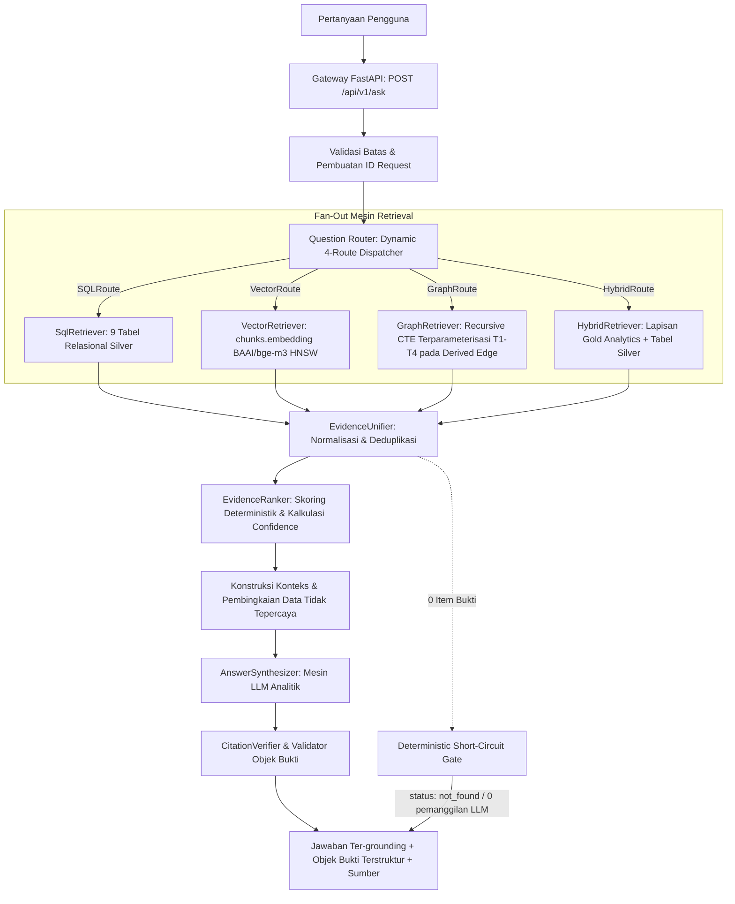

# Arsitektur Sistem — End-to-End (Hybrid Master Blueprint)

**Versi Dokumen:** 3.6.2 (Consolidated Hybrid Master Blueprint — aturan bahasa: narasi Indonesia, teknis Inggris)  
**Tanggal Status:** 2026-09-27  
**Menggantikan:** `03 System Architecture.md` Draft v2 s.d. v3.5.0  
**Konteks Otoritatif:** Selaras dengan `README.md` dan `docs/01` hingga `docs/12`  

> **Status Implementasi & Realitas Basis Data (Sinkronisasi Progress 2026-09-29):**  
> 1. **Database PostgreSQL:** Tim **sudah membuat database PostgreSQL**. Kredensial koneksi sudah tersedia secara internal (tidak diekspos di dokumentasi).  
> 2. **Dataset Prototipe:** Database memuat **dataset prototipe kecil** (22 kolom pada `publications`) untuk **validasi end-to-end (E2E)**.
> 3. **9 Tabel Relasional Silver:** Dataset prototipe ter-load pada 9 tabel kanonikal: `publications`, `authors`, `institutions`, `keywords`, `funding`, `pub_author`, `pub_institution`, `publication_references`, dan `chunks`.  
> 4. **Komponen Turunan (Phase 0–2 DONE):** Kolom vektor `chunks.embedding vector(1024)` + indeks HNSW (Task 1), 2 edge tables `institution_collaboration` dan `author_collaboration` (Task 8), kerangka FastAPI + DB pool + Ollama (Task 2–3) sudah DONE dan terverifikasi. 3 tabel Gold Analytics `topics`, `topic_evolution`, dan `researcher_expertise` (Task 8.5) masih PLANNED.  
> 5. **Cleaning & Export — DONE:** Data Scopus sudah dibersihkan dan berhasil di-export sebagai 9 file `data/*_cleaned.csv`. NEXT: Phase 3 Vertical Slice (`QuestionRouter` + `SqlRetriever`).

---

## 0. Arsitektur Target & Invariant Inti

### 0.1 Pipeline Target End-to-End
Arsitektur target mengalirkan pertanyaan pengguna secara linear dan deterministik dari antarmuka web hingga respons ter-grounding:



### 0.2 Lapisan Data Medallion & Pemisahan Dua Fase (Data Architecture & Phasing)

Arsitektur data memisahkan secara tegas dua fase rekayasa:
- **Fase Prototipe / Validasi E2E (Saat Ini):** Basis data PostgreSQL sudah aktif memuat **dataset prototipe kecil** pada 9 tabel relasional Silver (20 publikasi, 40 chunk, 138 author, 107 institusi, 344 keyword, 33 funding, 4.120 referensi). Tujuannya membuktikan seluruh flow end-to-end (Router → Retrieval 4 Rute → Evidence Unifier → LLM Synthesizer → Citation Verifier → API → UI) berfungsi sempurna dengan latensi terukur sebelum menangani dataset besar.
- **Fase Produksi / Skala Besar (Future):** Pipeline otomatisasi ingestion untuk ratusan ribu record Scopus dari berkas mentah (Bronze), pembersihan & deduplikasi multi-tier berkala, batch re-embedding bertahap, dan kalkulasi ulang Gold analytics.

Tingkatan data Medallion pada sistem ini:
1. **Bronze Layer (Raw Staging - Future/Production):** Berkas arsip ekspor mentah Scopus yang immutable beserta hash SHA-256 untuk auditability dan re-ingestion (`docs/12 Data Pipeline.md`).
2. **Silver Layer (Canonical Relational Storage - 9 Tabel Prototipe + 2 Edge Tables):** Sumber kebenaran terstruktur kanonikal yang telah dibersihkan dan dinormalisasi:
   - 9 Tabel Relasional: `publications`, `authors`, `institutions`, `keywords`, `funding`, `pub_author`, `pub_institution`, `publication_references`, dan `chunks`.
   - 2 Derived Edge Tables (PLANNED, Task 8): `institution_collaboration` dan `author_collaboration` yang dimaterialisasi secara idempoten dari `pub_institution` dan `pub_author`.
3. **Gold Layer (Analytics & Intelligence - 3 Tabel - PLANNED, Task 8.5):** Tabel analitik derivatif untuk mendukung sintesis kebijakan:
   - `topics`: Klaster topik BERTopic dan representasi vektor 1024-dimensi.
   - `topic_evolution`: Metrik time-series tahunan, growth score, dan citation acceleration.
   - `researcher_expertise`: Pemeringkatan kepakaran peneliti multi-dimensi terbobot ($\text{ExpertiseScore} = w_1 \cdot \text{Relevance} + w_2 \cdot \text{Productivity} + w_3 \cdot \text{Impact} + w_4 \cdot \text{Recency}$).

### 0.3 Invarian Arsitektur Wajib (Architectural Invariants)
1. **Source of Truth Invariant**: PostgreSQL adalah satu-satunya sumber kebenaran kanonikal. Ekstensi `pgvector`, edge tables, dan Gold tables adalah struktur turunan (*derived structures*) yang selalu disinkronkan dari tabel Silver.
2. **Strict Grounding & Evidence Object Enforcement**: LLM berfungsi murni sebagai **mesin sintesis analitik naratif, BUKAN sumber angka mentah atau statistik**. Setiap fakta numerik wajib dibungkus dalam `EvidenceObject` terstruktur (`claim`, `metric`, `value`, `period`, `sources`, `confidence`) yang ditarik langsung dari database.
3. **Security Invariant**: Akses database aplikasi runtime FastAPI wajib menggunakan role `app_readonly` dengan izin `SELECT` saja, `SET search_path = public`, dan `statement_timeout = '10s'`. Seluruh teks publikasi yang ditarik diperlakukan sebagai **DATA TIDAK TERPERCAYA (UNTRUSTED DATA)**.
4. **Zero-Hallucination Invariant**: Jika retrieval menghasilkan 0 item bukti, sistem wajib mengembalikan `status: not_found` secara deterministik dalam waktu < 200ms tanpa memanggil LLM.

---

## 1. Topologi Komponen Tingkat Tinggi

```
┌─────────────────────────────────┐           HTTPS            ┌──────────────────────────────────────────────┐
│        Next.js Frontend         │ ─────────────────────────> │             FastAPI Backend API              │
│   (Putih Bersih, Padat,             │ <───────────────────────── │       (Inti Aplikasi Python Async)         │
│      gaya Notion/Linear)            │        JSON Response       └──────────────────────────────────────────────┘
└─────────────────────────────────┘                                                   │
                                                       ┌───────────────────────────────┼───────────────────────────────┐
                                                       ▼                               ▼                               ▼
                                               ┌───────────────┐               ┌───────────────┐               ┌───────────────┐
                                                │Question Router  │               │ Ollama Lokal  │               │ Embed Lokal   │
                                               │   (4 Rute)  │               │(Qwen2.5-Coder │               │ (BAAI/bge-m3, │
                                               │               │               │  7B-Instruct) │               │   1024 dims)  │
                                               └───────────────┘               └───────────────┘               └───────────────┘
                                                       │                               │                               │
                                                       └───────────────────────┬───────┴───────────────────────────────┘
                                                                               ▼
                                               ┌───────────────────────────────────────────────────────────────┐
                                               │               Database PostgreSQL                             │
                                               │  • Silver: 9 Tabel Relasional Kanonikal                       │
                                               │  • Derived Edge: institution/author_collaboration (PLANNED)  │
                                               │  • Gold Analytics: topics, topic_evolution, exp (PLANNED)     │
                                               │  • Lapisan Semantik pgvector: chunks.embedding (PLANNED)        │
                                               │  • Peran Koneksi Terpaksa: app_readonly (hanya SELECT)       │
                                               └───────────────────────────────────────────────────────────────┘
```

---

## 2. Spesifikasi Rute & Komponen Retrieval

| Rute RAG | Lapisan Data Target | Strategi Eksekusi & Validasi | Jenis Objek Bukti yang Dihasilkan |
|---|---|---|---|
| **`SQLRoute`** | Silver Relasional (`publications`, `authors`, `institutions`, `funding`, `keywords`, `pub_author`, `pub_institution`, `publication_references`) | Text-to-SQL $\rightarrow$ Validasi AST `sqlglot` $\rightarrow$ Penegakan `LIMIT 50`. | `publication_count`, `citation_count`, total pendanaan. |
| **`VectorRoute`** | Silver Vector (`chunks.embedding vector(1024)`) JOIN `publications` | Embedding kueri `BAAI/bge-m3` $\rightarrow$ Kosinus HNSW $\rightarrow$ `DISTINCT ON (publication_id) LIMIT 8`. Gerbang kosinus $\ge 0.65$. | Ringkasan abstrak ilmiah, kemiripan semantik, tautan DOI. |
| **`GraphRoute`** | Derived Edge (`institution_collaboration`, `author_collaboration`) | Recursive CTE Terparameterisasi (Templat T1–T4) $\rightarrow$ Kedalaman `max_hops = 3`. | Bukti kolaborasi institusi/penulis via `via_publication_ids`. |
| **`HybridRoute`** | Gold Analytics (`topics`, `topic_evolution`, `researcher_expertise`) + Silver & `chunks` | Gabungan (join) analitik multi-tabel terparameterisasi $\rightarrow$ Ekstraksi metrik deret waktu & skor kepakaran. | `growth_score`, `citation_acceleration`, `expertise_score` terbobot ($w_1\text{--}w_4$). |

---

## 3. Kebutuhan Non-Fungsional (Verifikasi NFR)

1. **NFR1: Anggaran Latensi Kueri (Khusus CPU)**:
   - `SQLRoute` & `GraphRoute`: $\le 500\text{ ms}$
   - `VectorRoute`: $\le 1.5\text{ detik}$
   - `HybridRoute` (Gold Analytics): $\le 1.0\text{ detik}$
    - Sintesis LLM (`Qwen2.5-Coder-7B` CPU): $\sim 5\text{–}10\text{ detik}$
    - Total End-to-End: $\le 15\text{ detik}$ (dengan indikator progres pada UI).
2. **NFR2: Keter-groundingan Ketat (Strict Groundedness)**:
   - 100% fakta statistik dan sitasi terikat pada bukti database melalui `EvidenceObject` dan verifikasi `CitationVerifier`. Format sitasi baku: `[Judul, Tahun, DOI]` jika ada DOI, dan `[Judul, Tahun, no-doi]` jika naskah tanpa DOI.
3. **NFR3: Ketertelusuran & Silsilah Data (Auditability & Lineage)**:
   - Setiap respons menyertakan `request_id` (UUIDv4) dan array `sources` yang dapat ditelusuri balik ke record publikasi kanonikal.
4. **NFR4: Keamanan Hak Minimum (Least Privilege Security)**:
   - Isolasi runtime database dengan peran `app_readonly`, statement timeout 10 detik, dan search path terkunci.

---

## 4. Matriks Konsistensi Keputusan (Lintas Dokumen)

| Area Keputusan | Keputusan Kanonikal | Dokumen Terkait | Status |
|---|---|---|---|
| **Database** | PostgreSQL 15+ (sudah dibuat & siap pakai, kredensial internal aman) | `01`, `02`, `03`, `04`, `08`, `09`, `10`, `11` | ALIGNED |
| **Vector Storage** | `pgvector` HNSW (`m=16, ef_construction=64`, `vector_cosine_ops`) pada `chunks.embedding vector(1024)` (DONE, Task 1) | `02`, `03`, `04`, `05`, `09`, `10`, `12` | ALIGNED |
| **Konvensi penamaan** | 9 tabel relasional kanonikal standar: `publications`, `authors`, `institutions`, `keywords`, `funding`, `pub_author`, `pub_institution`, `publication_references`, `chunks` | `01`, `02`, `03`, `04`, `05`, `06`, `10`, `11`, `12` | ALIGNED |
| **Pembersihan data (cleaning)** | Bronze → Silver via script Python — **DONE** (hasil pembersihan ter-export di `data/*_cleaned.csv`, 9 file; sudah ter-load di 9 tabel Silver) | `01`, `04`, `10`, `12` | ALIGNED |
| **Normalisasi lowercase** | Naratif & kategorikal (`abstract`, `keyword`, `country`, dll.) disimpan full lowercase; tampilan & ID asli dipertahankan; kolom `*_normalized` (`author_name_normalized`, `institution_name_normalized`, `funding_agency_normalized`) disimpan lowercase+trim+strip-punct untuk agregasi/pencarian | `01`, `02`, `04`, `05`, `12` | ALIGNED |
| **Chunking** | Granularitas abstrak per publikasi pada tabel `chunks`, field `chunk_text`, `section = 'title_abstract'` | `03`, `04`, `05`, `12` | ALIGNED |
| **Embedding** | `BAAI/bge-m3` (1024-dim, Float32) via `sentence-transformers`, batch 32–64, CPU-optimized, input `Title: {title}\nAbstract: {abstract}` (DONE, Task 1) | `01`, `02`, `03`, `04`, `05`, `09`, `10`, `12` | ALIGNED |
| **Retrieval** | Dynamic 4-Route: `SQLRoute` (Silver), `VectorRoute` (`chunks.embedding`), `GraphRoute` (Derived Edge T1–T4), `HybridRoute` (Gold Analytics + Silver) | `01`, `02`, `03`, `05`, `06`, `10`, `11` | ALIGNED |
| **Vector Similarity Gate** | Cosine similarity threshold dikunci deterministik $\ge 0.65$ untuk model `BAAI/bge-m3`; kueri di bawah ambang → short-circuit ke `status: not_found` | `02`, `03`, `05`, `06` | ALIGNED |
| **Format sitasi** | Standar deterministik 3-elemen: `[Judul, Tahun, DOI]` jika ada DOI, dan `[Judul, Tahun, no-doi]` jika naskah tanpa DOI | `01`, `05`, `06`, `07` | ALIGNED |
| **Graph Engine Strategy** | MVP dikunci menggunakan parameterized PostgreSQL Recursive CTE (T1–T4); evaluasi pasca-MVP menggunakan Apache AGE pada Fase 9 | `03`, `04`, `09`, `11` | ALIGNED |
| **Konteks RAG** | Pembingkaian `UNTRUSTED DATA`, LLM murni menyintesis narasi & memvalidasi `EvidenceObject`, short-circuit deterministik pada 0 bukti, `CitationVerifier` post-hoc | `02`, `03`, `05`, `06`, `07`, `08` | ALIGNED |
| **Kontrak API** | `POST /api/v1/ask` (`AskRequest` & `AskResponse` dengan `evidence_objects`) + `GET /api/v1/health`. Endpoint `/api/query` resmi SUPERSEDED | `02`, `03`, `05`, `06`, `07`, `10`, `11` | ALIGNED |
| **Dataset prototipe** | Dataset prototipe kecil (~20 publikasi, 40 chunk, 138 author, 107 institusi, 22 kolom naskah) untuk validasi end-to-end lengkap | `01`, `02`, `03`, `04`, `10`, `11`, `12` | ALIGNED |
| **Dataset skala produksi** | Target masa depan untuk ingestion Scopus skala besar (>100K publikasi) dengan pipeline batch otomatis, deduplikasi multi-tier, dan worker async | `01`, `02`, `03`, `04`, `11`, `12` | ALIGNED |

---

## 5. Keputusan Arsitektur Kanonikal

1. **No-DOI Citation Decision:**
   - *Keputusan:* Format sitasi inline menggunakan pola baku `[Judul, Tahun, DOI]` jika DOI tersedia, dan `[Judul, Tahun, no-doi]` jika publikasi tidak memiliki DOI. Pola ini menjamin regex parser `CitationVerifier` dan parser frontend bekerja deterministik tanpa salah tafsir koma.
2. **Cosine Similarity Threshold Decision (`VectorRoute`):**
   - *Keputusan:* Nilai cosine similarity threshold dikunci pada $\ge 0.65$ untuk model `BAAI/bge-m3`. Kueri dengan nilai $< 0.65$ langsung diarahkan ke `status: not_found`.
3. **Post-MVP Graph Engine Decision:**
   - *Keputusan:* MVP menggunakan Recursive CTE Terparameterisasi PostgreSQL (Templat T1–T4) pada tabel edge `institution_collaboration` dan `author_collaboration`. Untuk fase pasca-MVP (Fase 9), sistem menetapkan **Apache AGE** sebagai target evaluasi utama karena terintegrasi langsung sebagai ekstensi PostgreSQL tanpa memerlukan infrastruktur instance database graf terpisah.

---

## 6. Riwayat Perubahan

| Dokumen | Perubahan | Alasan |
|---|---|---|
| `docs/03 System Architecture.md` v3.6.2 | Aturan bahasa: narasi Indonesia, teknis Inggris (`Question Router`, `Short-Circuit Gate`, `Vector Similarity Gate`, dll); sync status Phase 0–2 DONE | Tanpa duplikasi bilingual; perbaiki terjemahan literal yang aneh |
| `docs/03 System Architecture.md` v3.6.0 | Sinkronisasi Bahasa Indonesia; tanpa perubahan keputusan teknis | Penyelarasan bahasa 2026-09-27 |
| `docs/03 System Architecture.md` v3.5.0 | Menandai cleaning + cleaned export sebagai DONE; menandai vector storage sebagai PENDING eksplisit | Sinkronisasi progress aktual 2026-09-27 |
| `docs/03 System Architecture.md` v3.4.0 | Menyeragamkan seluruh komponen dan diagram ke nama tabel kanonikal tanpa akhiran `_cleaned` | Penyelarasan format penamaan sesuai instruksi project |
| `docs/03 System Architecture.md` v3.4.0 | Mengunci keputusan threshold kosinus $\ge 0.65$, sitasi `[Judul, Tahun, no-doi]`, dan strategi graf Apache AGE | Menutup open decision menjadi keputusan kanonikal |
| `docs/03 System Architecture.md` v3.4.0 | Memperbarui Matriks Konsistensi Keputusan dan Riwayat Perubahan | Menjamin konsistensi format dan keputusan di seluruh repository |
