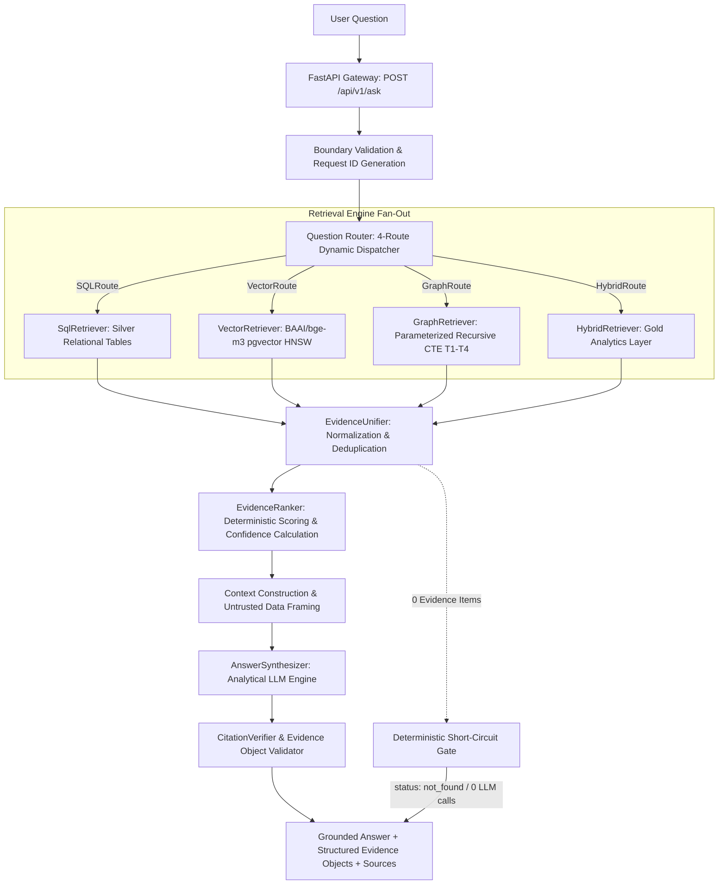

# System Architecture — End to End (Hybrid Master Blueprint)

**Document Version:** 3.2.0 (Consolidated Hybrid Master Blueprint)  
**Status Date:** 2026-09-28  
**Supersedes:** `03 System Architecture.md` Draft v2 s.d. v3.0.0  
**Authoritative Context:** Aligned with `README.md` and `docs/00` through `docs/12`  

> **Status Implementasi (Verifikasi Repositori 2026-09-28):**  
> Repositori saat ini hanya berisi dokumentasi Markdown (`README.md` dan `docs/00–12`). Direktori `backend/`, `frontend/`, `database/`, `scripts/`, `docker/`, dan `tests/` belum ada. Seluruh arsitektur sistem, 4 rute RAG, dan lapisan analitik Gold di bawah ini berstatus **PLANNED / NOT IMPLEMENTED** dan mendefinisikan target rekayasa sistem yang normatif.

---

## 0. Target Architecture & Core Invariants

### 0.1 Target End-to-End Pipeline
Arsitektur target mengalirkan pertanyaan pengguna secara linear dan deterministik dari antarmuka web hingga respons ter-grounding:



### 0.2 Lapisan Data Medallion (Data Storage Architecture)
Sistem menstrukturkan data ke dalam 3 tingkatan Medallion di PostgreSQL:
1. **Bronze Layer (Raw Staging)**: Berkas arsip ekspor mentah Scopus yang immutable beserta hash SHA-256 untuk auditability dan re-ingestion.
2. **Silver Layer (Canonical Relational Storage - 9 Tabel + 2 Edge Tables)**: Sumber kebenaran terstruktur (`publications`, `authors`, `institutions`, `keywords`, `funding`, `pub_author`, `pub_institution`, `publication_references`, `chunks`) ditambah 2 tabel edge kolaborasi (`institution_collaboration`, `author_collaboration`).
3. **Gold Layer (Analytics & Intelligence - 3 Tabel)**: Tabel analitik derivatif berkinerja tinggi untuk mendukung sintesis kebijakan:
   - `topics`: Klaster topik BERTopic dan representasi vektor 1024-dimensi.
   - `topic_evolution`: Metrik time-series tahunan, growth score, dan citation acceleration.
   - `researcher_expertise`: Pemeringkatan kepakaran peneliti multi-dimensi terbobot ($\text{ExpertiseScore} = w_1 \cdot \text{Relevance} + w_2 \cdot \text{Productivity} + w_3 \cdot \text{Impact} + w_4 \cdot \text{Recency}$).

### 0.3 Invarian Arsitektur Wajib (Architectural Invariants)
1. **Source of Truth Invariant**: PostgreSQL adalah satu-satunya sumber kebenaran kanonikal. Ekstensi `pgvector`, edge tables, dan Gold tables adalah struktur turunan (*derived structures*) yang selalu disinkronkan dari tabel Silver.
2. **Strict Grounding & Evidence Object Enforcement**: LLM berfungsi murni sebagai **mesin sintesis analitik naratif, BUKAN sumber angka mentah atau statistik**. Setiap fakta numerik wajib dibungkus dalam `EvidenceObject` terstruktur (`claim`, `metric`, `value`, `period`, `sources`, `confidence`) yang ditarik langsung dari database.
3. **Security Invariant**: Akses database aplikasi runtime FastAPI wajib menggunakan role `app_readonly` dengan izin `SELECT` saja, `SET search_path = public`, dan `statement_timeout = '10s'`. Seluruh teks publikasi yang ditarik diperlakukan sebagai **DATA TIDAK TERPERCAYA (UNTRUSTED DATA)**.
4. **Zero-Hallucination Invariant**: Jika retrieval menghasilkan 0 item bukti, sistem wajib mengembalikan `status: not_found` secara deterministik dalam waktu < 200ms tanpa memanggil LLM.

---

## 1. High-Level Component Topology

```
┌─────────────────────────────────┐           HTTPS            ┌──────────────────────────────────────────────┐
│        Next.js Frontend         │ ─────────────────────────> │             FastAPI Backend API              │
│   (Clean White, Dense Layout,   │ <───────────────────────── │       (Async Python Application Core)        │
│      Notion/Linear-Style)       │        JSON Response       └──────────────────────────────────────────────┘
└─────────────────────────────────┘                                                   │
                                                      ┌───────────────────────────────┼───────────────────────────────┐
                                                      ▼                               ▼                               ▼
                                              ┌───────────────┐               ┌───────────────┐               ┌───────────────┐
                                              │Question Router│               │ Local Ollama  │               │ Local Embed   │
                                              │   (4 Routes)  │               │(Qwen2.5-Coder │               │ (BAAI/bge-m3, │
                                              │               │               │  7B-Instruct) │               │   1024 dims)  │
                                              └───────────────┘               └───────────────┘               └───────────────┘
                                                      │                               │                               │
                                                      └───────────────────────┬───────┴───────────────────────────────┘
                                                                              ▼
                                              ┌───────────────────────────────────────────────────────────────┐
                                              │               PostgreSQL Database (Supabase)                  │
                                              │  • Silver: 9 Canonical Relational Tables                      │
                                              │  • Derived Edges: institution/author_collaboration            │
                                              │  • Gold Analytics: topics, topic_evolution, expertise         │
                                              │  • pgvector Semantic Layer: chunks.embedding (HNSW Index)     │
                                              │  • Enforced Connection Role: app_readonly (SELECT only)       │
                                              └───────────────────────────────────────────────────────────────┘
```

---

## 2. Spesifikasi Rute & Komponen Retrieval

| Rute RAG | Lapisan Data Target | Strategi Eksekusi & Validasi | Tipe Objek Bukti yang Dihasilkan |
|---|---|---|---|
| **`SQLRoute`** | Silver Relational (`publications`, `authors`, `institutions`, `funding`) | Text-to-SQL $\rightarrow$ Validasi AST `sqlglot` $\rightarrow$ Enforce `LIMIT 50`. | `publication_count`, `citation_count`, total pendanaan. |
| **`VectorRoute`** | Silver Vector (`chunks.embedding vector(1024)`) | Embedding kueri `BAAI/bge-m3` $\rightarrow$ HNSW Cosine $\rightarrow$ `DISTINCT ON (publication_id) LIMIT 8`. | Ringkasan abstrak ilmiah, kemiripan semantik, tautan DOI. |
| **`GraphRoute`** | Derived Edges (`institution_collaboration`, `author_collaboration`) | Parameterized Recursive CTE (Templat T1–T4) $\rightarrow$ Depth `max_hops = 3`. | Bukti kolaborasi institusi/penulis via `via_publication_ids`. |
| **`HybridRoute`** | Gold Analytics (`topics`, `topic_evolution`, `researcher_expertise`) + Silver & Vector | Join analitik multi-tabel terparameterisasi $\rightarrow$ Ekstraksi metrik time-series & skor kepakaran. | `growth_score`, `citation_acceleration`, `expertise_score` terbobot ($w_1\text{--}w_4$). |

---

## 3. Non-Functional Requirements (NFR Verification)

1. **NFR1: Query Latency Budget (CPU-Only)**:
   - `SQLRoute` & `GraphRoute`: $\le 500\text{ ms}$
   - `VectorRoute`: $\le 1.5\text{ detik}$
   - `HybridRoute` (Gold Analytics): $\le 1.0\text{ detik}$
   - LLM Synthesis (`Qwen2.5-Coder-7B` CPU): $\sim 5\text{–}10\text{ detik}$
   - Total End-to-End: $\le 15\text{ detik}$ (dengan streaming/progress indicator pada UI).
2. **NFR2: Strict Groundedness**:
   - 100% fakta statistik dan sitasi terikat pada bukti database melalui `EvidenceObject` dan verifikasi `CitationVerifier`.
3. **NFR3: Auditability & Lineage**:
   - Setiap respons menyertakan `request_id` (UUIDv4) dan array `sources` yang dapat ditelusuri balik ke record publikasi kanonikal.
4. **NFR4: Least Privilege Security**:
   - Isolasi runtime database dengan role `app_readonly`, statement timeout 10 detik, dan search path terkunci.
