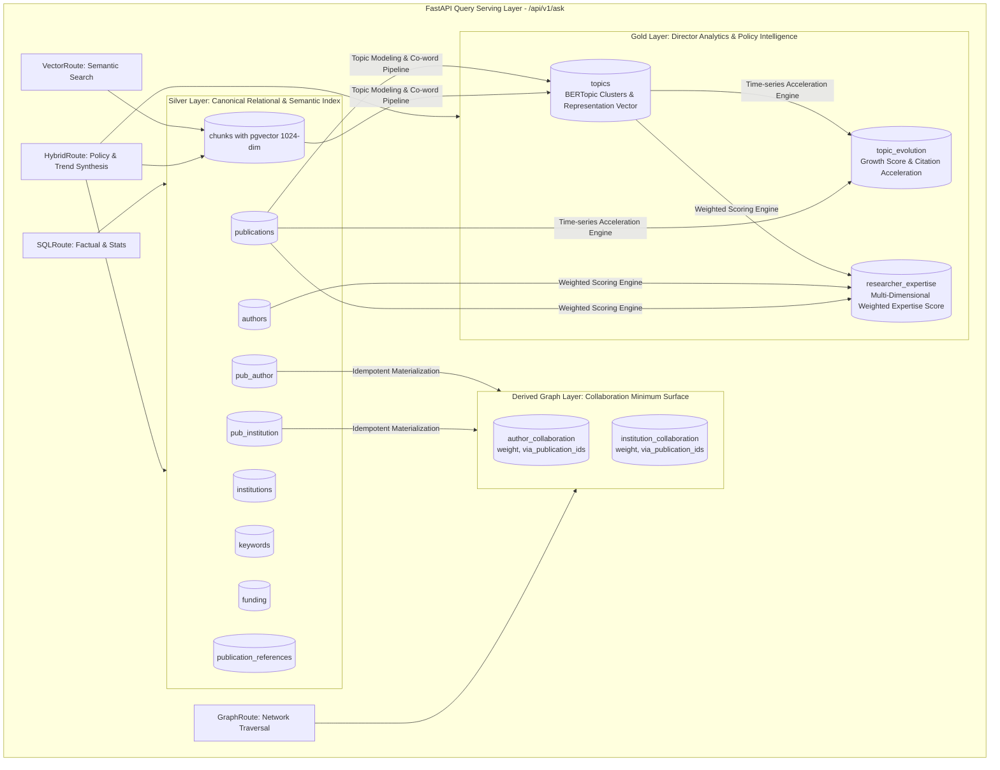

# Database Schema — Arsitektur Data & Spesifikasi Skema Kanonikal (Hybrid Master Blueprint)

**Document Version:** 3.2.0 (Consolidated Hybrid Master Blueprint)  
**Status Date:** 2026-09-28  
**Supersedes:** `04 Database Schema.md` Draft v1 s.d. v3.0.0  
**Authoritative Context:** Aligned with `README.md` and `docs/00` through `docs/12`  

> **Status Implementasi & Sumber Kebenaran (Verifikasi Repositori 2026-09-28):**  
> Repositori saat ini berada pada tahap perancangan arsitektur (*documentation-only*). Data publikasi ilmiah 9 tabel relasional Silver Layer dilaporkan telah dimuat pada instance eksternal Supabase PostgreSQL, namun **Task 0 (Audit Skema via `information_schema.columns`) belum dijalankan** dari repositori ini. Kolom `chunks.embedding vector(1024)` (Task 1), 2 tabel edge derivatif kolaborasi (Task 8), serta 3 tabel Gold Analytics (`topics`, `topic_evolution`, `researcher_expertise`) berstatus **PLANNED / NOT IMPLEMENTED**. Seluruh DDL, constraint, formula keahlian, dan indeks di bawah ini merupakan **kontrak rekayasa data normatif**.

---

## 1. Purpose & Medallion Data Architecture

Dokumen ini mendefinisikan arsitektur basis data relasional, representasi vektor (*pgvector*), struktur graf derivatif (*Knowledge Graph Minimum Surface*), dan lapisan analitik tingkat lanjut (**Gold Layer**) untuk sistem **Research Intelligence Assistant**.

Arsitektur data mengadopsi pola **Medallion Data Architecture**:
1. **Bronze Layer (Staging)**: Arsip berkas mentah Scopus (CSV/JSON/BibTeX) yang immutable untuk reproduktibilitas data dan audit log (`docs/12 Data Pipeline.md`).
2. **Silver Layer (Canonical Relational Storage - 9 Tabel)**: Sumber kebenaran terstruktur (*canonical source of truth*) yang telah dibersihkan, dinormalisasi, dan di-deduplikasi untuk menyimpan metadata naskah, penulis, institusi, kata kunci, pendanaan, dan chunk teks.
3. **Derived Graph Layer (2 Edge Tables)**: Struktur graf kolaborasi berbobot (*weighted collaboration edge tables*) yang dimaterialisasi secara idempoten dari tabel relasional Silver untuk mendukung penelusuran multi-hop berlatensi rendah.
4. **Gold Layer (Advanced Bibliometrics & Intelligence - 3 Tabel)**: Tabel analitik derivatif berkinerja tinggi yang menyimpan klaster topik naskah (*BERTopic clusters*), metrik akselerasi tren waktu (*topic evolution time-series*), serta pemeringkatan kepakaran peneliti multi-dimensi (*researcher expertise scoring*).

---

## 2. Arsitektur Basis Data End-to-End



---

## 3. Matriks Status Implementasi (Current vs Target Schema)

| Komponen / Tabel | Layer Arsitektur | Status Saat Ini | Target Phase | Keterangan Kesiapan Rekayasa |
|---|---|---|---|---|
| `publications` | Silver (Core) | `CURRENT` (di Supabase) | Phase 0 | 18 kolom metadata bibliometrik; perlu audit Task 0. |
| `authors` | Silver (Core) | `CURRENT` (di Supabase) | Phase 0 | Menyimpan nama display dan `author_name_normalized`. |
| `institutions` | Silver (Core) | `CURRENT` (di Supabase) | Phase 0 | Menyimpan nama display, normalized, city, dan country. |
| `keywords` | Silver (Core) | `CURRENT` (di Supabase) | Phase 0 | Menyimpan keyword lowercase dan `keyword_type`. |
| `funding` | Silver (Core) | `CURRENT` (di Supabase) | Phase 0 | Menyimpan nama agensi, normalized, grant number, dan teks. |
| `pub_author` | Silver (Junction) | `CURRENT` (di Supabase) | Phase 0 | Relasi publikasi-penulis beserta `author_order`. |
| `pub_institution` | Silver (Junction) | `CURRENT` (di Supabase) | Phase 0 | Relasi publikasi-institusi. |
| `publication_references` | Silver (1:N) | `CURRENT` (di Supabase) | Phase 0 | String sitasi mentah (`reference_text`); status *unlinked*. |
| `chunks` (Teks) | Silver (1:N) | `CURRENT` (di Supabase) | Phase 0 | Teks judul & abstrak untuk embedding. |
| `chunks.embedding` | Silver (Vector) | `PLANNED / NOT IMPLEMENTED` | Phase 3 (Task 1) | `vector(1024)` BAAI/bge-m3; HNSW (`m=16, ef=64`). |
| `institution_collaboration` | Derived Edge | `PLANNED / NOT IMPLEMENTED` | Phase 6 (Task 8) | Edge table kolaborasi institusi dengan `via_publication_ids`. |
| `author_collaboration` | Derived Edge | `PLANNED / NOT IMPLEMENTED` | Phase 6 (Task 8) | Edge table co-authorship dengan `via_publication_ids`. |
| `topics` | Gold (Analytics) | `PLANNED / NOT IMPLEMENTED` | Phase 6 (Task 8.5) | Klaster topik BERTopic, kata kunci representatif, & vektor. |
| `topic_evolution` | Gold (Analytics) | `PLANNED / NOT IMPLEMENTED` | Phase 6 (Task 8.5) | Time-series tahunan, growth score, dan citation acceleration. |
| `researcher_expertise` | Gold (Analytics) | `PLANNED / NOT IMPLEMENTED` | Phase 6 (Task 8.5) | Skor kepakaran terbobot multi-faktor ($w_1, w_2, w_3, w_4$). |
| Dedicated Graph DB (Neo4j/AGE) | External Graph | `POST-MVP / OPEN DECISION` | Phase 9 (Post-MVP) | Evaluasi engine graf dedicated setelah baseline SQL stabil. |

---

## 4. Silver Layer: Entitas Relasional Kanonikal (9 Tabel)

### 4.1 Tabel `publications` (Entitas Inti Publikasi)
| Nama Kolom | Tipe Data | Constraint | Deskripsi & Aturan Normalisasi |
|---|---|---|---|
| `publication_id` | `VARCHAR(64)` / `BIGINT` | `PRIMARY KEY` | Identifier unik kanonikal publikasi (Scopus ID atau internal hash). |
| `title` | `TEXT` | `NOT NULL` | Judul publikasi dalam format **Titlecase** (kecuali akronim baku). |
| `abstract` | `TEXT` | `NULLABLE` | Teks abstrak lengkap publikasi (seluruh teks telah di-**lowercase**). |
| `doi` | `VARCHAR(255)` | `NULLABLE`, `INDEX` | Digital Object Identifier resmi (format: `10.xxxx/...`, case preserved). |
| `eid` | `VARCHAR(64)` | `NULLABLE`, `UNIQUE` | Electronic Identifier Scopus (misal: `2-s2.0-85...`). |
| `year` | `SMALLINT` | `NOT NULL`, `INDEX` | Tahun publikasi (numerik, misal: `2023`). |
| `citation_count` | `INTEGER` | `NOT NULL DEFAULT 0` | Jumlah sitasi yang tercatat saat snapshot data Scopus diambil. |
| `document_type` | `VARCHAR(64)` | `NULLABLE` | Jenis dokumen (**lowercase**, contoh: `article`, `conference paper`). |
| `publication_stage` | `VARCHAR(32)` | `NULLABLE` | Tahap publikasi (**lowercase**, contoh: `final`, `article in press`). |
| `open_access` | `VARCHAR(16)` | `NULLABLE` | Status akses terbuka (**lowercase**, contoh: `all open access`, `gold`). |
| `language_of_original_document` | `VARCHAR(32)` | `NULLABLE` | Bahasa dokumen (**lowercase**, contoh: `english`, `indonesian`). |
| `publisher` | `VARCHAR(255)` | `NULLABLE` | Nama penerbit jurnal/prosiding (**lowercase**). |
| `source` | `TEXT` | `NULLABLE` | Nama jurnal, konferensi, atau buku sumber publikasi (**lowercase**). |
| `volume`, `issue`, `art_no`, `page_start`, `page_end` | `VARCHAR(32)`/`TEXT` | `NULLABLE` | Metadata volume/halaman tanpa pemrosesan string. |

### 4.2 Tabel `authors` (Entitas Penulis)
| Nama Kolom | Tipe Data | Constraint | Deskripsi & Aturan Normalisasi |
|---|---|---|---|
| `author_id` | `VARCHAR(64)` / `BIGINT` | `PRIMARY KEY` | Identifier unik penulis (Scopus Author ID jika tersedia). |
| `author_name` | `VARCHAR(255)` | `NOT NULL` | Nama penulis untuk keperluan tampilan antarmuka (casing asli dipertahankan). |
| `author_name_normalized` | `VARCHAR(255)` | `NOT NULL`, `INDEX` | Nama hasil normalisasi: **lowercase + strip whitespace + strip punctuation**. Wajib digunakan pada `GROUP BY` dan pencarian nama. |

### 4.3 Tabel `institutions` (Entitas Institusi & Afiliasi)
| Nama Kolom | Tipe Data | Constraint | Deskripsi & Aturan Normalisasi |
|---|---|---|---|
| `institution_id` | `VARCHAR(64)` / `BIGINT` | `PRIMARY KEY` | Identifier unik institusi (Scopus Affiliation ID atau internal ID). |
| `institution_name` | `TEXT` | `NOT NULL` | Nama resmi institusi untuk display (casing asli dipertahankan). |
| `institution_name_normalized` | `TEXT` | `NOT NULL`, `INDEX` | Nama institusi ternormalisasi (**lowercase + trim**) untuk pencarian dan agregasi. |
| `city` | `VARCHAR(128)` | `NULLABLE` | Kota lokasi institusi (**lowercase**). |
| `country` | `VARCHAR(128)` | `NULLABLE`, `INDEX` | Negara lokasi institusi (**lowercase**, contoh: `indonesia`, `singapore`). |

### 4.4 Tabel `keywords` & `funding`
- **`keywords`**: `keyword_id BIGSERIAL PK`, `publication_id FK`, `keyword VARCHAR(255) NOT NULL` (lowercase murni), `keyword_type VARCHAR(32)` (`author keyword` vs `index keyword`).
- **`funding`**: `funding_id BIGSERIAL PK`, `publication_id FK`, `funding_agency TEXT`, `funding_agency_normalized TEXT` (lowercase+trim), `grant_number VARCHAR(128)`, `funding_text TEXT` (lowercase).

### 4.5 Tabel Junction & Referensi
- **`pub_author`**: `PRIMARY KEY (publication_id, author_id)`, `author_order SMALLINT NOT NULL DEFAULT 1`.
- **`pub_institution`**: `PRIMARY KEY (publication_id, institution_id)`.
- **`publication_references`**: `reference_id BIGSERIAL PK`, `publication_id FK`, `reference_order INT NOT NULL`, `reference_text TEXT NOT NULL` (Status MVP: *unlinked citation strings*).

---

## 5. Vector Layer: Spesifikasi pgvector (`chunks` Table)

Tabel `chunks` bertindak sebagai indeks semantik berdimensi tinggi:

```sql
-- DDL Standarisasi Kolom Vektor & Metadata (Task 1)
CREATE EXTENSION IF NOT EXISTS vector;

CREATE TABLE IF NOT EXISTS chunks (
    chunk_id            BIGSERIAL PRIMARY KEY,
    publication_id      VARCHAR(64) NOT NULL REFERENCES publications(publication_id) ON DELETE CASCADE,
    chunk_text          TEXT NOT NULL,
    section             VARCHAR(32) DEFAULT 'title_abstract',
    embedding           vector(1024),                               -- BAAI/bge-m3 Float32 dense representation
    embedding_model     VARCHAR(64) DEFAULT 'BAAI/bge-m3',
    embedding_version   VARCHAR(32) DEFAULT 'v1.0',
    embedding_dimension SMALLINT DEFAULT 1024,
    created_at          TIMESTAMP WITH TIME ZONE DEFAULT CURRENT_TIMESTAMP
);

-- Indeks HNSW Standar Produksi (Keseimbangan Akurasi & Latensi)
CREATE INDEX IF NOT EXISTS idx_chunks_embedding_hnsw 
ON chunks 
USING hnsw (embedding vector_cosine_ops)
WITH (m = 16, ef_construction = 64);

CREATE INDEX IF NOT EXISTS idx_chunks_pub_id ON chunks (publication_id);
```

---

## 6. Derived Graph Layer: Tabel Edge Kolaborasi

Dua tabel edge dimaterialisasi secara idempoten dari tabel junction Silver (`pub_author` dan `pub_institution`):

```sql
-- Edge 1: Kolaborasi Antar-Institusi
CREATE TABLE IF NOT EXISTS institution_collaboration (
    institution_a       BIGINT   NOT NULL REFERENCES institutions(institution_id) ON DELETE CASCADE,
    institution_b       BIGINT   NOT NULL REFERENCES institutions(institution_id) ON DELETE CASCADE,
    weight              INTEGER  NOT NULL,         -- Jumlah publikasi bersama
    via_publication_ids TEXT[]   NOT NULL,         -- Array ID publikasi sebagai bukti provenance (NFR2)
    created_at          TIMESTAMP WITH TIME ZONE DEFAULT CURRENT_TIMESTAMP,
    PRIMARY KEY (institution_a, institution_b),
    CHECK (institution_a < institution_b)          -- Kunci kanonikal: mencegah duplikasi simetris (A,B)/(B,A)
);

CREATE INDEX idx_inst_collab_a ON institution_collaboration (institution_a);
CREATE INDEX idx_inst_collab_b ON institution_collaboration (institution_b);
CREATE INDEX idx_inst_collab_weight ON institution_collaboration (weight DESC);

-- Edge 2: Co-Authorship Antar-Penulis
CREATE TABLE IF NOT EXISTS author_collaboration (
    author_a            BIGINT   NOT NULL REFERENCES authors(author_id) ON DELETE CASCADE,
    author_b            BIGINT   NOT NULL REFERENCES authors(author_id) ON DELETE CASCADE,
    weight              INTEGER  NOT NULL,         -- Jumlah publikasi bersama
    via_publication_ids TEXT[]   NOT NULL,         -- Array ID publikasi sebagai bukti grounding
    created_at          TIMESTAMP WITH TIME ZONE DEFAULT CURRENT_TIMESTAMP,
    PRIMARY KEY (author_a, author_b),
    CHECK (author_a < author_b)                    -- Kunci kanonikal: author_a selalu < author_b
);

CREATE INDEX idx_author_collab_a ON author_collaboration (author_a);
CREATE INDEX idx_author_collab_b ON author_collaboration (author_b);
CREATE INDEX idx_author_collab_weight ON author_collaboration (weight DESC);
```

> **Keputusan Arsitektur Graf (Graph Strategy):**  
> Penelusuran jaringan kolaborasi pada MVP dijalankan via **PostgreSQL Parameterized Recursive CTE (Templat T1–T4)** pada tabel edge di atas. Penggunaan engine graf terpisah seperti **Neo4j, Memgraph, atau Apache AGE/Kùzu secara eksplisit dinyatakan POST-MVP (Phase 9)** untuk meminimalkan kompleksitas infrastruktur.

---

## 7. Gold Layer: Tabel Analitik Kepakaran & Tren Topik

Lapisan **Gold Database Layer** menambahkan 3 tabel analitik tingkat lanjut untuk mendukung kebutuhan pembuat kebijakan (*Director Analytics & Policy Synthesis*):

### 7.1 Tabel `topics` (Klaster Topik Riset)
Menyimpan klaster topik riset yang dihasilkan melalui analisis ko-kata (*co-word analysis*) dan pemodelan topik (*BERTopic*).

```sql
CREATE TABLE IF NOT EXISTS topics (
    topic_id                BIGSERIAL PRIMARY KEY,
    topic_name              VARCHAR(255) NOT NULL,          -- Label deskriptif topik (misal: "Mesenchymal Stem Cell Therapy")
    topic_name_normalized   VARCHAR(255) NOT NULL,          -- Lowercase + trim untuk pencarian router
    cluster_keywords        TEXT[] NOT NULL,                -- Array top 10 kata kunci representatif dari BERTopic/TF-IDF
    representation_vector   vector(1024),                   -- Centroid vektor topik (BAAI/bge-m3) untuk routing semantik
    total_publications      INTEGER NOT NULL DEFAULT 0,     -- Volume total naskah dalam topik
    total_citations         INTEGER NOT NULL DEFAULT 0,     -- Total sitasi akumulatif
    first_publication_year  SMALLINT,                       -- Tahun naskah paling awal dalam topik
    latest_publication_year SMALLINT,                       -- Tahun naskah terbaru dalam topik
    created_at              TIMESTAMP WITH TIME ZONE DEFAULT CURRENT_TIMESTAMP,
    updated_at              TIMESTAMP WITH TIME ZONE DEFAULT CURRENT_TIMESTAMP
);

CREATE INDEX idx_topics_name_norm ON topics (topic_name_normalized);
CREATE INDEX idx_topics_total_pub ON topics (total_publications DESC);
CREATE INDEX idx_topics_rep_vector_hnsw ON topics USING hnsw (representation_vector vector_cosine_ops) WITH (m = 16, ef_construction = 64);
```

### 7.2 Tabel `topic_evolution` (Akselerasi & Tren Waktu Topik)
Menyimpan metrik evolusi temporal tahunan untuk mengidentifikasi topik yang sedang berkembang (*emerging topics*) atau mengalami penurunan.

```sql
CREATE TABLE IF NOT EXISTS topic_evolution (
    evolution_id            BIGSERIAL PRIMARY KEY,
    topic_id                BIGINT NOT NULL REFERENCES topics(topic_id) ON DELETE CASCADE,
    year                    SMALLINT NOT NULL,              -- Tahun observasi time-series
    publication_count       INTEGER NOT NULL DEFAULT 0,     -- Jumlah publikasi pada tahun tersebut
    citation_count          INTEGER NOT NULL DEFAULT 0,     -- Jumlah sitasi yang diperoleh pada tahun tersebut
    growth_score            NUMERIC(6,4) NOT NULL DEFAULT 0.0000, -- Laju pertumbuhan relatif terhadap tahun sebelumnya (YoY)
    citation_acceleration   NUMERIC(6,4) NOT NULL DEFAULT 0.0000, -- Perubahan percepatan kecepatan sitasi (d2C/dt2)
    recency_weight          NUMERIC(4,3) NOT NULL DEFAULT 1.000,  -- Faktor bobot eksponensial kebaruan waktu
    is_emerging             BOOLEAN NOT NULL DEFAULT FALSE, -- Flag topik berkembang pesat (Growth > ambang batas)
    created_at              TIMESTAMP WITH TIME ZONE DEFAULT CURRENT_TIMESTAMP,
    UNIQUE (topic_id, year)
);

CREATE INDEX idx_topic_evol_lookup ON topic_evolution (topic_id, year);
CREATE INDEX idx_topic_evol_emerging ON topic_evolution (year, is_emerging) WHERE is_emerging = TRUE;
CREATE INDEX idx_topic_evol_growth ON topic_evolution (year, growth_score DESC);
```

### 7.3 Tabel `researcher_expertise` (Skor Kepakaran Peneliti Terbobot)
Menyimpan skor kepakaran peneliti multi-dimensi per topik riset.

```sql
CREATE TABLE IF NOT EXISTS researcher_expertise (
    expertise_id            BIGSERIAL PRIMARY KEY,
    author_id               VARCHAR(64) NOT NULL REFERENCES authors(author_id) ON DELETE CASCADE,
    topic_id                BIGINT NOT NULL REFERENCES topics(topic_id) ON DELETE CASCADE,
    expertise_score         NUMERIC(8,4) NOT NULL,          -- Skor akhir kepakaran terbobot [0.0000 - 100.0000]
    relevance_score         NUMERIC(6,4) NOT NULL,          -- Skor relevansi semantik naskah penulis thd topik (w1)
    productivity_score      NUMERIC(6,4) NOT NULL,          -- Skor volume produktivitas publikasi dalam topik (w2)
    impact_score            NUMERIC(6,4) NOT NULL,          -- Skor dampak sitasi ternormalisasi bidang (w3)
    recency_score           NUMERIC(6,4) NOT NULL,          -- Skor keaktifan publikasi 3 tahun terakhir (w4)
    h_index_topic           INTEGER NOT NULL DEFAULT 0,     -- H-index spesifik pada klaster topik ini
    publication_count_topic INTEGER NOT NULL DEFAULT 0,     -- Jumlah karya dalam klaster topik
    citation_count_topic    INTEGER NOT NULL DEFAULT 0,     -- Total sitasi dalam klaster topik
    coauthor_network_size   INTEGER NOT NULL DEFAULT 0,     -- Jumlah kolaborator aktif dalam topik (Network centrality)
    calculated_at           TIMESTAMP WITH TIME ZONE DEFAULT CURRENT_TIMESTAMP,
    UNIQUE (author_id, topic_id)
);

CREATE INDEX idx_researcher_exp_rank ON researcher_expertise (topic_id, expertise_score DESC);
CREATE INDEX idx_researcher_exp_author ON researcher_expertise (author_id);
```

#### Formula Perhitungan Skor Kepakaran (`ExpertiseScore`):
Skor kepakaran peneliti dihitung secara matematis menggunakan formula multi-faktor terbobot:
$$\text{ExpertiseScore} = w_1 \cdot \text{Relevance} + w_2 \cdot \text{Productivity} + w_3 \cdot \text{Impact} + w_4 \cdot \text{Recency}$$

Di mana bobot standar (*default weights*) dikonfigurasi sebagai:
- **$w_1 = 0.30$ (Relevance)**: Tingkat kemiripan semantik naskah penulis terhadap representasi vektor topik (`representation_vector`).
- **$w_2 = 0.25$ (Productivity)**: Jumlah publikasi penulis dalam topik, diskalakan secara logaritmik $\log_2(1 + N_{\text{pubs}})$.
- **$w_3 = 0.25$ (Impact)**: Total sitasi penulis dalam topik dibagi rata-rata sitasi global topik (*Field-Weighted Citation Impact*).
- **$w_4 = 0.20$ (Recency)**: Rasio naskah yang diterbitkan dalam 3 tahun terakhir terhadap total publikasi penulis ($\sum e^{-\lambda(T_{\text{curr}} - T_{\text{pub}})}$).

---

## 8. Diagram Lengkap Relasi Entitas (Comprehensive Master ERD)

```mermaid
erDiagram
    %% Silver Core Relational
    PUBLICATIONS ||--o{ PUB_AUTHOR : "has authors"
    AUTHORS ||--o{ PUB_AUTHOR : "writes"
    PUBLICATIONS ||--o{ PUB_INSTITUTION : "affiliated with"
    INSTITUTIONS ||--o{ PUB_INSTITUTION : "includes"
    PUBLICATIONS ||--o{ KEYWORDS : "indexed with"
    PUBLICATIONS ||--o{ FUNDING : "sponsored by"
    PUBLICATIONS ||--o{ PUBLICATION_REFERENCES : "cites raw"
    PUBLICATIONS ||--o{ CHUNKS : "chunked for embedding"

    %% Derived Edge Tables
    INSTITUTIONS ||--o{ INSTITUTION_COLLABORATION : "collab A"
    INSTITUTIONS ||--o{ INSTITUTION_COLLABORATION : "collab B"
    AUTHORS ||--o{ AUTHOR_COLLABORATION : "coauthor A"
    AUTHORS ||--o{ AUTHOR_COLLABORATION : "coauthor B"

    %% Gold Analytics Layer
    TOPICS ||--o{ TOPIC_EVOLUTION : "evolves over time"
    AUTHORS ||--o{ RESEARCHER_EXPERTISE : "possesses expertise"
    TOPICS ||--o{ RESEARCHER_EXPERTISE : "domain of expertise"

    PUBLICATIONS {
        varchar publication_id PK
        text title
        text abstract
        varchar doi
        varchar eid UK
        int year
        int citation_count
        varchar document_type
        varchar open_access
        text source
    }

    AUTHORS {
        varchar author_id PK
        varchar author_name
        varchar author_name_normalized
    }

    INSTITUTIONS {
        varchar institution_id PK
        text institution_name
        text institution_name_normalized
        varchar city
        varchar country
    }

    CHUNKS {
        bigint chunk_id PK
        varchar publication_id FK
        text chunk_text
        vector_1024 embedding
        varchar embedding_model
    }

    INSTITUTION_COLLABORATION {
        bigint institution_a PK,FK
        bigint institution_b PK,FK
        int weight
        text_array via_publication_ids
    }

    AUTHOR_COLLABORATION {
        bigint author_a PK,FK
        bigint author_b PK,FK
        int weight
        text_array via_publication_ids
    }

    TOPICS {
        bigint topic_id PK
        varchar topic_name
        varchar topic_name_normalized
        text_array cluster_keywords
        vector_1024 representation_vector
        int total_publications
        int total_citations
    }

    TOPIC_EVOLUTION {
        bigint evolution_id PK
        bigint topic_id FK
        smallint year
        int publication_count
        int citation_count
        numeric growth_score
        numeric citation_acceleration
        boolean is_emerging
    }

    RESEARCHER_EXPERTISE {
        bigint expertise_id PK
        varchar author_id FK
        bigint topic_id FK
        numeric expertise_score
        numeric relevance_score
        numeric productivity_score
        numeric impact_score
        numeric recency_score
        int h_index_topic
        int coauthor_network_size
    }
```



---

## 9. Pemetaan Kueri Basis Data ke Lapisan RAG (/api/v1/ask)

| Rute RAG | Lapisan Data yang Diakses | Pola Kueri SQL / Vector / Graph | Output Bukti Terstruktur |
|---|---|---|---|
| **`SQLRoute`** | Silver Layer (`publications`, `authors`, `institutions`, `funding`) | Parameterized SQL SELECT / Aggregation (`COUNT`, `AVG`, `GROUP BY`) dengan AST validation `sqlglot`. | Faktual bibliometrik, ranking produktivitas, statistik pendanaan. |
| **`VectorRoute`** | Silver Vector (`chunks.embedding`) JOIN `publications` | `chunks.embedding <=> query_vec` (HNSW Cosine) dengan `DISTINCT ON (p.publication_id) LIMIT 8`. | Bukti semantik naskah relevan, ringkasan abstrak, sitasi DOI. |
| **`GraphRoute`** | Edge Layer (`institution_collaboration`, `author_collaboration`) | Parameterized Recursive CTE (Templat T1–T4) dengan batasan kedalaman `max_hops = 3`. | Jaringan kolaborasi, partner institusi, bukti co-authorship via `via_publication_ids`. |
| **`HybridRoute`** | Gold Layer (`topics`, `topic_evolution`, `researcher_expertise`) + Silver & Vector | Join analitik multi-tabel: pencarian klaster topik, akselerasi tren, dan pemeringkatan kepakaran. | Tren topik tahunan, skor kepakaran multi-dimensi, sintesis kebijakan. |

---

## 10. Prosedur Audit & Validasi Skema (Task 0 DDL Checklist)

Sebelum skema ini didaftarkan sebagai system prompt Text-to-SQL atau dieksekusi oleh backend, jalankan kueri introspeksi berikut pada Task 0 (`10 Implementation Plan.md`):

```sql
SELECT 
    table_name, 
    column_name, 
    data_type,
    is_nullable
FROM information_schema.columns
WHERE table_schema = 'public'
ORDER BY table_name, ordinal_position;
```

### Checklist Kesiapan Skema (Schema Acceptance Criteria):
- [ ] **AC-DB-1**: 9 tabel relasional Silver terverifikasi ada di Supabase dengan tipe data dan kolom sesuai §4.
- [ ] **AC-DB-2**: Seluruh kolom teks naratif/kategorikal dipastikan telah di-lowercase sesuai aturan pembersihan.
- [ ] **AC-DB-3**: Kolom `author_name_normalized`, `institution_name_normalized`, dan `funding_agency_normalized` tersedia dan terindeks untuk agregasi.
- [ ] **AC-DB-4**: Granularitas tabel `chunks` terverifikasi via query rasio (1:1 vs N:1).
- [ ] **AC-DB-5**: Ekstensi `vector` aktif dan kolom `chunks.embedding vector(1024)` beserta metadata versi terbuat (Task 1).
- [ ] **AC-DB-6**: Indeks HNSW `idx_chunks_embedding_hnsw` (`m=16, ef=64`) terbuat dan aktif pada tabel `chunks` (Task 1).
- [ ] **AC-DB-7**: Tabel edge `institution_collaboration` dan `author_collaboration` terbuat dan terisi data agregasi idempoten (Task 8).
- [ ] **AC-DB-8**: Tabel Gold Analytics (`topics`, `topic_evolution`, `researcher_expertise`) terbuat beserta indeks dan formula kepakaran terbobot (§7).
- [ ] **AC-DB-9**: Hak akses `SELECT` pada seluruh tabel Silver, Edge, dan Gold diberikan kepada role `app_readonly` dengan enforcement timeout 10 detik.
