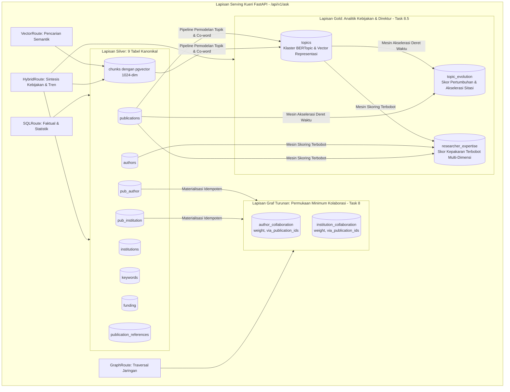

# Skema Database — Arsitektur Data & Spesifikasi Skema Kanonikal (Hybrid Master Blueprint)

**Versi Dokumen:** 3.6.3 (Consolidated Hybrid Master Blueprint — aturan bahasa: narasi Indonesia, teknis Inggris)  
**Tanggal Status:** 2026-09-27  
**Menggantikan:** `04 Database Schema.md` v3.6.2 (2026-10-03)
**Konteks Otoritatif:** Selaras dengan `README.md` dan `docs/01` hingga `docs/12`  
> **Status Implementasi & Source of Truth (Sinkronisasi Progress 2026-09-29):**  
> 1. **PostgreSQL Database — DONE:** Basis data PostgreSQL **sudah dibuat dan siap pakai**. Seluruh kredensial koneksi telah diamankan secara internal (tidak diekspos di dokumentasi).  
> 2. **Dataset Prototipe (Validasi E2E) — DONE:** Database memuat **dataset prototipe kecil** (~20 naskah, 40 chunk, 138 author, 107 institusi, 22 kolom metadata naskah pada `publications`) untuk validasi alur end-to-end.  
> 3. **Cleaning & Cleaned Export — DONE:** Data Scopus sudah dibersihkan dan ter-export sebagai 9 file `data/*_cleaned.csv`; 9 tabel relasional kanonikal Silver sudah terisi data bersih.  
> 4. **Vector Storage — DONE (Task 1):** Kolom `chunks.embedding vector(1024)` + data vektor + indeks HNSW sesuai DDL §5 sudah dibuat dan terverifikasi. Dimensi embedding terkunci `1024` mengikuti model `BAAI/bge-m3`.  
> 5. **Edge Tables — DONE (Task 8):** 2 edge tables `institution_collaboration` dan `author_collaboration` sudah dimaterialisasi secara idempoten dari Silver. 3 tabel Gold Analytics (`topics`, `topic_evolution`, `researcher_expertise`) masih PLANNED (Task 8.5).  
> 6. **Pembedaan Fase:** Dokumentasi membedakan secara tegas antara **Fase Validasi Prototipe E2E** (menggunakan 9 tabel kanonikal saat ini) dan **Fase Produksi Skala Besar** (pipeline ingestion otomatis untuk ratusan ribu record Scopus).

---

## 1. Tujuan & Arsitektur Data Medallion

Dokumen ini mendefinisikan arsitektur database relasional, representasi vector (*pgvector*), struktur graf turunan (*Knowledge Graph Minimum Surface*), dan lapisan analitik tingkat lanjut (**Lapisan Gold**) untuk sistem **Asisten Riset Intelijen**.

Arsitektur data mengadopsi pola **Medallion Data Architecture**:
1. **Bronze Layer (Raw Staging - Future/Production)**: Arsip berkas mentah Scopus (CSV/JSON/BibTeX) yang immutable untuk reproduktibilitas data dan audit log (`docs/12 Data Pipeline.md`).
2. **Silver Layer (Canonical Relational Storage - 9 Tabel Prototipe + 2 Edge Tables)**: canonical source of truth terstruktur yang telah dibersihkan, dinormalisasi, dan di-deduplikasi:
   - 9 Tabel Relasional: `publications`, `authors`, `institutions`, `keywords`, `funding`, `pub_author`, `pub_institution`, `publication_references`, dan `chunks`.
   - 2 Derived Edge Tables (PLANNED, Task 8): `institution_collaboration` dan `author_collaboration` yang dimaterialisasi secara idempoten dari `pub_institution` dan `pub_author`.
3. **Gold Layer (Advanced Bibliometrics & Policy Intelligence - 3 Tabel - PLANNED, Task 8.5)**: Tabel analitik derivatif berkinerja tinggi yang menyimpan klaster topik naskah (`topics`), metrik akselerasi tren waktu (`topic_evolution`), serta pemeringkatan kepakaran peneliti multi-dimensi (`researcher_expertise`).

---

## 2. Arsitektur Basis Data End-to-End



---

## 3. Matriks Status Implementasi (Skema Saat Ini vs Target)

| Komponen / Tabel | Lapisan Arsitektur | Status Saat Ini | Fase Target | Keterangan Kesiapan Rekayasa |
|---|---|---|---|---|
| `publications` | Silver (Core) | `CURRENT` (di PostgreSQL) | Phase 0 | 22 kolom metadata bibliometrik pada prototype dataset. |
| `authors` | Silver (Core) | `CURRENT` (di PostgreSQL) | Phase 0 | Menyimpan nama display dan `author_name_normalized`. |
| `institutions` | Silver (Core) | `CURRENT` (di PostgreSQL) | Phase 0 | Menyimpan nama display, normalized, city, dan country. |
| `keywords` | Silver (Core) | `CURRENT` (di PostgreSQL) | Phase 0 | Menyimpan keyword lowercase dan `keyword_type`. |
| `funding` | Silver (Core) | `CURRENT` (di PostgreSQL) | Phase 0 | Menyimpan nama agensi, normalized, grant number, dan teks. |
| `pub_author` | Silver (Junction) | `CURRENT` (di PostgreSQL) | Phase 0 | Relasi publikasi-penulis beserta `author_order`. |
| `pub_institution` | Silver (Junction) | `CURRENT` (di PostgreSQL) | Phase 0 | Relasi publikasi-institusi. |
| `publication_references` | Silver (1:N) | `CURRENT` (di PostgreSQL) | Phase 0 | String sitasi mentah (`reference_text`); status *unlinked*. |
| `chunks` (Teks) | Silver (1:N) | `CURRENT` (di PostgreSQL) | Phase 0 | Teks judul & abstrak untuk semantic search. Sumber load: `data/chunks_cleaned.csv` (export DONE). |
| `chunks.embedding` | Silver (Vector) | `DONE` (Task 1) | Phase 1 | `vector(1024)` BAAI/bge-m3; HNSW (`m=16, ef=64`). |
| `institution_collaboration` | Derived Edge | `DONE` (Task 8) | Phase 1 | Edge table kolaborasi institusi dengan `via_publication_ids`. |
| `author_collaboration` | Derived Edge | `DONE` (Task 8) | Phase 1 | Edge table co-authorship dengan `via_publication_ids`. |
| `topics` | Gold (Analytics) | `PLANNED / NOT IMPLEMENTED` | Phase 6 (Task 8.5) | Klaster topik BERTopic, kata kunci representatif, & centroid vector. |
| `topic_evolution` | Gold (Analytics) | `PLANNED / NOT IMPLEMENTED` | Phase 6 (Task 8.5) | Time-series tahunan, growth score, dan citation acceleration. |
| `researcher_expertise` | Gold (Analytics) | `PLANNED / NOT IMPLEMENTED` | Phase 6 (Task 8.5) | Skor kepakaran terbobot multi-faktor ($w_1, w_2, w_3, w_4$). |
| Dedicated Graph Extension (Apache AGE) | Ext Graf Native | `POST-MVP / RECOMMENDED` | Fase 9 (Pasca-MVP) | Ekstensi native PostgreSQL Cypher query untuk traversal graf tingkat lanjut. |

---

## 4. Lapisan Silver: 9 Entitas Relasional Kanonikal

### 4.1 Tabel `publications` (Entitas Inti Publikasi)
| Nama Kolom | Tipe Data | Batasan (Constraint) | Deskripsi & Aturan Normalisasi |
|---|---|---|---|
| `publication_id` | `VARCHAR(64)` / `BIGINT` | `PRIMARY KEY` | Identifier unik kanonikal publikasi (Scopus ID atau internal hash). |
| `title` | `TEXT` | `NOT NULL` | Judul publikasi dalam format **Titlecase** (casing asli dipertahankan). |
| `abstract` | `TEXT` | `NULLABLE` | Teks abstrak lengkap publikasi (seluruh teks telah di-**lowercase**). |
| `doi` | `VARCHAR(255)` | `NULLABLE`, `INDEX` | Digital Object Identifier resmi (format: `10.xxxx/...`, case preserved). |
| `eid` | `VARCHAR(64)` | `NULLABLE`, `UNIQUE` | Electronic Identifier Scopus (misal: `2-s2.0-85...`). |
| `year` | `SMALLINT` | `NOT NULL`, `INDEX` | Tahun publikasi (numerik, misal: `2023`). |
| `citation_count` | `INTEGER` | `NOT NULL DEFAULT 0` | Jumlah sitasi yang tercatat saat snapshot data diambil. |
| `document_type` | `VARCHAR(64)` | `NULLABLE` | Jenis dokumen (**lowercase**, contoh: `article`, `conference paper`). |
| `publication_stage` | `VARCHAR(32)` | `NULLABLE` | Tahap publikasi (**lowercase**, contoh: `final`, `article in press`). |
| `open_access` | `VARCHAR(16)` | `NULLABLE` | Status akses terbuka (**lowercase**, contoh: `all open access`, `gold`). |
| `language_of_original_document` | `VARCHAR(32)` | `NULLABLE` | Bahasa dokumen (**lowercase**, contoh: `english`, `indonesian`). |
| `publisher` | `VARCHAR(255)` | `NULLABLE` | Nama penerbit jurnal/prosiding (**lowercase**). |
| `source` | `TEXT` | `NULLABLE` | Nama jurnal, konferensi, atau buku sumber publikasi (**lowercase**). |
| `volume`, `issue`, `art_no`, `page_start`, `page_end` | `VARCHAR(32)`/`TEXT` | `NULLABLE` | Metadata volume/halaman tanpa pemrosesan string. |

### 4.2 Tabel `authors` (Entitas Penulis)
| Nama Kolom | Tipe Data | Batasan (Constraint) | Deskripsi & Aturan Normalisasi |
|---|---|---|---|
| `author_id` | `VARCHAR(64)` / `BIGINT` | `PRIMARY KEY` | Identifier unik penulis (Scopus Author ID jika tersedia). |
| `author_name` | `VARCHAR(255)` | `NOT NULL` | Nama penulis untuk keperluan tampilan antarmuka (casing asli dipertahankan). |
| `author_name_normalized` | `VARCHAR(255)` | `NOT NULL`, `INDEX` | Nama hasil normalisasi: **lowercase + strip whitespace + strip punctuation**. Wajib digunakan pada `GROUP BY` dan pencarian nama. |

### 4.3 Tabel `institutions` (Entitas Institusi & Afiliasi)
| Nama Kolom | Tipe Data | Batasan (Constraint) | Deskripsi & Aturan Normalisasi |
|---|---|---|---|
| `institution_id` | `VARCHAR(64)` / `BIGINT` | `PRIMARY KEY` | Identifier unik institusi (Scopus Affiliation ID atau internal ID). |
| `institution_name` | `TEXT` | `NOT NULL` | Nama resmi institusi untuk display (casing asli dipertahankan). |
| `institution_name_normalized` | `TEXT` | `NOT NULL`, `INDEX` | Nama institusi ternormalisasi (**lowercase + trim**) untuk pencarian dan agregasi. |
| `city` | `VARCHAR(128)` | `NULLABLE` | Kota lokasi institusi (**lowercase**). |
| `country` | `VARCHAR(128)` | `NULLABLE`, `INDEX` | Negara lokasi institusi (**lowercase**, contoh: `indonesia`, `singapore`). |

### 4.4 Tabel `keywords` & `funding`
- **`keywords`**: `keyword_id BIGSERIAL PK`, `publication_id VARCHAR(64) FK REFERENCES publications(publication_id)`, `keyword VARCHAR(255) NOT NULL` (lowercase murni), `keyword_type VARCHAR(32)` (`author keyword` vs `index keyword`).
- **`funding`**: `funding_id BIGSERIAL PK`, `publication_id VARCHAR(64) FK REFERENCES publications(publication_id)`, `funding_agency TEXT`, `funding_agency_normalized TEXT` (lowercase+trim), `grant_number VARCHAR(128)`, `funding_text TEXT` (lowercase).

### 4.5 Tabel Junction & Referensi
- **`pub_author`**: `PRIMARY KEY (publication_id, author_id)`, `author_order SMALLINT NOT NULL DEFAULT 1`, `FOREIGN KEY (publication_id) REFERENCES publications(publication_id)`, `FOREIGN KEY (author_id) REFERENCES authors(author_id)`.
- **`pub_institution`**: `PRIMARY KEY (publication_id, institution_id)`, `FOREIGN KEY (publication_id) REFERENCES publications(publication_id)`, `FOREIGN KEY (institution_id) REFERENCES institutions(institution_id)`.
- **`publication_references`**: `reference_id BIGSERIAL PK`, `publication_id VARCHAR(64) FK REFERENCES publications(publication_id)`, `reference_order INT NOT NULL`, `reference_text TEXT NOT NULL` (Status MVP: *unlinked citation strings*).

---

## 5. Lapisan Vector: Spesifikasi pgvector (Tabel `chunks`)

> **Status: DONE (Task 1).** DDL di bawah sudah dieksekusi dan diverifikasi — kolom `embedding vector(1024)`, kolom metadata (`embedding_model`, `embedding_version`, `embedding_dimension`), indeks HNSW (`idx_chunks_embedding_hnsw`), dan indeks FK (`idx_chunks_pub_id`) telah aktif di basis data PostgreSQL. Seluruh 40 chunk dokumen telah memiliki representasi vector lengkap 1024-dimensi model `BAAI/bge-m3`. Rantai linkage yang aktif: **article/research record (`publications`) → embedding input (`chunks.chunk_text` dari `Title + Abstract`) → embedding/vector (`chunks.embedding`) → database record (`chunks` ↔ `publications` via `publication_id`) → retrieval (`VectorRoute`)**.

> **Literature:** [[literature/2024 - BGE M3 Embedding]] · [[literature/2018 - HNSW Index]]

Tabel `chunks` bertindak sebagai indeks semantik berdimensi tinggi:

```sql
-- DDL Penambahan Kolom Vektor & Metadata pada Tabel chunks (Task 1)
CREATE EXTENSION IF NOT EXISTS vector;

-- Tabel chunks sudah ada, DDL di bawah untuk melengkapi kolom embedding jika belum tersedia:
ALTER TABLE chunks ADD COLUMN IF NOT EXISTS embedding vector(1024);
ALTER TABLE chunks ADD COLUMN IF NOT EXISTS embedding_model VARCHAR(64) DEFAULT 'BAAI/bge-m3';
ALTER TABLE chunks ADD COLUMN IF NOT EXISTS embedding_version VARCHAR(32) DEFAULT 'v1.0';
ALTER TABLE chunks ADD COLUMN IF NOT EXISTS embedding_dimension SMALLINT DEFAULT 1024;

-- Indeks HNSW Standar Produksi (Keseimbangan Akurasi & Latensi)
CREATE INDEX IF NOT EXISTS idx_chunks_embedding_hnsw 
ON chunks 
USING hnsw (embedding vector_cosine_ops)
WITH (m = 16, ef_construction = 64);

CREATE INDEX IF NOT EXISTS idx_chunks_pub_id ON chunks (publication_id);
```

---

## 6. Lapisan Graf Turunan: Tabel Edge Kolaborasi

Dua tabel edge dimaterialisasi secara idempoten dari tabel junction Silver (`pub_author` dan `pub_institution`):

```sql
-- Edge 1: Kolaborasi Antar-Institusi (DONE, Task 8)
CREATE TABLE IF NOT EXISTS institution_collaboration (
    institution_a       VARCHAR(64) NOT NULL REFERENCES institutions(institution_id) ON DELETE CASCADE,
    institution_b       VARCHAR(64) NOT NULL REFERENCES institutions(institution_id) ON DELETE CASCADE,
    weight              INTEGER     NOT NULL,         -- Jumlah publikasi bersama
    via_publication_ids TEXT[]      NOT NULL,         -- Array ID publikasi sebagai bukti provenance (NFR2)
    created_at          TIMESTAMP WITH TIME ZONE DEFAULT CURRENT_TIMESTAMP,
    PRIMARY KEY (institution_a, institution_b),
    CHECK (institution_a < institution_b)             -- Kunci kanonikal: mencegah duplikasi simetris (A,B)/(B,A)
);

CREATE INDEX idx_inst_collab_b ON institution_collaboration (institution_b);
CREATE INDEX idx_inst_collab_weight ON institution_collaboration (weight DESC);

-- Edge 2: Co-Authorship Antar-Penulis (DONE, Task 8)
CREATE TABLE IF NOT EXISTS author_collaboration (
    author_a            VARCHAR(64) NOT NULL REFERENCES authors(author_id) ON DELETE CASCADE,
    author_b            VARCHAR(64) NOT NULL REFERENCES authors(author_id) ON DELETE CASCADE,
    weight              INTEGER     NOT NULL,         -- Jumlah publikasi bersama
    via_publication_ids TEXT[]      NOT NULL,         -- Array ID publikasi sebagai bukti grounding
    created_at          TIMESTAMP WITH TIME ZONE DEFAULT CURRENT_TIMESTAMP,
    PRIMARY KEY (author_a, author_b),
    CHECK (author_a < author_b)                       -- Kunci kanonikal: author_a selalu < author_b
);

CREATE INDEX idx_author_collab_b ON author_collaboration (author_b);
CREATE INDEX idx_author_collab_weight ON author_collaboration (weight DESC);
```

> **Catatan indeks (Task 004):** indeks `idx_inst_collab_a` / `idx_author_collab_a` **dihapus** — keduanya persis merupakan awalan (leading prefix) dari composite `PRIMARY KEY (…_a, …_b)`, sehingga indeks kedua tidak menambah jalur akses apa pun. Indeks `_b` tetap dipertahankan karena satu-satunya jalur untuk hop terbalik pada Recursive CTE T1–T4 dan untuk `ON DELETE CASCADE` dari tabel induk.

> **Keputusan Arsitektur Graf (Graph Strategy):**  
> Penelusuran jaringan kolaborasi pada MVP dijalankan via **Recursive CTE Terparameterisasi PostgreSQL (Templat T1–T4)** pada tabel edge di atas. Untuk kebutuhan graf pasca-MVP (Phase 9), sistem menetapkan **Apache AGE** sebagai ekstensi native PostgreSQL pilihan.
> **Literature:** [[literature/Apache AGE Graph Extension]]

---

## 7. Lapisan Gold: Tabel Analitik Kepakaran & Tren Topik

Lapisan **Database Gold** menambahkan 3 tabel analitik tingkat lanjut untuk mendukung kebutuhan pembuat kebijakan (*Director Analytics & Policy Synthesis*):

### 7.1 Tabel `topics` (Klaster Topik Riset - PLANNED, Task 8.5)
Menyimpan klaster topik riset yang dihasilkan melalui analisis ko-kata (*co-word analysis*) dan pemodelan topik (*BERTopic*).
> **Literature:** [[literature/2022 - BERTopic]] · [[literature/1983 - Co-word Analysis]]

```sql
CREATE TABLE IF NOT EXISTS topics (
    topic_id                BIGSERIAL PRIMARY KEY,
    topic_name              VARCHAR(255) NOT NULL,          -- Label deskriptif topik (misal: "Mesenchymal Stem Cell Therapy")
    topic_name_normalized   VARCHAR(255) NOT NULL,          -- Lowercase + trim untuk pencarian router
    cluster_keywords        TEXT[] NOT NULL,                -- Array top 10 kata kunci representatif dari BERTopic/TF-IDF
    representation_vector   vector(1024),                   -- Centroid vektor topik (BAAI/bge-m3) untuk routing semantik
    total_publications      INTEGER NOT NULL DEFAULT 0,     -- Volume total naskah dalam topik
    total_citations         INTEGER NOT NULL DEFAULT 0,     -- Total sitasi akumulatif
    first_publication_year  SMALLINT,                       -- Tahun naskah paling awal dalam topik
    latest_publication_year SMALLINT,                       -- Tahun naskah terbaru dalam topik
    created_at              TIMESTAMP WITH TIME ZONE DEFAULT CURRENT_TIMESTAMP,
    updated_at              TIMESTAMP WITH TIME ZONE DEFAULT CURRENT_TIMESTAMP
);

CREATE INDEX idx_topics_name_norm ON topics (topic_name_normalized);
CREATE INDEX idx_topics_total_pub ON topics (total_publications DESC);
CREATE INDEX idx_topics_rep_vector_hnsw ON topics USING hnsw (representation_vector vector_cosine_ops) WITH (m = 16, ef_construction = 64);
```

> **Status indeks `idx_topics_rep_vector_hnsw`:** `topics` holds 5 rows on the prototype. An HNSW index pays off only above roughly 10k rows; at this cardinality it is pure write amplification with no read benefit. Create it conditionally once the topic count justifies it, and drop it while the table stays small.

### 7.2 Tabel `topic_evolution` (Akselerasi & Tren Waktu Topik - PLANNED, Task 8.5)
Menyimpan metrik evolusi temporal tahunan untuk mengidentifikasi topik yang sedang berkembang (*emerging topics*) atau mengalami penurunan.

```sql
CREATE TABLE IF NOT EXISTS topic_evolution (
    evolution_id            BIGSERIAL PRIMARY KEY,
    topic_id                BIGINT NOT NULL REFERENCES topics(topic_id) ON DELETE CASCADE,
    year                    SMALLINT NOT NULL,              -- Tahun observasi time-series
    publication_count       INTEGER NOT NULL DEFAULT 0,     -- Jumlah publikasi pada tahun tersebut
    citation_count          INTEGER NOT NULL DEFAULT 0,     -- Jumlah sitasi yang diperoleh pada tahun tersebut
    growth_score            NUMERIC(6,4) NOT NULL DEFAULT 0.0000, -- Laju pertumbuhan relatif terhadap tahun sebelumnya (YoY)
    citation_acceleration   NUMERIC(6,4) NOT NULL DEFAULT 0.0000, -- Perubahan percepatan kecepatan sitasi (d2C/dt2)
    recency_weight          NUMERIC(4,3) NOT NULL DEFAULT 1.000,  -- Faktor bobot eksponensial kebaruan waktu
    is_emerging             BOOLEAN NOT NULL DEFAULT FALSE, -- Flag topik berkembang pesat (Growth > ambang batas)
    created_at              TIMESTAMP WITH TIME ZONE DEFAULT CURRENT_TIMESTAMP,
    UNIQUE (topic_id, year)
);

CREATE INDEX idx_topic_evol_lookup ON topic_evolution (topic_id, year);
CREATE INDEX idx_topic_evol_emerging ON topic_evolution (year, is_emerging) WHERE is_emerging = TRUE;
CREATE INDEX idx_topic_evol_growth ON topic_evolution (year, growth_score DESC);
```

### 7.3 Tabel `researcher_expertise` (Skor Kepakaran Peneliti Terbobot - PLANNED, Task 8.5)
Menyimpan skor kepakaran peneliti multi-dimensi per topik riset.

```sql
CREATE TABLE IF NOT EXISTS researcher_expertise (
    expertise_id            BIGSERIAL PRIMARY KEY,
    author_id               VARCHAR(64) NOT NULL REFERENCES authors(author_id) ON DELETE CASCADE,
    topic_id                BIGINT NOT NULL REFERENCES topics(topic_id) ON DELETE CASCADE,
    expertise_score         NUMERIC(8,4) NOT NULL,          -- Skor akhir kepakaran terbobot [0.0000 - 100.0000]
    relevance_score         NUMERIC(6,4) NOT NULL,          -- Skor relevansi semantik naskah penulis thd topik (w1)
    productivity_score      NUMERIC(6,4) NOT NULL,          -- Skor volume produktivitas publikasi dalam topik (w2)
    impact_score            NUMERIC(6,4) NOT NULL,          -- Skor dampak sitasi ternormalisasi bidang (w3)
    recency_score           NUMERIC(6,4) NOT NULL,          -- Skor keaktifan publikasi 3 tahun terakhir (w4)
    h_index_topic           INTEGER NOT NULL DEFAULT 0,     -- H-index spesifik pada klaster topik ini
    publication_count_topic INTEGER NOT NULL DEFAULT 0,     -- Jumlah karya dalam klaster topik
    citation_count_topic    INTEGER NOT NULL DEFAULT 0,     -- Total sitasi dalam klaster topik
    coauthor_network_size   INTEGER NOT NULL DEFAULT 0,     -- Jumlah kolaborator aktif dalam topik (Network centrality)
    calculated_at           TIMESTAMP WITH TIME ZONE DEFAULT CURRENT_TIMESTAMP,
    UNIQUE (author_id, topic_id)
);

CREATE INDEX idx_researcher_exp_rank ON researcher_expertise (topic_id, expertise_score DESC);
CREATE INDEX idx_researcher_exp_author ON researcher_expertise (author_id);
```

> **Koreksi tipe + batasan (Task 004, `database/migrations/004_index_and_integrity_hardening.sql`):**
> - Kolom sub-skor `relevance_score` / `productivity_score` / `impact_score` / `recency_score` diperlebar dari `NUMERIC(6,4)` menjadi `NUMERIC(8,4)`. `NUMERIC(6,4)` hanya muat sampai `99.9999`, sedangkan rentang yang dispesifikasikan di §7.3 adalah `[0, 100]` dan `scripts/score_expertise.py` memang membatasi setiap sub-skor di `100.0` — sehingga nilai `100.0000` akan melebihi kapasitas `NUMERIC(6,4)`. Kisaran `expertise_score` sudah `NUMERIC(8,4)` sejak awal.
> - Rentang yang dispesifikasikan §7.3 sekarang ditegakkan sebagai `CHECK` constraint: kelima skor `BETWEEN 0 AND 100`, serta `h_index_topic` / `publication_count_topic` / `citation_count_topic` / `coauthor_network_size >= 0`. `topic_evolution` mendapat `publication_count`/`citation_count`/`recency_weight >= 0`; `topics` mendapat total non-negatif dan `first_publication_year <= latest_publication_year`; `publications.citation_count >= 0`; kedua tabel edge mendapat `weight >= 0`. `growth_score` dan `citation_acceleration` sengaja dibiarkan tanpa batas karena bersifat signed (topik bisa menurun).
> - Constraint ditambahkan `NOT VALID` lalu dipromosikan dengan `VALIDATE CONSTRAINT` — lock `SHARE UPDATE EXCLUSIVE`, tidak memblokir `SELECT`/`INSERT`/`UPDATE`.
> - `topics.updated_at` kini dipelihara trigger `trg_topics_updated_at` (`public.touch_topics_updated_at()`); sebelumnya hanya punya `DEFAULT` sehingga stale diam-diam pada setiap `UPDATE`.

---

## 7.4 Cakupan Indeks.Foreign Key (Task 004)

Composite PK `(publication_id, <x>)` hanya mengindeks kolom pertama, sehingga sisi `<x>` dari setiap junction butuh indeks sendiri. Tanpa indeks tersebut, setiap kueri ber-scope penulis/institusi dan setiap `ON DELETE CASCADE` dari tabel induk turun ke sequential scan.

| Tabel | Kolom FK | Indeks | Alasan |
|---|---|---|---|
| `pub_author` | `author_id` | `idx_pub_author_author_id (author_id, publication_id)` | Sisi terbalik junction penulis |
| `pub_institution` | `institution_id` | `idx_pub_institution_institution_id (institution_id, publication_id)` | Sisi terbalik junction institusi |
| `keywords` | `publication_id` | `idx_keywords_publication_id` | Skor/filter per naskah |
| `funding` | `publication_id` | `idx_funding_publication_id` | Analisis pendanaan per naskah |
| `publication_references` | `publication_id` | `idx_publication_refs_publication_id` | Citasi keluar per naskah |
| `chunks` | `publication_id` | `idx_chunks_pub_id` | Sudah ada sejak Task 1 |

Indeks pendukung yang ditambahkan bersama:

| Indeks | Kueri yang dilayani |
|---|---|
| `idx_publications_citation_count (citation_count DESC)` | Template "most cited" selalu `ORDER BY citation_count DESC` |
| `idx_publications_year (year)` | Year scoping yang dipakai hampir semua template SQL |
| `idx_institutions_country_trgm` (GIN `gin_trgm_ops`) | `country ILIKE '%…%'` |
| `idx_institutions_name_trgm` (GIN `gin_trgm_ops`) | `institution_name ILIKE '%…%'` |
| `idx_authors_name_trgm` (GIN `gin_trgm_ops`) | `author_name ILIKE '%…%'` |

> **Kenapa trigram:** `SqlRetriever` dan `VectorRetriever` memancarkan `ILIKE '%nilai%'` (wildcard di depan) untuk resolusi entitas. B-tree tidak pernah dapat melayani pola berawalan `%`, sehingga setiap filter entitas sebelumnya memindai seluruh tabel. Kolom `*_normalized` yang sudah diindeks (AC-DB-3) tidak menolong karena kueri tidak memakainya. Indeks GIN trigram menutup celah tersebut tanpa mengubah semantik kueri.

> **Layout skema `pg_trgm`:** migration 004 menyelesaikan skema `pg_trgm` dari katalog (`pg_extension`/`pg_namespace`) sebelum qualify `gin_trgm_ops`, karena Supabase memasangnya di `extensions`, bukan `public`.

#### Formula Perhitungan Skor Kepakaran (`ExpertiseScore`):
$$\text{ExpertiseScore} = w_1 \cdot \text{Relevance} + w_2 \cdot \text{Productivity} + w_3 \cdot \text{Impact} + w_4 \cdot \text{Recency}$$
- $w_1 = 0.30$ (Relevance), $w_2 = 0.25$ (Productivity), $w_3 = 0.25$ (Impact), $w_4 = 0.20$ (Recency).
> **Literature:** [[literature/2005 - Hirsch h-index]]

---

## 8. Diagram Lengkap Relasi Entitas (ERD Master Komprehensif)

```mermaid
erDiagram
    %% Silver Core Relational (9 Tabel Kanonikal)
    PUBLICATIONS ||--o{ PUB_AUTHOR : "has authors"
    AUTHORS ||--o{ PUB_AUTHOR : "writes"
    PUBLICATIONS ||--o{ PUB_INSTITUTION : "affiliated with"
    INSTITUTIONS ||--o{ PUB_INSTITUTION : "includes"
    PUBLICATIONS ||--o{ KEYWORDS : "indexed with"
    PUBLICATIONS ||--o{ FUNDING : "sponsored by"
    PUBLICATIONS ||--o{ PUBLICATION_REFERENCES : "cites raw"
    PUBLICATIONS ||--o{ CHUNKS : "chunked for embedding"

    %% Derived Edge Tables
    INSTITUTIONS ||--o{ INSTITUTION_COLLABORATION : "collab A"
    INSTITUTIONS ||--o{ INSTITUTION_COLLABORATION : "collab B"
    AUTHORS ||--o{ AUTHOR_COLLABORATION : "coauthor A"
    AUTHORS ||--o{ AUTHOR_COLLABORATION : "coauthor B"

    %% Gold Analytics Layer
    TOPICS ||--o{ TOPIC_EVOLUTION : "evolves over time"
    AUTHORS ||--o{ RESEARCHER_EXPERTISE : "possesses expertise"
    TOPICS ||--o{ RESEARCHER_EXPERTISE : "domain of expertise"

    PUBLICATIONS {
        varchar publication_id PK
        text title
        text abstract
        varchar doi
        varchar eid UK
        int year
        int citation_count
        varchar document_type
        varchar open_access
        text source
    }

    AUTHORS {
        varchar author_id PK
        varchar author_name
        varchar author_name_normalized
    }

    INSTITUTIONS {
        varchar institution_id PK
        text institution_name
        text institution_name_normalized
        varchar city
        varchar country
    }

    CHUNKS {
        bigint chunk_id PK
        varchar publication_id FK
        text chunk_text
        vector_1024 embedding
        varchar embedding_model
    }

    INSTITUTION_COLLABORATION {
        varchar institution_a PK,FK
        varchar institution_b PK,FK
        int weight
        text_array via_publication_ids
    }

    AUTHOR_COLLABORATION {
        varchar author_a PK,FK
        varchar author_b PK,FK
        int weight
        text_array via_publication_ids
    }

    TOPICS {
        bigint topic_id PK
        varchar topic_name
        varchar topic_name_normalized
        text_array cluster_keywords
        vector_1024 representation_vector
        int total_publications
        int total_citations
    }

    TOPIC_EVOLUTION {
        bigint evolution_id PK
        bigint topic_id FK
        smallint year
        int publication_count
        int citation_count
        numeric growth_score
        numeric citation_acceleration
        boolean is_emerging
    }

    RESEARCHER_EXPERTISE {
        bigint expertise_id PK
        varchar author_id FK
        bigint topic_id FK
        numeric expertise_score
        numeric relevance_score
        numeric productivity_score
        numeric impact_score
        numeric recency_score
        int h_index_topic
        int coauthor_network_size
    }
```



---

## 9. Pemetaan Kueri Basis Data ke Lapisan RAG (/api/v1/ask)

| Rute RAG | Lapisan Data yang Diakses | Pola Kueri SQL / Vector / Graph | Output Bukti Terstruktur |
|---|---|---|---|
| **`SQLRoute`** | Lapisan Silver (`publications`, `authors`, `institutions`, `funding`, `pub_author`, `pub_institution`, `keywords`, `publication_references`) | SQL SELECT / Agregasi terparameterisasi (`COUNT`, `AVG`, `GROUP BY`) dengan validasi AST `sqlglot`. | Faktual bibliometrik, ranking produktivitas, statistik pendanaan. |
| **`VectorRoute`** | Silver Vector (`chunks.embedding`) JOIN `publications` | `chunks.embedding <=> query_vec` (Kosinus HNSW $\ge 0.65$) dalam jendela ANN ber-*overfetch*, lalu `DISTINCT ON (publication_id)` di luar jendela + `LIMIT 8`. | Bukti semantik naskah relevan, ringkasan abstrak, sitasi DOI/no-doi. |
| **`GraphRoute`** | Lapisan Edge (`institution_collaboration`, `author_collaboration`) | Recursive CTE Terparameterisasi (Templat T1–T4) dengan batasan kedalaman `max_hops = 3`. | Jaringan kolaborasi, partner institusi, bukti co-authorship via `via_publication_ids`. |
| **`HybridRoute`** | Lapisan Gold (`topics`, `topic_evolution`, `researcher_expertise`) + Silver & `chunks` | Gabungan (join) analitik multi-tabel: pencarian klaster topik, akselerasi tren, dan pemeringkatan kepakaran. | Tren topik tahunan, skor kepakaran multi-dimensi, sintesis kebijakan. |

---

## 10. Prosedur Audit & Validasi Skema (Daftar Periksa DDL Task 0)

Sebelum skema ini didaftarkan sebagai system prompt Text-to-SQL atau dieksekusi oleh backend, jalankan kueri introspeksi berikut pada Task 0 (`10 Implementation Plan.md`):

```sql
SELECT 
    table_name, 
    column_name, 
    data_type,
    is_nullable
FROM information_schema.columns
WHERE table_schema = 'public'
ORDER BY table_name, ordinal_position;
```

### Daftar Periksa Kesiapan Skema (Kriteria Penerimaan Skema):
- [ ] **AC-DB-1**: 9 tabel relasional Silver terverifikasi ada di PostgreSQL dengan tipe data dan kolom sesuai §4.
- [ ] **AC-DB-2**: Seluruh kolom teks naratif/kategorikal dipastikan telah di-lowercase sesuai aturan pembersihan.
- [ ] **AC-DB-3**: Kolom `author_name_normalized`, `institution_name_normalized`, dan `funding_agency_normalized` tersedia dan terindeks untuk agregasi.
- [ ] **AC-DB-4**: Granularitas tabel `chunks` terverifikasi via query rasio publikasi-chunk.
- [ ] **AC-DB-5**: Ekstensi `vector` aktif dan kolom `chunks.embedding vector(1024)` beserta metadata versi terbuat (Task 1).
- [ ] **AC-DB-6**: Indeks HNSW `idx_chunks_embedding_hnsw` (`m=16, ef=64`) terbuat dan aktif pada tabel `chunks` (Task 1).
- [ ] **AC-DB-7**: Tabel edge `institution_collaboration` dan `author_collaboration` terbuat dan terisi data agregasi idempoten (Task 8).
- [ ] **AC-DB-8**: Tabel Gold Analytics (`topics`, `topic_evolution`, `researcher_expertise`) terbuat beserta indeks dan formula kepakaran terbobot (§7).
- [ ] **AC-DB-9**: Hak akses `SELECT` pada seluruh tabel Silver, Edge, dan Gold diberikan kepada role `app_readonly` dengan enforcement timeout 10 detik.

---

## 11. Matriks Konsistensi Keputusan (Lintas Dokumen)

| Area Keputusan | Keputusan Kanonikal | Dokumen Terkait | Status |
|---|---|---|---|
| **Database** | PostgreSQL 15+ (sudah dibuat & siap pakai, kredensial internal aman) | `01`, `02`, `03`, `04`, `08`, `09`, `10`, `11` | ALIGNED |
| **Vector Storage** | `pgvector` HNSW (`m=16, ef_construction=64`, `vector_cosine_ops`) pada `chunks.embedding vector(1024)` (DONE, Task 1) | `02`, `03`, `04`, `05`, `09`, `10`, `12` | ALIGNED |
| **Konvensi penamaan** | 9 tabel relasional kanonikal standar: `publications`, `authors`, `institutions`, `keywords`, `funding`, `pub_author`, `pub_institution`, `publication_references`, `chunks` | `01`, `02`, `03`, `04`, `05`, `06`, `10`, `11`, `12` | ALIGNED |
| **Pembersihan data (cleaning)** | Bronze → Silver via script Python — **DONE** (hasil pembersihan ter-export di `data/*_cleaned.csv`, 9 file; sudah ter-load di 9 tabel Silver) | `01`, `04`, `10`, `12` | ALIGNED |
| **Normalisasi lowercase** | Naratif & kategorikal (`abstract`, `keyword`, `country`, dll.) disimpan full lowercase; tampilan & ID asli dipertahankan; kolom `*_normalized` (`author_name_normalized`, `institution_name_normalized`, `funding_agency_normalized`) disimpan lowercase+trim+strip-punct untuk agregasi/pencarian | `01`, `02`, `04`, `05`, `12` | ALIGNED |
| **Chunking** | Granularitas abstrak per publikasi pada tabel `chunks`, field `chunk_text`, `section = 'title_abstract'` | `03`, `04`, `05`, `12` | ALIGNED |
| **Embedding** | `BAAI/bge-m3` (1024-dim, Float32) via `sentence-transformers`, batch 32–64, CPU-optimized, input `Title: {title}\nAbstract: {abstract}` (DONE, Task 1) | `01`, `02`, `03`, `04`, `05`, `09`, `10`, `12` | ALIGNED |
| **Retrieval** | Dynamic 4-Route: `SQLRoute` (Silver), `VectorRoute` (`chunks.embedding`), `GraphRoute` (Derived Edge T1–T4), `HybridRoute` (Gold Analytics + Silver) | `01`, `02`, `03`, `05`, `06`, `10`, `11` | ALIGNED |
| **Vector Similarity Gate** | Cosine similarity threshold dikunci deterministik $\ge 0.65$ untuk model `BAAI/bge-m3`; kueri di bawah ambang → short-circuit ke `status: not_found` | `02`, `03`, `05`, `06` | ALIGNED |
| **Format sitasi** | Standar deterministik 3-elemen: `[Judul, Tahun, DOI]` jika ada DOI, dan `[Judul, Tahun, no-doi]` jika naskah tanpa DOI | `01`, `05`, `06`, `07` | ALIGNED |
| **Graph Engine Strategy** | MVP dikunci menggunakan parameterized PostgreSQL Recursive CTE (T1–T4); evaluasi pasca-MVP menggunakan Apache AGE pada Fase 9 | `03`, `04`, `09`, `11` | ALIGNED |
| **Konteks RAG** | Pembingkaian `UNTRUSTED DATA`, LLM murni menyintesis narasi & memvalidasi `EvidenceObject`, short-circuit deterministik pada 0 bukti, `CitationVerifier` post-hoc | `02`, `03`, `05`, `06`, `07`, `08` | ALIGNED |
| **Kontrak API** | `POST /api/v1/ask` (`AskRequest` & `AskResponse` dengan `evidence_objects`) + `GET /api/v1/health`. Endpoint `/api/query` resmi SUPERSEDED | `02`, `03`, `05`, `06`, `07`, `10`, `11` | ALIGNED |
| **Dataset prototipe** | Dataset prototipe kecil (~20 publikasi, 40 chunk, 138 author, 107 institusi, 22 kolom naskah) untuk validasi end-to-end lengkap | `01`, `02`, `03`, `04`, `10`, `11`, `12` | ALIGNED |
| **Dataset skala produksi** | Target masa depan untuk ingestion Scopus skala besar (>100K publikasi) dengan pipeline batch otomatis, deduplikasi multi-tier, dan worker async | `01`, `02`, `03`, `04`, `11`, `12` | ALIGNED |

---

## 12. Keputusan Arsitektur Kanonikal

1. **No-DOI Citation Decision:**
   - *Keputusan:* Format sitasi inline menggunakan pola baku `[Judul, Tahun, DOI]` jika DOI tersedia, dan `[Judul, Tahun, no-doi]` jika publikasi tidak memiliki DOI. Pola ini menjamin regex parser `CitationVerifier` dan parser frontend bekerja deterministik tanpa salah tafsir koma.
2. **Cosine Similarity Threshold Decision (`VectorRoute`):**
   - *Keputusan:* Nilai cosine similarity threshold dikunci pada $\ge 0.65$ untuk model `BAAI/bge-m3`. Kueri dengan nilai $< 0.65$ langsung diarahkan ke `status: not_found`.
3. **Post-MVP Graph Engine Decision:**
   - *Keputusan:* MVP menggunakan Recursive CTE Terparameterisasi PostgreSQL (Templat T1–T4) pada tabel edge `institution_collaboration` dan `author_collaboration`. Untuk fase pasca-MVP (Fase 9), sistem menetapkan **Apache AGE** sebagai target evaluasi utama karena terintegrasi langsung sebagai ekstensi PostgreSQL tanpa memerlukan infrastruktur instance database graf terpisah.

---

---

## 13. Skema Aplikasi: Persistensi Sesi (Conversation State)

**Ini BUKAN bagian dari canonical bibliometric source of truth.** Bagian §4–§7
(Silver, Vector, Edge, Gold) tetap satu-satunya sumber kebenaran untuk data
ilmiah. Schema `app` menyimpan satu-satunya hal yang tidak terkait dengan itu:
apa yang telah dibicarakan pengguna dan assistant.

### 13.1 Kenapa Skema Terpisah, Bukan Sekadar Tabel Tambahan

Pool retrieval mengunci `SET search_path = public` (`backend/app/db/pool.py`).
Tabel sesi yang diletakkan di `public` akan bisa dijangkau oleh SELECT yang lolos
AST whitelist — cukup dengan satu perubahan `search_path`, dan satu prompt
injection pada teks publikasi sudah cukup untuk membuatnya masuk ke jalur baca.
Dengan meletakkan tabel sesi di schema `app`, objek tersebut **tidak dapat
diresolve** dari jalur baca retrieval sama sekali. Batas ini ditegakkan oleh
database, bukan oleh disiplin developer.

Dua batas lain yang saling lepas:

| Batas | Mekanisme | Ditegakkan oleh |
|---|---|---|
| Skema | `search_path` pool baca = `public`; sesi = `app` | Database |
| Kredensial | `app_readonly` (SELECT/`public`) vs `app_session` (DML/`app`) | `scripts/grant_session_role.py`, diverifikasi dua arah |
| Whitelist SQL | `ALLOWED_TABLES` tidak memuat tabel sesi | `sql_security.py` |

### 13.2 DDL (migration `005_session_persistence_schema.sql`)

```sql
CREATE SCHEMA IF NOT EXISTS app;
REVOKE ALL ON SCHEMA app FROM PUBLIC;

CREATE TABLE app.research_sessions (
    session_id       UUID        PRIMARY KEY DEFAULT gen_random_uuid(),
    title            TEXT        NOT NULL,
    status           TEXT        NOT NULL DEFAULT 'active',
    created_at       TIMESTAMPTZ NOT NULL DEFAULT now(),
    updated_at       TIMESTAMPTZ NOT NULL DEFAULT now(),
    last_message_at  TIMESTAMPTZ,
    CONSTRAINT research_sessions_title_not_blank  CHECK (btrim(title) <> ''),
    CONSTRAINT research_sessions_status_valid
        CHECK (status IN ('active', 'archived')),
    CONSTRAINT research_sessions_updated_after_created
        CHECK (updated_at >= created_at)
);

CREATE TABLE app.research_messages (
    message_id       UUID        NOT NULL DEFAULT gen_random_uuid(),
    session_id       UUID        NOT NULL,
    role             TEXT        NOT NULL,
    content          TEXT        NOT NULL,
    status           TEXT        NOT NULL DEFAULT 'complete',
    applied_filters  JSONB,
    request_id       TEXT,
    route            TEXT,
    -- Migrasi 006: provenance rendering per-turn (lihat §13.1)
    evidence_objects JSONB        NOT NULL DEFAULT '[]'::jsonb,
    sources          JSONB        NOT NULL DEFAULT '[]'::jsonb,
    seq              BIGINT      GENERATED ALWAYS AS IDENTITY,
    created_at       TIMESTAMPTZ NOT NULL DEFAULT now(),
    CONSTRAINT research_messages_pkey PRIMARY KEY (message_id),
    CONSTRAINT research_messages_session_fk
        FOREIGN KEY (session_id) REFERENCES app.research_sessions (session_id)
        ON DELETE CASCADE,
    CONSTRAINT research_messages_role_valid   CHECK (role IN ('user','assistant')),
    CONSTRAINT research_messages_status_valid CHECK (status IN ('complete','failed','not_found')),
    CONSTRAINT research_messages_evidence_objects_array CHECK (jsonb_typeof(evidence_objects) = 'array'),
    CONSTRAINT research_messages_sources_array            CHECK (jsonb_typeof(sources) = 'array'),
    CONSTRAINT research_messages_content_not_blank CHECK (btrim(content) <> '')
);

CREATE TABLE app.research_session_summaries (
    session_id       UUID        PRIMARY KEY,
    summary          TEXT        NOT NULL,
    messages_covered INTEGER     NOT NULL DEFAULT 0,
    created_at       TIMESTAMPTZ NOT NULL DEFAULT now(),
    updated_at       TIMESTAMPTZ NOT NULL DEFAULT now(),
    CONSTRAINT research_session_summaries_session_fk
        FOREIGN KEY (session_id) REFERENCES app.research_sessions (session_id)
        ON DELETE CASCADE,
    CONSTRAINT research_session_summaries_summary_not_blank
        CHECK (btrim(summary) <> ''),
    CONSTRAINT research_session_summaries_covered_non_negative
        CHECK (messages_covered >= 0),
    CONSTRAINT research_session_summaries_updated_after_created
        CHECK (updated_at >= created_at)
);
```

**Keputusan desain yang perlu dicatat:**

- **`research_session_summaries` 1:1, dengan `session_id` sebagai PK** — bukan riwayat
  append-only. Ringkasan adalah satu proyeksi bergulir dari transkrip, dan
  menjadikan `session_id` PK mengubah masalah konkurensi menjadi satu
  `INSERT ... ON CONFLICT`, yang atomik secara konstruksi. Index pada
  `(session_id)` **sengaja tidak dibuat** karena PK sudah meng-cover-nya
  (konsisten dengan §7.4 yang menghapus index yang persis prefix PK).
- **`seq` adalah identity global tabel, bukan per-sesi** — memberi urutan sisip
  total untuk pemutus tie ketika dua turn ditulis pada milidetik yang sama,
  sehingga `GET /api/v1/sessions/{id}` tetap promised chronological.
- **Tidak ada foreign key dari `app` ke `public`.** Ini bukan kebijakan melainkan
  struktural: `ON DELETE CASCADE` secara fisik tidak dapat menjangkau korpus,
  sehingga AC-SESSION-9 dijamin oleh skema, bukan oleh disiplin aplikasi.

### 13.1 Pengecualian Terelatasi: `evidence_objects` / `sources` (Migrasi 006)

**Latar belakang.** Migrasi 005 menyatakan sebuah invarian: *tidak ada kolom pun
pada tabel sesi yang boleh memuat metrik bibliometrik* (`publication_count`,
`citation_count`, `top_authors`, `expertise_score`, ...). Alasannya pragmatif:
salinan `public` yang basi, dengan tidak ada cara bagi pembaca untuk mengetahui
yang mana yang basi.

Kolom `evidence_objects` dan `sources` **memang memuat nilai metrik** —
`EvidenceObject` membawa `value`. Jadi migrasi 006 adalah **penyempitan invarian
yang disetujui owner**, dan ia dipagar — bukan dilonggarkan diam-diam.

**Yang diizinkan — persis satu:** snapshot immutable **per-turn** dari apa yang
sudah dibawa satu `AskResponse` terverifikasi. Sengaja JSONB agar buram dan tidak
bisa dijumlahkan dengan aritika SQL biasa. Tujuannya hanya satu: workspace yang
ditutup dapat menggambar kembali evidence rail dan source card persis seperti yang
ditampilkan, tanpa menjalankan ulang RAG.

Snapshot ikut dalam **satu INSERT yang sama** dengan turn-nya, di dalam transaksi
`_persist_turn` yang sudah ada — sehingga snapshot tidak mungkin ter-commit tanpa
turn-nya, atau sebaliknya.

**Yang tetap dilarang — tidak berubah oleh migrasi ini:**

1. **Bukan penyimpanan metrik kanonik.** `value` di sini tidak pernah menjadi
   jawaban atas sebuah pertanyaan; ia bukti kwitansi atas jawaban yang sudah diberikan.
2. **Bukan sumber kebenaran.** Tidak ada jalur retrieval, agregasi, peringkat,
   analitik, routing, sintesis, maupun verifikasi sitasi yang boleh membaca kolom
   ini untuk membenarkan klaim bibliometrik. Menjawab selalu requery ke `public`.
3. **Bukan agregat.** Tidak ada rollup tingkat sesi secara sengaja. Angka yang
   dibaca dari turn lampau harus diverifikasi ulang dengan bertanya lagi — aturan
   yang sama seperti yang sudah mengunci `summary` dan `content` jawaban sebelumnya.
4. **Tidak terjangkau dari jalur baca retrieval.** Pool bibliometrik runtime mengunci
   `SET search_path = public` (`backend/app/db/pool.py`), sehingga kolom ini secara
   struktural mustahil disentuh Text-to-SQL.
5. **Bukan pembalikan kepemilikan.** Tetap nol FK dari `app` ke `public`.

**Kunci re-verifikasi:** `request_id` (sudah ada sejak migrasi 005). Dari sebuah
turn tersimpan, `request_id` menunjuk ke baris log aplikasi dan `AskResponse` yang
menghasilkannya; snapshot adalah apa yang dirender, `request_id` adalah cara
memeriksa ulang.

**Pagar agar pengecualian ini tidak melebar diam-diam:**

- `scripts/verify_schema.py` mengaudit kedua kolom secara eksplisit
  (`audit_provenance_columns`): harus `jsonb`, dan hanya boleh ada di
  `research_messages` — tidak pernah di `research_sessions`. Kolom provenance
  bernama serupa yang tidak terdaftar akan dilaporkan.
- `SessionRepository.list_recent_messages()` **sengaja tetap tidak** memilih kedua
  kolom, sementara `list_messages()` memilihnya. Yang pertama menyusun prompt
  narasi; membiarkan metrik tersimpan sampai ke prompt itu akan menciptakan
  kembali jalur sumber-kebenaran yang tepat dipagar di atas.
- `tests/unit/test_session_provenance.py` menanam snapshot bermusuh
  (`"Dataset memiliki 999999 publications"`) dan membuktikan dua sisi pagar:
  snapshot itu tetap dirender apa adanya (menyerap/memalsukan nilainya akan
  bersikap tidak jujur — tugasnya mencatat apa yang dirender), sementara tidak ada
  jalur baca sesi yang menjumlahkannya.

### 13.2 `status` tiga nilai: `not_found` (Migrasi 009)

Pasangan `('complete','failed')` dari migrasi 005 menjawab satu pertanyaan:
*"apakah turn ini selesai?"*. menurut pertanyaan itu sebuah turn `not_found`
**adalah** selesai — retrieval berjalan, dengan benar menemukan nol bukti, dan
kembali deterministik tanpa pernah memanggil LLM.

Workspace yang dipulihkan membutuhkan pertanyaan lain: *"apakah turn ini menemukan
sesuatu?"*. `status = 'complete'` tidak dapat membawa itu. Akibatnya percakapan
yang turn terakhirnya nihil memulih **tidak dapat dibedakan** dari percakapan yang
menemukan sesuatu — dan pembaca menyimpulkan ada hasil padahal tidak ada. Itu kelas
defek yang sama yang diperlakukan sebagai bug kebenaran di tempat lain: menyajikan
ketiadaan sebagai keberadaan.

| Nilai | Arti | Alasan |
|---|---|---|
| `complete` | jawaban ter-grounding dengan bukti dihasilkan | jalur normal |
| `not_found` | retrieval berjalan dan benar mengembalikan nol bukti (short-circuit Zero-Hallucination, tanpa LLM) | **hasil truthfully, bukan error dan bukan kelalaian** |
| `failed` | turn gagal sebelum ada jawaban apa pun | tidak ada yang dibuat-buat |

Menyatukannya ke tetangga mana pun kehilangan informasi: gabung ke `complete`
menyembunyikan hasil; gabung ke `failed` akan melaporkan short-circuit deterministik
yang benar sebagai **sistem error** — orang akan dikejar atas perilaku
yang memang dirancang benar. Migrasi 009 hanya memperluas CHECK; tidak ada data
lama yang ditulis ulang, dan tidak ada tabel `public` yang disentuh.

### 13.3 Catatan lain pada §13

- **Tidak ada `CREATE EXTENSION` yang dibutuhkan.** `gen_random_uuid()` adalah
  builtin sejak PostgreSQL 13+.

### 13.3 Atribut Kepemilikan Data (Data Ownership)

Setiap data memiliki satu owner. Tidak ada duplikasi kepemilikan:

| Data | Owner | Bukan |
|---|---|---|
| Metadata publikasi kanonik | `public.publications` | tidak disalin ke sesi |
| Chunk semantik | `public.chunks` | tidak disalin ke sesi |
| Relasi graf | tabel edge turunan | tidak disalin ke sesi |
| Analitik | tabel Gold | tidak disalin ke sesi |
| Pesan percakapan | `app.research_messages` | bukan evidence |
| Konteks percakapan | `app.research_session_summaries` | **bukan** bibliometric memory |
| Tracing request | `request_id` + application log | bukan evidence |
| Evidence hasil retrieval | `EvidenceSet` (request-scoped) | bukan sesi |

**Larangan eksplisit.** Tabel sesi tidak pernah memuat `publication_count`,
`citation_count`, `top_authors`, `top_institutions`, `expertise_score`, atau
`growth_score` sebagai state kanonik. Nilai tersebut menjadi stale begitu korpus
di-reingest, dan tidak ada pembaca yang bisa tahu angka mana yang otoritatif.
`scripts/verify_schema.py` memindai schema `app` dan **gagal** bila kolom
bermetric ditemukan di sana.

### 13.4 Invarian `applied_filters`

`research_messages.applied_filters` (JSONB) menyimpan **cakupan yang benar-benar
di-resolve untuk turn tersebut** — hanya kunci scope berbentuk `FilterParams`
(`country`, `author_name`, `institution_name`, `topic_name`, `keyword`,
`document_type`, `year_from`, `year_to`). Field ini dipersempit oleh
`SessionRepository._sanitize_filters()` sebelum disimpan dan tidak pernah memuat
output retrieval.

> **`applied_filters` adalah metadata provenance saja.** Ia mencatat *scope* yang
> di-resolve, bukan *jawaban*-nya. Kegunaannya deterministik: pertanyaan lanjutan
> tanpa filter eksplisit mewarisi scope yang sudah ditetapkan, lalu retrieval
> meng-query ulang `public` dari nol. Bukti database tetap menang.

Alternatifnya — mem-parse scope kembali dari teks pesan — ditolak karena bisa
mengarang constraint yang tidak pernah dinyatakan pengguna, dan membutuhkan
heuristik NLP yang perilakunya berubah diam-diam saat kalimatnya berubah.

### 13.5 Ringkasan Sesi Bukan Memory Bibliometrik

`SessionSummaryService.build()` bersifat deterministik, tanpa panggilan LLM.
Determinisme itu dijamin secara struktural: urutan iterasi kunci scope mengikuti
`SCOPE_KEY_ORDER` (tuple), **bukan** `frozenset`, karena urutan iterasi
`frozenset` untuk string bergantung pada `PYTHONHASHSEED` — dua proses akan
menghasilkan string berbeda untuk transkrip yang sama.

Jaminan "tidak bisa memuat angka" juga struktural, bukan daftar forbidden:
`build()` hanya menerima `messages` dan `max_chars`. **Tidak ada parameter** yang
dapat membawa `EvidenceSet`, `EvidenceObject`, atau hasil sintesis. Ringkasan
adalah *conversation memory*, bukan *bibliometric memory*.

Jika suatu saat ada yang menambahkan `evidence_set=` demi "lebih pintar",
`tests/unit/test_session_summary.py::TestSummaryCannotSeeEvidence` akan gagal —
dan memang harus gagal, karena saat itu ringkasan telah menjadi sumber angka
kedua yang tidak diaudit.

### 13.6 Audit Skema

`scripts/verify_schema.py` mengaudit schema `app` secara terpisah dari gate
Silver/Gold, dengan sifat gagal yang berbeda secara sengaja:

- **Schema `app` tidak ada** → *note*, bukan error. Persistensi sesi bersifat
  opt-in lewat `DB_URL_SESSION`, jadi absennya `app` adalah state awal yang valid.
- **Schema `app` ada tetapi ada drift kolom** → *error*. Runtime membaca dan
  menulis tabel itu pada setiap request session-aware.
- **Ada FK `app` → `public`** → *error* berlabel `VIOLATION Session Isolation
  Invariant`.
- **Ada kolom metrik bibliometrik di `app`** → *error* berlabel `VIOLATION data
  ownership`.

---

## 14. Riwayat Perubahan

| Dokumen | Perubahan | Alasan |
|---|---
| `docs/04 Database Schema.md` v3.7.0 | Tambah §13 Skema Aplikasi (`app`): DDL `research_sessions`/`research_messages`/`research_session_summaries`, aturan data ownership, invarian `applied_filters`, audit `verify_schema` | Memisahkan conversation state dari canonical bibliometric source of truth (docs/03 §0.3 invarian 5) tanpa mengubah satu pun tabel Silver/Edge/Gold |
|---|
| `docs/04 Database Schema.md` v3.6.2 | Aturan bahasa: narasi Indonesia, teknis Inggris (`Source of Truth`, `Vector Storage`, `Dynamic 4-Route`, `Vector Similarity Gate`, dll); sync status Task 1 + Task 8 DONE | Tanpa duplikasi bilingual; perbaiki terjemahan literal yang aneh |
| `docs/04 Database Schema.md` v3.6.0 | Sinkronisasi Bahasa Indonesia; tanpa perubahan keputusan teknis | Penyelarasan bahasa 2026-09-27 |
| `docs/04 Database Schema.md` v3.5.0 | Menandai DB + prototype + cleaning/cleaned-export sebagai DONE; menandai vector storage (kolom, data, HNSW) sebagai PENDING eksplisit; menambah rantai linkage article → embedding input → vector → record | Sinkronisasi progress aktual 2026-09-27 |
| `docs/04 Database Schema.md` v3.4.0 | Mengembalikan seluruh nama 9 tabel Silver ke nama standar tanpa akhiran `_cleaned` pada DDL, ERD, dan kueri | Penyelarasan format penamaan sesuai instruksi project |
| `docs/04 Database Schema.md` v3.4.0 | Mengunci keputusan format sitasi (`no-doi`), threshold kosinus $\ge 0.65$, dan strategi graf Apache AGE | Menutup open decisions menjadi keputusan kanonikal |
| `docs/04 Database Schema.md` v3.4.0 | Memperbarui Matriks Konsistensi Keputusan dan Riwayat Perubahan | Menjamin konsistensi dokumen di seluruh repository |
