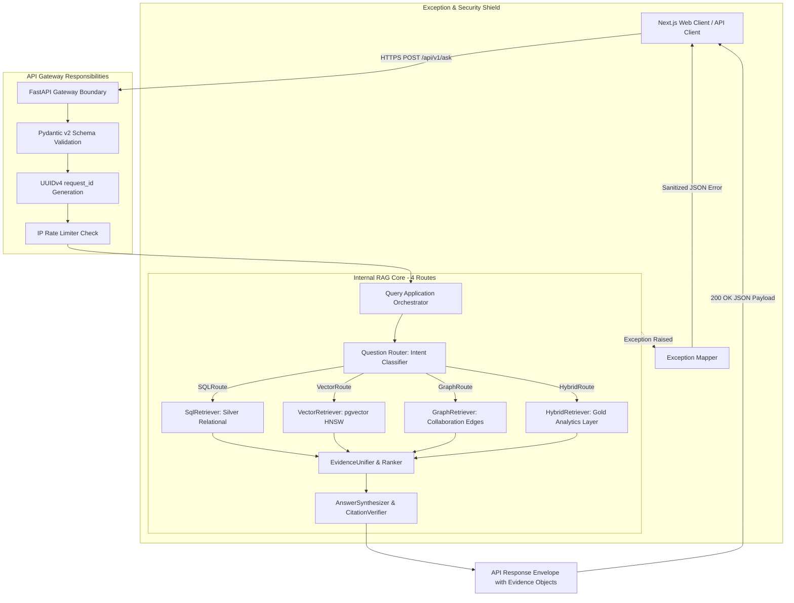

# API Design — Spesifikasi Teknis & Kontrak API (/api/v1)

**Document Version:** 3.2.0 (Consolidated Hybrid Master Blueprint)  
**Status Date:** 2026-09-28  
**Supersedes:** `06 Api Design.md` Draft v2 s.d. v3.0.0  
**Authoritative Context:** Aligned with `README.md` and `docs/00` through `docs/12`  

> **Status Implementasi (Verifikasi Repositori 2026-09-28):**  
> Repositori saat ini hanya berisi dokumentasi perancangan teknis (`README.md` dan `docs/00–12`). Direktori implementasi (`backend/`, `frontend/`, `database/`, `scripts/`, `docker/`, `tests/`) belum ada di repositori. Seluruh endpoint API, skema Pydantic `EvidenceObject`, dan middleware di bawah ini berstatus **PLANNED / NOT IMPLEMENTED** dan mendefinisikan kontrak rekayasa normatif untuk fase implementasi (Task 2, 4, 10).

---

## 1. Purpose

Dokumen ini mendefinisikan spesifikasi teknis lengkap dan kontrak antarmuka **REST API v1** untuk sistem **Research Intelligence Assistant**. 

API ini bertindak sebagai **lapisan batas sistem terluar (*system boundary layer*)** yang melayani kueri analitik dan kebijakan riset multi-moda melalui endpoint terpadu `POST /api/v1/ask`. Seluruh respons analitik diwajibkan menyertakan **`EvidenceObject` terstruktur** untuk menjamin *zero-hallucination* pada data statistik dan metrik bibliometrik.

---

## 2. API Architecture & System Boundary



---

## 3. Current vs Target State

| Endpoint Path | HTTP Method | Status Implementasi | Target Phase | Deskripsi & Kesenjangan (Gap) |
|---|---|---|---|---|
| `/api/v1/ask` | `POST` | `PLANNED` | MVP (Task 10) | Endpoint primer RAG riset multi-rute; mendukung payload `evidence_objects`. |
| `/api/v1/health` | `GET` | `PLANNED` | MVP (Task 2) | Endpoint health & dependency check (PostgreSQL, pgvector, Ollama). |
| `/api/query` | `POST` | `SUPERSEDED` | Historical Draft v2 | Desain v2 awal; **resmi superseded oleh `/api/v1/ask`**. |
| `/api/v1/ask/stream` | `POST` | `POST-MVP` | Phase 10 (Future) | SSE Streaming synthesis token-by-token; didefer ke pasca-MVP. |
| Resource Endpoints (`/papers`, `/authors`, `/topics`) | `GET` | `POST-MVP` | Phase 10 (Future) | Metadata detail individual; didefer ke pasca-MVP. |

---

## 4. API Conventions & Standards

- **Base Path**: `/api/v1`
- **Header Request Wajib**: `Content-Type: application/json`
- **Header Response Standar**: `Content-Type: application/json; charset=utf-8`
- **Header Tracing**: `X-Request-ID: <UUIDv4>`

---

## 5. Spesifikasi Endpoint Primer: `POST /api/v1/ask`

Menerima pertanyaan bahasa natural, mengeksekusi routing 4-jalur, menyintesis jawaban analitik, dan mengembalikan bukti terstruktur.

### 5.1 Request Contract (Pydantic v2 Schema)

```python
from pydantic import BaseModel, Field
from typing import Optional, List, Literal

class FilterParams(BaseModel):
    year: Optional[int] = Field(None, ge=1900, le=2026, description="Tahun publikasi eksak")
    year_from: Optional[int] = Field(None, ge=1900, le=2026, description="Tahun publikasi awal")
    year_to: Optional[int] = Field(None, ge=1900, le=2026, description="Tahun publikasi akhir")
    country: Optional[str] = Field(None, max_length=128, description="Negara institusi (lowercase)")
    author_name: Optional[str] = Field(None, max_length=255, description="Nama penulis")
    institution_name: Optional[str] = Field(None, max_length=255, description="Nama institusi")
    topic_name: Optional[str] = Field(None, max_length=255, description="Klaster topik riset")
    document_type: Optional[str] = Field(None, max_length=64, description="Tipe dokumen Scopus")

class AskRequest(BaseModel):
    question: str = Field(..., min_length=3, max_length=1000, description="Pertanyaan riset pengguna")
    filters: Optional[FilterParams] = Field(default_factory=FilterParams, description="Filter metadata terstruktur")
    developer_mode: Optional[bool] = Field(False, description="Flag untuk menyertakan metadata debug, SQL, dan latensi")
```

### 5.2 Response Contract (Pydantic v2 Schema with Evidence Objects)

```python
from pydantic import BaseModel, Field
from typing import Optional, List, Literal, Union, Dict, Any

class EvidenceSourceRef(BaseModel):
    publication_id: str = Field(..., description="ID kanonikal publikasi di PostgreSQL")
    doi: Optional[str] = Field(None, description="DOI resmi publikasi")
    eid: Optional[str] = Field(None, description="Scopus EID publikasi")
    title: Optional[str] = Field(None, description="Judul publikasi")
    year: Optional[int] = Field(None, description="Tahun publikasi")

class EvidenceObject(BaseModel):
    claim: str = Field(..., description="Pernyataan faktual spesifik yang disintesis")
    metric: str = Field(..., description="Jenis metrik: publication_count | citation_count | expertise_score | growth_score | citation_acceleration")
    value: Union[float, int, str] = Field(..., description="Nilai numerik eksak dari database")
    period: str = Field(..., description="Rentang waktu observasi, misal: '2020-2023' atau 'all-time'")
    sources: List[EvidenceSourceRef] = Field(..., description="Daftar publikasi bukti pendukung")
    confidence: float = Field(..., ge=0.0, le=1.0, description="Tingkat keyakinan bukti data")

class SourceItem(BaseModel):
    publication_id: str
    title: str
    year: Optional[int]
    doi: Optional[str]
    source_type: Literal["sql", "vector", "graph", "analytics"]
    relevance_score: Optional[float]
    provenance: Optional[str]

class CandidateItem(BaseModel):
    id: str
    name: str
    type: Literal["author", "institution", "topic"]
    publication_count: int
    affiliation: Optional[str]

class DebugInfo(BaseModel):
    sql_executed: Optional[str]
    route_reasoning: Optional[str]
    latency_breakdown_ms: Dict[str, float]

class AskResponse(BaseModel):
    request_id: str = Field(..., description="UUIDv4 pelacakan request unik")
    status: Literal["ok", "not_found", "needs_clarification", "error"]
    route: Literal["SQLRoute", "VectorRoute", "GraphRoute", "HybridRoute"]
    answer: str = Field(..., description="Teks jawaban naratif ter-grounding")
    evidence_objects: List[EvidenceObject] = Field(default_factory=list, description="Array bukti numerik dan tematik terstruktur")
    sources: List[SourceItem] = Field(default_factory=list, description="Daftar naskah literatur bukti")
    candidates: Optional[List[CandidateItem]] = Field(None, description="Daftar pilihan entitas ambigu saat status=needs_clarification")
    filters_ignored: List[str] = Field(default_factory=list, description="Daftar filter yang diabaikan")
    answered_via_fallback: bool = Field(False, description="Flag jika rute dijatuhkan ke fallback semantik")
    unverified_citations: List[str] = Field(default_factory=list, description="Sitasi yang di-strip oleh CitationVerifier")
    debug: Optional[DebugInfo] = Field(None, description="Metadata debug jika developer_mode=true")
```

### 5.3 Contoh Respons Sukses dengan Objek Bukti (`status: ok`)

```json
{
  "request_id": "c83b7e41-6a20-4e89-981f-f1791a8e9921",
  "status": "ok",
  "route": "HybridRoute",
  "answer": "Berdasarkan analisis bibliometrik, terapi Mesenchymal Stem Cell (MSC) menunjukkan pertumbuhan publikasi yang sangat pesat sebesar 28.4% YoY pada tahun 2023. Peneliti paling terkemuka dalam domain ini di Indonesia adalah Dr. A. Rahman dengan skor kepakaran 84.50, didukung oleh 14 publikasi dan H-index 9 pada klaster topik ini [Mesenchymal Stem Cell Therapy for Cartilage Regeneration, 2023, 10.1016/j.cell.2023.01.002].",
  "evidence_objects": [
    {
      "claim": "Terapi Mesenchymal Stem Cell (MSC) mengalami pertumbuhan publikasi 28.4% YoY pada 2023",
      "metric": "growth_score",
      "value": 0.2840,
      "period": "2023",
      "sources": [
        {
          "publication_id": "pub_89210",
          "doi": "10.1016/j.cell.2023.01.002",
          "eid": "2-s2.0-851492019",
          "title": "Mesenchymal Stem Cell Therapy for Cartilage Regeneration",
          "year": 2023
        }
      ],
      "confidence": 1.0
    },
    {
      "claim": "Dr. A. Rahman memimpin kepakaran topik MSC dengan skor 84.50 dan H-index topik 9",
      "metric": "expertise_score",
      "value": 84.50,
      "period": "all-time",
      "sources": [
        {
          "publication_id": "pub_89210",
          "doi": "10.1016/j.cell.2023.01.002",
          "eid": "2-s2.0-851492019",
          "title": "Mesenchymal Stem Cell Therapy for Cartilage Regeneration",
          "year": 2023
        }
      ],
      "confidence": 1.0
    }
  ],
  "sources": [
    {
      "publication_id": "pub_89210",
      "title": "Mesenchymal Stem Cell Therapy for Cartilage Regeneration",
      "year": 2023,
      "doi": "10.1016/j.cell.2023.01.002",
      "source_type": "analytics",
      "relevance_score": 0.94,
      "provenance": "Gold Layer: topics & researcher_expertise"
    }
  ],
  "filters_ignored": [],
  "answered_via_fallback": false,
  "unverified_citations": []
}
```

---

## 6. Spesifikasi Health Check: `GET /api/v1/health`

Memeriksa integritas backend dan kesiapan koneksi ke PostgreSQL, `pgvector`, dan service Ollama:

```json
{
  "status": "healthy",
  "version": "1.0.0",
  "database": {
    "status": "connected",
    "role": "app_readonly",
    "silver_tables_ready": true,
    "gold_tables_ready": true,
    "pgvector_ready": true
  },
  "llm_service": {
    "status": "connected",
    "model": "Qwen2.5-Coder-7B-Instruct",
    "provider": "Ollama"
  },
  "embedding_service": {
    "status": "ready",
    "model": "BAAI/bge-m3",
    "dimension": 1024
  }
}
```

---

## 7. Error Handling & Standardized Error Envelope

Semua pengecualian (*exceptions*) internal ditangkap di gerbang boundary dan dipetakan ke format error terstandarisasi:

```json
{
  "request_id": "c83b7e41-6a20-4e89-981f-f1791a8e9921",
  "error": {
    "error_type": "db_timeout",
    "message": "Permintaan membutuhkan waktu terlalu lama untuk diproses oleh database. Silakan persempit filter pencarian Anda.",
    "status_code": 503
  }
}
```

---

## 8. Kriteria Penerimaan Kontrak API (Acceptance Criteria)

- [ ] **AC-API-1**: Endpoint `POST /api/v1/ask` tervalidasi menggunakan Pydantic v2 dan mendukung 4 rute retrieval normatif.
- [ ] **AC-API-2**: Skema `AskResponse` menyertakan array `evidence_objects` dengan field `claim`, `metric`, `value`, `period`, `sources`, dan `confidence`.
- [ ] **AC-API-3**: Tidak ada error internal atau raw stack trace yang bocor ke respons client.
- [ ] **AC-API-4**: Endpoint `GET /api/v1/health` memverifikasi status koneksi basis data Silver/Gold, pgvector, dan LLM Ollama.
