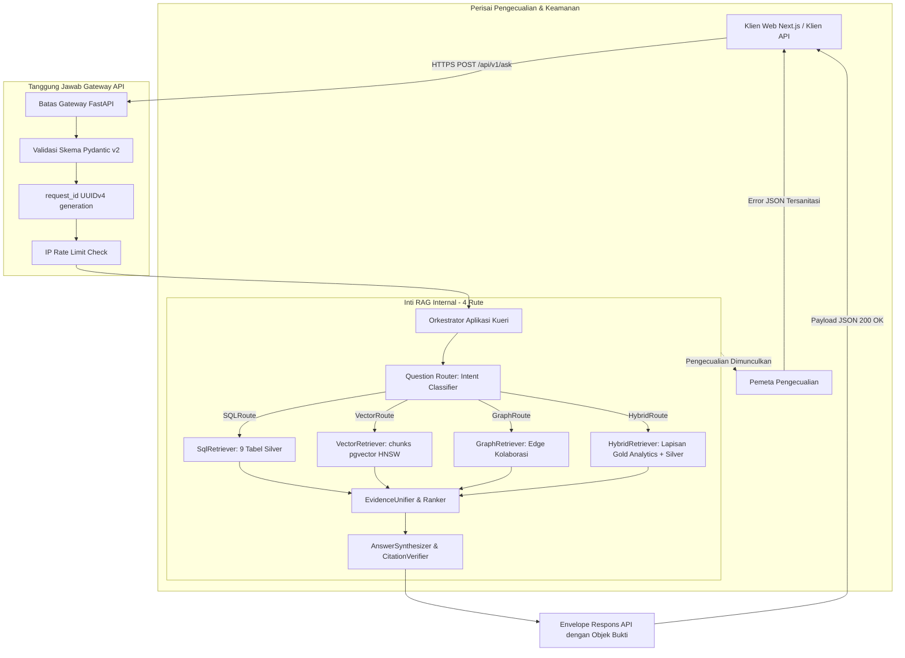

# Desain API — Spesifikasi Teknis & Kontrak API (/api/v1)

**Versi Dokumen:** 3.8.0 (Observability — blok `synthesis` pada `/api/v1/health` + endpoint `GET /metrics`)  
**Tanggal Status:** 2026-10-03  
**Menggantikan:** `06 Api Design.md` v3.7.1  
**Konteks Otoritatif:** Selaras dengan `README.md` dan `docs/01` hingga `docs/12`

> **Status Implementasi (Sinkronisasi Progress Fase 7 Close-out):**  
> 1. **Database PostgreSQL & pgvector — DONE (terverifikasi live 2026-10-03):** 9 tabel Silver kanonikal, 40 chunk ber-embedding vector(1024) `BAAI/bge-m3` (0 NULL) dengan indeks HNSW aktif, tabel edge `institution_collaboration` (254 baris) dan `author_collaboration` (484 baris), serta 3 tabel Gold (`topics`: 5, `topic_evolution`: 25, `researcher_expertise`: 140).  
> 2. **Implementasi Gateway API (Fase 2–7 DONE):** Kerangka backend FastAPI (`backend/app/`), pool koneksi async `asyncpg`, endpoint `GET /api/v1/health`, kontrak `POST /api/v1/ask` 4-rute (skema Pydantic v2 `EvidenceObject` & `AskResponse`), middleware `X-Request-ID`, rate limiting, penanganan error terstandarisasi, dan sintesis LLM opt-in (`llm_synthesis`, Qwen2.5-Coder via Ollama dengan fallback deterministik) **sudah selesai dan terverifikasi** (laporan: `reports/fase7_closeout.md`).  
> 3. **NEXT (Fase 8):** Verifikasi formal + baseline latensi + sign-off MVP.
---

## 1. Tujuan

Dokumen ini mendefinisikan spesifikasi teknis lengkap dan kontrak antarmuka **REST API v1** untuk sistem **Asisten Riset Intelijen**. 

API ini bertindak sebagai **system boundary layer** yang melayani kueri analitik dan kebijakan riset multi-moda melalui endpoint terpadu `POST /api/v1/ask`. Seluruh respons analitik diwajibkan menyertakan **`EvidenceObject` terstruktur** untuk menjamin *zero-hallucination* pada data statistik dan metrik bibliometrik.

---

## 2. Arsitektur API & Batas Sistem



---

## 3. Status Saat Ini vs Target

| Path Endpoint | Metode HTTP | Status Implementasi | Fase Target | Deskripsi & Kesenjangan (Gap) |
|---|---|---|---|---|
| `/api/v1/ask` | `POST` | `FOUNDATION DONE` | Fase 2 (Gateway) / Fase 3 (Routing) | Endpoint primer RAG riset; skema `AskRequest`, `AskResponse`, dan `EvidenceObject` aktif. |
| `/api/v1/health` | `GET` | `DONE` | Fase 2 | Endpoint pemeriksaan kesehatan & dependensi (PostgreSQL, pgvector, Ollama) terverifikasi; melapor blok penghitung `synthesis` (lihat §6). |
| `/metrics` | `GET` | `DONE` | Fase 2 (observability) | Eksposisi Prometheus untuk penghitung fallback sintesis; di luar kontrak RAG utama, tanpa autentikasi (lihat §6.1). |
| `/api/query` | `POST` | `SUPERSEDED` | Historis Draft v2 | Desain awal v2; **resmi digantikan (superseded) oleh `/api/v1/ask`**. |
| `/api/v1/ask/stream` | `POST` | `POST-MVP` | Fase 10 (Masa Depan) | Sintesis streaming SSE token-per-token; ditunda ke pasca-MVP. |
| Endpoint Resource (`/papers`, `/authors`, `/topics`) | `GET` | `POST-MVP` | Fase 10 (Masa Depan) | Detail metadata individual; ditunda ke pasca-MVP. |

---

## 4. Konvensi & Standar API

- **Path Dasar (Base Path)**: `/api/v1`
- **Header Request Wajib**: `Content-Type: application/json`
- **Header Respons Standar**: `Content-Type: application/json; charset=utf-8`
- **Header Penelusuran (Tracing)**: `X-Request-ID: <UUIDv4>`

---

## 5. Spesifikasi Endpoint Primer: `POST /api/v1/ask`

Menerima pertanyaan bahasa natural, mengeksekusi routing 4-jalur, menyintesis jawaban analitik, dan mengembalikan bukti terstruktur.

### 5.1 Kontrak Request (Skema Pydantic v2)

```python
from pydantic import BaseModel, Field
from typing import Optional, List, Literal

class FilterParams(BaseModel):
    year: Optional[int] = Field(None, ge=1900, le=2026, description="Tahun publikasi eksak")
    year_from: Optional[int] = Field(None, ge=1900, le=2026, description="Tahun awal publikasi")
    year_to: Optional[int] = Field(None, ge=1900, le=2026, description="Tahun akhir publikasi")
    country: Optional[str] = Field(None, max_length=128, description="Negara institusi (lowercase)")
    author_name: Optional[str] = Field(None, max_length=255, description="Nama penulis")
    institution_name: Optional[str] = Field(None, max_length=255, description="Nama institusi")
    topic_name: Optional[str] = Field(None, max_length=255, description="Klaster topik riset")
    document_type: Optional[str] = Field(None, max_length=64, description="Tipe dokumen Scopus")
    keyword: Optional[str] = Field(None, max_length=255, description="Kata kunci publikasi (lowercase; Fase 7)")

class AskRequest(BaseModel):
    question: str = Field(..., min_length=3, max_length=1000, description="Pertanyaan riset pengguna")
    filters: Optional[FilterParams] = Field(default_factory=FilterParams, description="Filter metadata terstruktur")
    developer_mode: Optional[bool] = Field(False, description="Flag untuk menyertakan metadata debug, SQL, dan latensi")
    llm_synthesis: Optional[bool] = Field(False, description="Opt-in sintesis naratif LLM Qwen2.5-Coder via Ollama di atas EvidenceSet (Fase 7 B1); default deterministik dengan fallback otomatis bila LLM tak tersedia")
```

### 5.2 Kontrak Respons (Skema Pydantic v2 dengan Objek Bukti)

```python
from pydantic import BaseModel, Field
from typing import Optional, List, Literal, Union, Dict, Any

class EvidenceSourceRef(BaseModel):
    publication_id: str = Field(..., description="ID kanonikal publikasi di PostgreSQL (publications)")
    doi: Optional[str] = Field(None, description="DOI resmi publikasi (jika ada)")
    eid: Optional[str] = Field(None, description="EID Scopus publikasi")
    title: Optional[str] = Field(None, description="Judul publikasi")
    year: Optional[int] = Field(None, description="Tahun publikasi")

class EvidenceObject(BaseModel):
    claim: str = Field(..., description="Pernyataan faktual spesifik yang disintesis")
    metric: str = Field(..., description="Jenis metrik: publication_count | citation_count | expertise_score | growth_score | citation_acceleration | similarity_score")
    value: Union[float, int, str] = Field(..., description="Nilai numerik eksak dari database")
    period: str = Field(..., description="Rentang waktu observasi, misal: '2020-2023' atau 'all-time'")
    sources: List[EvidenceSourceRef] = Field(..., description="Daftar publikasi bukti pendukung")
    confidence: float = Field(..., ge=0.0, le=1.0, description="Tingkat keyakinan bukti data")

class SourceItem(BaseModel):
    publication_id: str
    title: str
    year: Optional[int]
    doi: Optional[str]
    source_type: Literal["sql", "vector", "graph", "analytics"]
    relevance_score: Optional[float]
    provenance: Optional[str]

class CandidateItem(BaseModel):
    id: str
    name: str
    type: Literal["author", "institution", "topic"]
    publication_count: int
    affiliation: Optional[str]

class DebugInfo(BaseModel):
    sql_executed: Optional[str]
    route_reasoning: Optional[str]  # Wajib ada di semua cabang saat developer_mode=true (dikunci via test parametrized 6 rute x fallback)
    latency_breakdown_ms: Dict[str, float]  # Kunci kanonikal: routing_ms, entity_resolution_ms, sql_retrieval_ms | vector_retrieval_ms | graph_retrieval_ms | hybrid_retrieval_ms, evidence_unify_ms (Fase 5), synthesis_ms, llm_synthesis_ms (Fase 7 B1, hanya bila llm_synthesis=true), total_ms (+ embedding_ms bila VectorRoute)
    scored_chunks: Optional[List[Dict[str, Any]]]  # VectorRoute saja: publication_id, title, year, doi, chunk_id, similarity_score
    embedding_backend: Optional[str]  # VectorRoute saja: "local" | "ollama" (Fase 4 audit D1)
    synthesis_backend: Optional[str]  # "deterministic" | "llm" | "deterministic-fallback" (Fase 7 B1; selalu terisi di semua cabang ok saat developer_mode=true)
    evidence_set: Optional[Dict[str, Any]]  # Fase 5: {query, evidence_objects[], sources[], items_count, filters_ignored[], sql_executed, is_empty} — hanya saat developer_mode=true

class AskResponse(BaseModel):
    request_id: str = Field(..., description="UUIDv4 pelacakan request yang unik")
    status: Literal["ok", "not_found", "needs_clarification", "error"]
    route: Literal["SQLRoute", "VectorRoute", "GraphRoute", "HybridRoute"]
    answer: str = Field(..., description="Teks jawaban naratif yang ter-grounding")
    evidence_objects: List[EvidenceObject] = Field(default_factory=list, description="Array bukti numerik dan tematik terstruktur")
    sources: List[SourceItem] = Field(default_factory=list, description="Daftar naskah literatur bukti")
    candidates: Optional[List[CandidateItem]] = Field(None, description="Daftar pilihan entitas ambigu saat status=needs_clarification")
    filters_ignored: List[str] = Field(default_factory=list, description="Daftar filter yang diabaikan")
    answered_via_fallback: bool = Field(False, description="Flag bila rute dijatuhkan ke fallback semantik")
    unverified_citations: List[str] = Field(default_factory=list, description="Sitasi yang dipangkas oleh CitationVerifier")
    debug: Optional[DebugInfo] = Field(None, description="Metadata debug jika developer_mode=true")
```

### 5.3 Contoh Respons Sukses dengan Objek Bukti (`status: ok`)

```json
{
  "request_id": "c83b7e41-6a20-4e89-981f-f1791a8e9921",
  "status": "ok",
  "route": "HybridRoute",
  "answer": "Berdasarkan analisis bibliometrik, terapi Mesenchymal Stem Cell (MSC) menunjukkan pertumbuhan publikasi yang sangat pesat sebesar 28.4% YoY pada tahun 2023. Peneliti paling terkemuka dalam domain ini di Indonesia adalah Dr. A. Rahman dengan skor kepakaran 84.50, didukung oleh 14 publikasi dan H-index 9 pada klaster topik ini [Mesenchymal Stem Cell Therapy for Cartilage Regeneration, 2023, 10.1016/j.cell.2023.01.002].",
  "evidence_objects": [
    {
      "claim": "Terapi Mesenchymal Stem Cell (MSC) mengalami pertumbuhan publikasi 28.4% YoY pada 2023",
      "metric": "growth_score",
      "value": 0.2840,
      "period": "2023",
      "sources": [
        {
          "publication_id": "pub_89210",
          "doi": "10.1016/j.cell.2023.01.002",
          "eid": "2-s2.0-851492019",
          "title": "Mesenchymal Stem Cell Therapy for Cartilage Regeneration",
          "year": 2023
        }
      ],
      "confidence": 1.0
    },
    {
      "claim": "Dr. A. Rahman memimpin kepakaran topik MSC dengan skor 84.50 dan H-index topik 9",
      "metric": "expertise_score",
      "value": 84.50,
      "period": "all-time",
      "sources": [
        {
          "publication_id": "pub_89210",
          "doi": "10.1016/j.cell.2023.01.002",
          "eid": "2-s2.0-851492019",
          "title": "Mesenchymal Stem Cell Therapy for Cartilage Regeneration",
          "year": 2023
        }
      ],
      "confidence": 1.0
    }
  ],
  "sources": [
    {
      "publication_id": "pub_89210",
      "title": "Mesenchymal Stem Cell Therapy for Cartilage Regeneration",
      "year": 2023,
      "doi": "10.1016/j.cell.2023.01.002",
      "source_type": "analytics",
      "relevance_score": 0.94,
      "provenance": "Gold Layer: topics & researcher_expertise"
    }
  ],
  "filters_ignored": [],
  "answered_via_fallback": false,
  "unverified_citations": []
}
```

---

## 6. Spesifikasi Pemeriksaan Kesehatan: `GET /api/v1/health`

Memeriksa integritas backend dan kesiapan koneksi ke PostgreSQL, `pgvector`, lapisan Evidence Fase 5, dan layanan Ollama:

```json
{
  "status": "healthy",
  "version": "1.0.0",
  "database": {
    "status": "connected",
    "role": "app_readonly",
    "silver_tables_ready": true,
    "gold_tables_ready": true,
    "pgvector_ready": true
  },
  "llm_service": {
    "status": "connected",
    "model": "Qwen2.5-Coder-7B-Instruct",
    "provider": "Ollama"
  },
  "embedding_service": {
    "status": "ready",
    "model": "BAAI/bge-m3",
    "dimension": 1024
  },
  "synthesis": {
    "llm_calls": 12,
    "fallback_calls": 0,
    "fallback_rate": 0.0,
    "fallback_by_reason": {},
    "last_llm_ms": 1432.7,
    "last_fallback_reason": null,
    "degraded": false,
    "scope": "process"
  },
  "evidence_layer_ready": true
}
```

`evidence_layer_ready` adalah probe Fase 5 tanpa DB: `true` hanya bila `EvidenceUnifier` mengekspos `from_sql`/`from_vector`/`from_graph`/`from_analytics`/`unify`, `EvidenceRanker` mengekspos `rank_evidence_objects`/`rank_sources`/`rank_items`, dan `EvidenceSet` mengekspos `is_empty`/`to_metrics_json`/`to_chunks_text`/`to_untrusted_evidence_block`. Probe tidak pernah melempar (gagal → `false`, respons tetap tersanitasi). Status sistem `healthy` mensyaratkan `silver_tables_ready && pgvector_ready && evidence_layer_ready`; selain itu `degraded` (atau `unhealthy` bila DB `disconnected`).

Blok `synthesis` ada karena `docs/05 §7` mewajibkan kegagalan sintesis tidak pernah menggagalkan request: setiap kegagalan diserap renderer deterministik, sehingga status HTTP tidak dapat membedakan LLM yang hidup dari LLM yang mati total. `fallback_rate` mendekati `1.0` menandakan jalur sintesis praktis tidak berjalan. Reason kanonik: `timeout`, `unreachable`, `transport`, `http`, `empty`, `citation_stripped`, `unknown`. Penghitung bersifat **process-local** dan **reset setiap restart** (`scope: "process"`), serta tidak dibagi antar-worker. `synthesis.degraded` **tidak** menurunkan `status` sistem, sebab renderer deterministik tetap melayani request dengan sukses. Angka yang sama tersedia dalam format Prometheus lewat `GET /metrics`.

---

## 6.1 Eksposisi Metrik: `GET /metrics`

Endpoint observability (di luar kontrak RAG utama) yang mengekspos penghitung sintesis dalam format Prometheus text exposition, memakai `prometheus-client`. `SynthesisStats` di `backend/app/services/synthesizer/stats.py` tetap menjadi satu-satunya sumber kebenaran; `backend/app/core/metrics.py` hanya menjadikannya adapter collector, sehingga `/metrics` dan blok `synthesis` pada `/api/v1/health` tidak mungkin berbeda.

| Metrik | Tipe | Arti |
|---|---|---|
| `aibiblio_synthesis_llm_total{model}` | counter | Sintesis LLM sukses sejak start proses |
| `aibiblio_synthesis_fallback_total{model,reason}` | counter | Fallback per reason kanonik (di-zero-fill agar seri eksis sebelum kegagalan pertama) |
| `aibiblio_synthesis_fallback_ratio` | gauge | `fallback_calls / total_calls`; mendekati `1.0` berarti LLM praktis mati |
| `aibiblio_synthesis_calls_current` | gauge | Total percobaan sintesis pada proses ini |
| `aibiblio_synthesis_last_llm_ms` | gauge | Durasi panggilan LLM sukses terakhir (`0` bila belum ada) |

Endpoint ini dikecualikan dari rate limiting (agar scraper tidak mengunci dirinya sendiri dengan 429) dan **tidak diautentikasi** — ia membocorkan identifier model serta rasio kegagalan, sehingga saat produksi harus dibatasi di edge (Caddy/tunnel). `prometheus_client` diimpor secara lazy di dalam handler agar dependensi yang hilang hanya menurunkan endpoint ini, dan tidak menghambat gateway untuk boot.

---

## 6.2 Spesifikasi Endpoint Sesi: `/api/v1/sessions`

Endpoint sesi mengelola **conversation state** pada schema `app` (docs/04 §13).
Endpoint ini **bukan** endpoint retrieval bibliometrik: tidak ada metrik, jumlah,
atau agregat yang dikembalikan, dan router sesi mengimpor hanya `SessionService`
— tidak pernah retriever atau synthesizer. UI yang membutuhkan angka harus
bertanya ke `POST /api/v1/ask`.

### 6.2.1 `POST /api/v1/sessions` — buat sesi

```json
// request
{ "title": "AI Research Indonesia" }
```

`title` opsional. Sesi tanpa judul akan diberi nama dari pertanyaan pertamanya
oleh `POST /api/v1/ask` (dipotong dari teks pertanyaan, bukan diringkas — lihat
§6.2.6). Judul yang diberikan pengguna tidak pernah ditimpa.

```json
// 201 Created
{
  "id": "3f2b...-uuid",
  "title": "AI Research Indonesia",
  "status": "active",
  "created_at": "2026-10-04T09:00:00Z",
  "updated_at": "2026-10-04T09:00:00Z",
  "last_message_at": null
}
```

### 6.2.2 `GET /api/v1/sessions` — sesi terbaru

Query parameter: `limit` (default 50, max 200) dan `status` (`active` | `archived`,
default `active`).

```json
// 200 OK — metadata + hitungan agregat, TIDAK menyertakan transkrip
[
  {
    "id": "3f2b...-uuid",
    "title": "AI Research Indonesia",
    "status": "active",
    "created_at": "2026-10-04T09:00:00Z",
    "updated_at": "2026-10-04T09:12:00Z",
    "last_message_at": "2026-10-04T09:12:00Z",
    "message_count": 6,
    "source_count": 3,
    "last_route": "HybridRoute"
  }
]
```

Diurutkan `last_message_at DESC NULLS LAST`, sehingga sesi yang belum pernah
bertanya tidak menyamar sebagai riset terbaru. Endpoint list sengaja tidak
menyeret history: pengguna dengan 200 sesi tidak boleh membayar 200 transkrip.

**Makna hitungan — didefinisikan di SQL, bukan ditebak client:**

| Field | Arti |
|---|---|
| `message_count` | seluruh turn tersimpan, **termasuk** turn `user` dan turn `failed`. Ia menjawab "sepanjang apa transkrip ini", jadi tidak boleh menyusut diam-diam hanya karena satu turn gagal. |
| `source_count` | jumlah publikasi **distinct** yang menopang turn `assistant` sesi ini. Menghitung setiap sitasi akaninflationbias pengulangan, sehingga sesi yang mengutip 3 paper yang sama 10 kali melaporkan 3, bukan 30. Identitas memakai `publication_id`, dengan fallback `doi` lalu `title`. |
| `last_route` | rute dari turn `assistant` terakhir yang punya rute. `null` untuk sesi yang belum terjawab — karena itu sidebar **wajib**.null dan tidak boleh menampilkan rute untuk percakapan kosong. |

Hitungan ini dihitung di database dengan sengaja: sidebar tidak pernah menebak
dari transkrip yang tidak ia ambil.

> **Catatan operasional:** endpoint ini berbagi budget rate-limit per-IP dengan
> `/api/v1/ask` (docs/08 §3). Client sebaiknya mengambil daftar saat mount dan
> setelah setiap mutasi, **bukan** polling.

### 6.2.3 `GET /api/v1/sessions/{session_id}` — detail + transkrip

```json
// 200 OK
{
  "id": "3f2b...-uuid",
  "title": "AI Research Indonesia",
  "status": "active",
  "created_at": "2026-10-04T09:00:00Z",
  "updated_at": "2026-10-04T09:12:00Z",
  "last_message_at": "2026-10-04T09:12:00Z",
  "summary": "Topik saat ini: ...",
  "messages": [
    { "id": "a1...", "role": "user",      "content": "...", "status": "complete",
      "created_at": "...", "request_id": "...", "route": null,
      "evidence_objects": [], "sources": [] },
    { "id": "a2...", "role": "assistant", "content": "...", "status": "complete",
      "created_at": "...", "request_id": "...", "route": "SQLRoute",
      "evidence_objects": [], "sources": [] }
  ]
}
```

Transkrip diurutkan kronologis (`created_at, seq`). Field `summary` adalah
conversation memory: topiknya sederhana, cakupannya, dan pertanyaan sebelumnya.
Field ini berisi teks yang dipengaruhi pengguna, diperlakukan sebagai
**UNTRUSTED DATA**, dan **tidak pernah** menjadi evidence.

**`evidence_objects` / `sources` (migrasi 006) — provenance per-turn.** Endpoint
ini adalah **pure read**: membuka sesi lama tidak pernah menjalankan ulang
QuestionRouter, retriever, LLM, maupun verifikasi sitasi. Snapshot tersebut
memungkinkan workspace digambar ulang persis seperti saat ditampilkan.

> **Snapshot adalah kuitansi, bukan fakta.** Setiap angka di dalamnya benar saat
> jawaban itu diberikan dan mungkin tidak lagi benar sekarang. `request_id` pada
> turn yang sama adalah kunci re-verifikasi: satu-satunya cara mengonfirmasi
> kembali adalah bertanya ulang, yang akan requery `public` dari nol. Kolom ini
> tidak pernah dibaca sebagai sumber kebenaran oleh retrieval, agregasi,
> peringkat, analitik, sintesis, atau verifikasi sitasi. Lihat docs/04 §13.1.

`status` pada turn `assistant` mencerminkan hasil retrieval, bukan sekadar
"selesai": `complete` (jawaban ter-grounding), `not_found` (retrieval berjalan dan
benar menemukan nol bukti — hasil truthfully, bukan error), `failed` (turn gagal
sebelum ada jawaban). Ketiganya sengaja tidak digabung; lihat docs/04 §13.2.

### 6.2.4 `PATCH /api/v1/sessions/{session_id}` — ganti judul

```json
// Request
{ "title": "Riset MSC saya" }
// 200 OK — bentuk sama dengan POST /api/v1/sessions
```

Endpoint **hanya** untuk mengganti judul — **bukan** update generik.
`SessionUpdateRequest` memakai `extra="forbid"`, jadi tidak ada field yang bisa
menyentuh transkrip, lifecycle, atau apa pun yang bibliometrik.

Validasi: trim + collapse whitespace, tidak boleh blank, maksimum 200 karakter.
Kosong diperiksa **setelah** trim, sehingga `"   "` menghasilkan `422` — bukan
lolos `min_length=1` lalu gagal sebagai `500` di CHECK constraint database dengan
tanpa field path. Validasi hanya ada di satu lapisan (request model);
mengulangnya di service akan menghasilkan dua jawaban untuk "apa judul yang valid".

Judul yang dikirim selalu menang, termasuk menimpa judul turunan otomatis maupun
placeholder. `updated_at` bergerak, dan `last_message_at` **tidak** — mengganti
judul bukan aktivitas riset. `404` untuk sesi yang tidak ada; `503
session_store_unavailable` bila persistensi sesi belum dikonfigurasi.

### 6.2.5 `DELETE /api/v1/sessions/{session_id}` — hapus sesi

Mengembalikan `204 No Content` **baikpun** sesinya ada atau tidak: DELETE bersifat
idempoten, dan `404` akan mendorong client masuk retry loop terhadap sesi yang
memang sudah dihapus.

Cascade hanya mencapai `research_messages` dan `research_session_summaries`.
Tidak ada foreign key dari `app` ke `public`, sehingga operasi ini secara
struktural tidak dapat menyentuh korpus (AC-SESSION-9).

### 6.2.6 Kontrak session_id pada `POST /api/v1/ask`

`AskRequest` mendapatkan tiga field opsional. Ketiganya **backward-compatible**:
request lama tanpa `session_id` berperilaku persis sama.

```jsonc
{
  "question": "...",         // tidak pernah ditulis ulang oleh sesi
  "filters": { ... },
  "session_id": "uuid",     // opsional
"use_session_context": true  // opsional, default true. false = scope dihitung
                                // dari nol DAN transkrip tidak masuk prompt LLM.
                                // Turn tetap dipersistensi ke riwayat sesi.
  }
  ```

`AskResponse` mendapatkan satu field echo:

```jsonc
{ "session_id": "uuid", ... }   // null bila request tidak menyertakan sesi
```

`DebugInfo` (hanya saat `developer_mode=true`) gaining dua field audit:

```jsonc
{
  "session_filters_applied": ["institution_name"],  // filter yang diisi dari sesi
  "session_context_used": true
}
```

`session_filters_applied` ada karena filter yang diwarisi secara otomatis dan
tidak terlihat pengguna, dari luar, tidak dapat dibedakan dari jawaban yang salah.

### 6.2.7 Aturan Session Context

| Aspek | Perilaku |
|---|---|
| Pemahaman | Context mengisi filter yang **tidak** disebutkan pertanyaan saat ini |
| `question` | **Tidak pernah** ditulis ulang → routing, Text-to-SQL, `EvidenceSet.query`, sitasi tidak berubah |
| Precedence | Filter eksplisit pada request saat ini selalu menang atas scope sesi |
| Opt-out | `use_session_context=false` membuat pertanyaan bersifat global lagi **dan** menahan transkrip dari prompt LLM — kedua efeknya, bukan hanya filter |
| Batas prompt | `summary` + N pesan terakhir (`SESSION_RECENT_MESSAGES_LIMIT`, default 10) + pertanyaan sekarang |
| Kegagalan summary | **Best effort.** Kegagalan summary tidak boleh menggagalkan `/api/v1/ask` |
| Nilai dari context | Tidak pernah. Setiap angka tetap berasal dari retrieval ke `public` |

---

## 7. Penanganan Error & Envelope Error Terstandarisasi

Semua pengecualian (*exception*) internal ditangkap di gerbang batas (boundary) dan dipetakan ke format error terstandarisasi:

```json
{
  "request_id": "c83b7e41-6a20-4e89-981f-f1791a8e9921",
  "error": {
    "error_type": "db_timeout",
    "message": "Permintaan membutuhkan waktu terlalu lama untuk diproses oleh database. Silakan persempit filter pencarian Anda.",
    "status_code": 503
  }
}
```

### 7.1 Taksonomi Status yang Harus Tetap Terdistinguishable (P0-B)

Status berikut **tidak boleh** digabung. Menggabungkannya sama dengan mengarang jawaban, dan menyita waktu operator di tempat yang salah:

| `status` HTTP | `error_type` | Arti | Tindakan pengguna |
|---|---|---|---|
| `200` | — (`status: "ok"`) | Jawaban ter-grounding dengan bukti | Baca jawaban |
| `200` | — (`status: "not_found"`) | **Zero evidence.** Backend menjawab dengan benar; corpus tidak punya data | Persempit/ruasakan filter |
| `200` | — (`status: "needs_clarification"`) | Entitas ambigu; `candidates` diisi | Pilih kandidat |
| `422` | `sql_generation_failed` | Pertanyaan dipahami tetapi **tidak bisa** diekspresikan sebagai SQL yang aman | Rumuskan ulang sebagai hitungan/peringkatan/daftar |
| `422` | `validation_error` | Payload tidak valid | Perbaiki input |
| `503` | `db_timeout` | `statement_timeout` PostgreSQL yang menyala | Persempit filter |
| `503` | `session_store_unavailable` | `DB_URL_SESSION` belum dikonfigurasi | Konfigurasi server |
| `503` | `rate_limit_exceeded` | Kuota per-IP habis | Tunggu |
| **`504`** | **`llm_timeout`** | **Generator Ollama melewati `TEXT2SQL_TIMEOUT_S`** | Rumuskan ulang lebih spesifik, atau tanya agregat yang didukung |
| `500` | `internal_error` | Kesalahan tak terduga (disanitasi) | Coba lagi nanti |

`llm_timeout` sengaja **tidak** memakai 422 `sql_generation_failed` walaupun keduanya berasal dari jalur Text-to-SQL: 422 berarti "kalimat Anda tidak bisa jadi SQL yang aman" (masalah prompt), sedangkan 504 berarti "modelnya terlalu lambat" (masalah kapasitas). Menggabungkannya membuat operator mengejar prompt saat penyebabnya sebenarnya box CPU yang lambat.

### 7.2 Anggaran Batas Panggilan LLM (P0-B)

```text
POST /api/v1/ask
  └─ SqlRetriever
       ├─ template deterministik  → 0 panggilan LLM
       └─ Text-to-SQL             → attempts = 1 + OLLAMA_MAX_RETRIES
                                     timeout per attempt = TEXT2SQL_TIMEOUT_S (default 6s)
                                     TIMEOUT TIDAK PERNAH DI-RETRY
```

Aturan yang ditegakkan `backend/app/core/retry.py`:

- **Timeout bersifat terminal.** `retry_on_timeout=False` (default) membuat `httpx.TimeoutException` dan `asyncio.TimeoutError` tidak di-retry. Retry hanya untuk `ConnectError` transien (soket keep-alive yang basi), karena di sana percobaan kedua benar-benar dapat pulih. Timeout pada model yang sama di box yang sama membutuhkan waktu yang sama — percobaan kedua hanya membayar batas yang sama dua kali.
- **Langit-langit percobaan dikonfigurasi.** `OLLAMA_MAX_RETRIES` (default 1) › jumlah percobaan total = `1 + OLLAMA_MAX_RETRIES`, dengan ceiling 3.
- **Round-trip perbaikan AST hanya untuk penolakan validator.** Satu percobaan ulang dengan konteks error `sqlglot` (FR3.3) tetap ada, tapi hanya di entered ketika pemanggilan pertama **mengembalikan SQL yang ditolak gate**. Timeout atau kegagalan transport keluar lebih awal: tidak ada SQL untuk diperbaiki, jadi membayarnya dua kali hanya menambah latency.

Sebelum P0-B, jalur ini boros: `timeout (8s) + backoff + timeout (8s)` ≈ **17 detik** per pertanyaan SQL yang tidak didukung, dengan percobaan kedua yang tidak mungkin berhasil.

**Batasan yang diketahui:** Ollama tidak menyediakan API pembatalan untuk `/api/generate` non-streaming. Ketika API berhenti menunggu pada `TEXT2SQL_TIMEOUT_S`, **generasi di sisi server Ollama tetap berjalan** sampai selesai. API tidak lagi menunggunya, dan tidak ada proses yang menggantung, tetapi CPU Ollama tetap sibuk. Selain itu, disconnect klien **tidak** membatalkan handler di bawah `BaseHTTPMiddleware`.

Log yang dapat dicari untuk satu peristiwa:

```text
request_id=... route=SQLRoute llm_fallback=true llm_timeout=true retry_count=0 status=llm_timeout latency_ms=...
```

---

## 8. Kriteria Penerimaan Kontrak API (Kriteria Penerimaan)

- [ ] **AC-API-1**: Endpoint `POST /api/v1/ask` tervalidasi menggunakan Pydantic v2 dan mendukung 4 rute retrieval normatif.
- [ ] **AC-API-2**: Skema `AskResponse` menyertakan array `evidence_objects` dengan field `claim`, `metric`, `value`, `period`, `sources`, dan `confidence`.
- [ ] **AC-API-3**: Tidak ada error internal atau raw stack trace yang bocor ke respons client.
- [ ] **AC-API-4**: Endpoint `GET /api/v1/health` memverifikasi status koneksi basis data Silver/Gold, pgvector, lapisan Evidence Fase 5 (`evidence_layer_ready`), dan LLM Ollama.

---

## 9. Matriks Konsistensi Keputusan (Lintas Dokumen)

| Area Keputusan | Keputusan Kanonikal | Dokumen Terkait | Status |
|---|---|---|---|
| **Database** | PostgreSQL 15+ (sudah dibuat & siap pakai, kredensial internal aman) | `01`, `02`, `03`, `04`, `08`, `09`, `10`, `11` | ALIGNED |
| **Vector Storage** | `pgvector` HNSW (`m=16, ef_construction=64`, `vector_cosine_ops`) pada `chunks.embedding vector(1024)` (DONE, Task 1) | `02`, `03`, `04`, `05`, `09`, `10`, `12` | ALIGNED |
| **Konvensi penamaan** | 9 tabel relasional kanonikal standar: `publications`, `authors`, `institutions`, `keywords`, `funding`, `pub_author`, `pub_institution`, `publication_references`, `chunks` | `01`, `02`, `03`, `04`, `05`, `06`, `10`, `11`, `12` | ALIGNED |
| **Pembersihan data (cleaning)** | Bronze → Silver via script Python — **DONE** (hasil pembersihan ter-export di `data/*_cleaned.csv`, 9 file; sudah ter-load di 9 tabel Silver) | `01`, `04`, `10`, `12` | ALIGNED |
| **Normalisasi lowercase** | Naratif & kategorikal (`abstract`, `keyword`, `country`, dll.) disimpan full lowercase; tampilan & ID asli dipertahankan; kolom `*_normalized` (`author_name_normalized`, `institution_name_normalized`, `funding_agency_normalized`) disimpan lowercase+trim+strip-punct untuk agregasi/pencarian | `01`, `02`, `04`, `05`, `12` | ALIGNED |
| **Chunking** | Granularitas abstrak per publikasi pada tabel `chunks`, field `chunk_text`, `section = 'title_abstract'` | `03`, `04`, `05`, `12` | ALIGNED |
| **Embedding** | `BAAI/bge-m3` (1024-dim, Float32) via `sentence-transformers`, batch 32–64, CPU-optimized, input `Title: {title}\nAbstract: {abstract}` (DONE, Task 1) | `01`, `02`, `03`, `04`, `05`, `09`, `10`, `12` | ALIGNED |
| **Retrieval** | Dynamic 4-Route: `SQLRoute` (Silver), `VectorRoute` (`chunks.embedding`), `GraphRoute` (Derived Edge T1–T4), `HybridRoute` (Gold Analytics + Silver) | `01`, `02`, `03`, `05`, `06`, `10`, `11` | ALIGNED |
| **Vector Similarity Gate** | Cosine similarity threshold $\ge 0.48$ untuk model `BAAI/bge-m3`, dipilih dari benchmark berlabel 94 kueri (P1 recalibration); kueri di bawah ambang → short-circuit ke `status: not_found`. **PROTOTIPE-KALIBRASI**: wajib divalidasi ulang setelah ingestion skala produksi | `02`, `03`, `05`, `06` | ALIGNED |
| **Format sitasi** | Standar deterministik 3-elemen: `[Judul, Tahun, DOI]` jika ada DOI, dan `[Judul, Tahun, no-doi]` jika naskah tanpa DOI | `01`, `05`, `06`, `07` | ALIGNED |
| **Graph Engine Strategy** | MVP dikunci menggunakan parameterized PostgreSQL Recursive CTE (T1–T4); evaluasi pasca-MVP menggunakan Apache AGE pada Fase 9 | `03`, `04`, `09`, `11` | ALIGNED |
| **Konteks RAG** | Pembingkaian `UNTRUSTED DATA`, LLM murni menyintesis narasi & memvalidasi `EvidenceObject`, short-circuit deterministik pada 0 bukti, `CitationVerifier` post-hoc | `02`, `03`, `05`, `06`, `07`, `08` | ALIGNED |
| **Kontrak API** | `POST /api/v1/ask` (`AskRequest` & `AskResponse` dengan `evidence_objects`) + `GET /api/v1/health`. Endpoint `/api/query` resmi SUPERSEDED | `02`, `03`, `05`, `06`, `07`, `10`, `11` | ALIGNED |
| **Dataset prototipe** | Dataset prototipe kecil (~20 publikasi, 40 chunk, 138 author, 107 institusi, 22 kolom naskah) untuk validasi end-to-end lengkap | `01`, `02`, `03`, `04`, `10`, `11`, `12` | ALIGNED |
| **Dataset skala produksi** | Target masa depan untuk ingestion Scopus skala besar (>100K publikasi) dengan pipeline batch otomatis, deduplikasi multi-tier, dan worker async | `01`, `02`, `03`, `04`, `11`, `12` | ALIGNED |

---

## 10. Keputusan Arsitektur Kanonikal

1. **No-DOI Citation Decision:**
   - *Keputusan:* Format sitasi inline menggunakan pola baku `[Judul, Tahun, DOI]` jika DOI tersedia, dan `[Judul, Tahun, no-doi]` jika publikasi tidak memiliki DOI. Pola ini menjamin regex parser `CitationVerifier` dan parser frontend bekerja deterministik tanpa salah tafsir koma.
2. **Cosine Similarity Threshold Decision (`VectorRoute`):**
   - *Keputusan:* Nilai cosine similarity threshold dikunci pada $\ge 0.48$ untuk model `BAAI/bge-m3` (recalibrated P1 dari 0.65 berdasarkan benchmark berlabel; `reports/retrieval_calibration.md`). Kueri dengan nilai $< 0.48$ langsung diarahkan ke `status: not_found`.
3. **Post-MVP Graph Engine Decision:**
   - *Keputusan:* MVP menggunakan Recursive CTE Terparameterisasi PostgreSQL (Templat T1–T4) pada tabel edge `institution_collaboration` dan `author_collaboration`. Untuk fase pasca-MVP (Fase 9), sistem menetapkan **Apache AGE** sebagai target evaluasi utama karena terintegrasi langsung sebagai ekstensi PostgreSQL tanpa memerlukan infrastruktur instance database graf terpisah.

---

## 11. Riwayat Perubahan

| Dokumen | Perubahan | Alasan |
|---|---|
| `docs/06 Api Design.md` v3.7.0 | Tambah §6.2: empat endpoint `/api/v1/sessions`, `session_id` pada `/api/v1/ask`, dan aturan session context | Mendokumentasikan kontrak conversation state tanpa mengubah kontrak `/api/v1/ask` yang ada |
---|
| `docs/06 Api Design.md` v3.8.0 | Tambah blok `synthesis` pada respons `/api/v1/health` (`llm_calls`, `fallback_calls`, `fallback_rate`, `fallback_by_reason`, `last_llm_ms`, `degraded`, `scope`) agar kegagalan LLM yang senyap menjadi terlihat; tambah §6.1 `GET /metrics` (Prometheus text exposition, di luar kontrak RAG utama) | 2026-10-03 |
| `docs/06 Api Design.md` v3.7.0 | **P1 recalibration:** ambang kosinus VectorRoute $\ge 0.48$ (dari 0.65) berdasarkan benchmark berlabel; `not_found` tetap dipertahankan untuk kueri strict-absence (FP 0/15) | `reports/retrieval_calibration.md` |
| `docs/06 Api Design.md` v3.6.2 | Aturan bahasa: narasi Indonesia, teknis Inggris (`system boundary layer`, `EvidenceObject`, `Question Router`, `Rate Limit Check`, dll) | Tanpa duplikasi bilingual; perbaiki terjemahan literal yang aneh |
| `docs/06 Api Design.md` v3.6.0 | Sinkronisasi Bahasa Indonesia; tanpa perubahan keputusan teknis | Penyelarasan bahasa 2026-09-27 |
| `docs/06 Api Design.md` v3.5.0 | Menandai cleaning + cleaned export DONE; mengklarifikasi contoh `health` (`pgvector_ready`/`gold_tables_ready: true`) baru berlaku pasca-Task 1/8.5 | Sinkronisasi progress aktual 2026-09-27 |
| `docs/06 Api Design.md` v3.4.0 | Menyelaraskan referensi model data backend ke nama tabel kanonikal tanpa akhiran `_cleaned` | Penyelarasan format penamaan sesuai instruksi project |
| `docs/06 Api Design.md` v3.4.0 | Mengunci keputusan format sitasi (`no-doi`), threshold kosinus $\ge 0.65$, dan strategi graf Apache AGE | Menutup open decisions menjadi keputusan kanonikal |
| `docs/06 Api Design.md` v3.4.0 | Memperbarui Matriks Konsistensi Keputusan dan Riwayat Perubahan | Menjamin standarisasi dokumentasi di seluruh repository |
