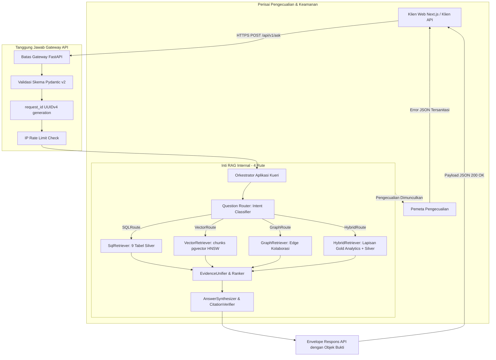

# Desain API — Spesifikasi Teknis & Kontrak API (/api/v1)

**Versi Dokumen:** 3.6.2 (Consolidated Hybrid Master Blueprint — aturan bahasa: narasi Indonesia, teknis Inggris)  
**Tanggal Status:** 2026-09-27  
**Menggantikan:** `06 Api Design.md` Draft v2 s.d. v3.5.0  
**Konteks Otoritatif:** Selaras dengan `README.md` dan `docs/01` hingga `docs/12`  

> **Status Implementasi (Sinkronisasi Progress Phase 2):**  
> 1. **Database PostgreSQL & pgvector — DONE:** Basis data PostgreSQL aktif memuat 9 tabel relasional kanonikal, 40 chunk ber-embedding vector(1024) `BAAI/bge-m3` dengan indeks HNSW aktif, serta tabel edge `institution_collaboration` dan `author_collaboration`.  
> 2. **Implementasi Gateway API (Fase 2 DONE):** Kerangka backend FastAPI (`backend/app/`), pool koneksi async `asyncpg`, endpoint `GET /api/v1/health`, kontrak `POST /api/v1/ask` (skema Pydantic v2 `EvidenceObject` & `AskResponse`), middleware `X-Request-ID`, rate limiting, dan penanganan error terstandarisasi **sudah selesai dan terverifikasi**.  
> 3. **NEXT (Fase 3):** Implementasi `QuestionRouter` dan `SqlRetriever` (Text-to-SQL + AST gate `sqlglot`).
---

## 1. Tujuan

Dokumen ini mendefinisikan spesifikasi teknis lengkap dan kontrak antarmuka **REST API v1** untuk sistem **Asisten Riset Intelijen**. 

API ini bertindak sebagai **system boundary layer** yang melayani kueri analitik dan kebijakan riset multi-moda melalui endpoint terpadu `POST /api/v1/ask`. Seluruh respons analitik diwajibkan menyertakan **`EvidenceObject` terstruktur** untuk menjamin *zero-hallucination* pada data statistik dan metrik bibliometrik.

---

## 2. Arsitektur API & Batas Sistem



---

## 3. Status Saat Ini vs Target

| Path Endpoint | Metode HTTP | Status Implementasi | Fase Target | Deskripsi & Kesenjangan (Gap) |
|---|---|---|---|---|
| `/api/v1/ask` | `POST` | `FOUNDATION DONE` | Fase 2 (Gateway) / Fase 3 (Routing) | Endpoint primer RAG riset; skema `AskRequest`, `AskResponse`, dan `EvidenceObject` aktif. |
| `/api/v1/health` | `GET` | `DONE` | Fase 2 | Endpoint pemeriksaan kesehatan & dependensi (PostgreSQL, pgvector, Ollama) terverifikasi. |
| `/api/query` | `POST` | `SUPERSEDED` | Historis Draft v2 | Desain awal v2; **resmi digantikan (superseded) oleh `/api/v1/ask`**. |
| `/api/v1/ask/stream` | `POST` | `POST-MVP` | Fase 10 (Masa Depan) | Sintesis streaming SSE token-per-token; ditunda ke pasca-MVP. |
| Endpoint Resource (`/papers`, `/authors`, `/topics`) | `GET` | `POST-MVP` | Fase 10 (Masa Depan) | Detail metadata individual; ditunda ke pasca-MVP. |

---

## 4. Konvensi & Standar API

- **Path Dasar (Base Path)**: `/api/v1`
- **Header Request Wajib**: `Content-Type: application/json`
- **Header Respons Standar**: `Content-Type: application/json; charset=utf-8`
- **Header Penelusuran (Tracing)**: `X-Request-ID: <UUIDv4>`

---

## 5. Spesifikasi Endpoint Primer: `POST /api/v1/ask`

Menerima pertanyaan bahasa natural, mengeksekusi routing 4-jalur, menyintesis jawaban analitik, dan mengembalikan bukti terstruktur.

### 5.1 Kontrak Request (Skema Pydantic v2)

```python
from pydantic import BaseModel, Field
from typing import Optional, List, Literal

class FilterParams(BaseModel):
    year: Optional[int] = Field(None, ge=1900, le=2026, description="Tahun publikasi eksak")
    year_from: Optional[int] = Field(None, ge=1900, le=2026, description="Tahun awal publikasi")
    year_to: Optional[int] = Field(None, ge=1900, le=2026, description="Tahun akhir publikasi")
    country: Optional[str] = Field(None, max_length=128, description="Negara institusi (lowercase)")
    author_name: Optional[str] = Field(None, max_length=255, description="Nama penulis")
    institution_name: Optional[str] = Field(None, max_length=255, description="Nama institusi")
    topic_name: Optional[str] = Field(None, max_length=255, description="Klaster topik riset")
    document_type: Optional[str] = Field(None, max_length=64, description="Tipe dokumen Scopus")

class AskRequest(BaseModel):
    question: str = Field(..., min_length=3, max_length=1000, description="Pertanyaan riset pengguna")
    filters: Optional[FilterParams] = Field(default_factory=FilterParams, description="Filter metadata terstruktur")
    developer_mode: Optional[bool] = Field(False, description="Flag untuk menyertakan metadata debug, SQL, dan latensi")
```

### 5.2 Kontrak Respons (Skema Pydantic v2 dengan Objek Bukti)

```python
from pydantic import BaseModel, Field
from typing import Optional, List, Literal, Union, Dict, Any

class EvidenceSourceRef(BaseModel):
    publication_id: str = Field(..., description="ID kanonikal publikasi di PostgreSQL (publications)")
    doi: Optional[str] = Field(None, description="DOI resmi publikasi (jika ada)")
    eid: Optional[str] = Field(None, description="EID Scopus publikasi")
    title: Optional[str] = Field(None, description="Judul publikasi")
    year: Optional[int] = Field(None, description="Tahun publikasi")

class EvidenceObject(BaseModel):
    claim: str = Field(..., description="Pernyataan faktual spesifik yang disintesis")
    metric: str = Field(..., description="Jenis metrik: publication_count | citation_count | expertise_score | growth_score | citation_acceleration | similarity_score")
    value: Union[float, int, str] = Field(..., description="Nilai numerik eksak dari database")
    period: str = Field(..., description="Rentang waktu observasi, misal: '2020-2023' atau 'all-time'")
    sources: List[EvidenceSourceRef] = Field(..., description="Daftar publikasi bukti pendukung")
    confidence: float = Field(..., ge=0.0, le=1.0, description="Tingkat keyakinan bukti data")

class SourceItem(BaseModel):
    publication_id: str
    title: str
    year: Optional[int]
    doi: Optional[str]
    source_type: Literal["sql", "vector", "graph", "analytics"]
    relevance_score: Optional[float]
    provenance: Optional[str]

class CandidateItem(BaseModel):
    id: str
    name: str
    type: Literal["author", "institution", "topic"]
    publication_count: int
    affiliation: Optional[str]

class DebugInfo(BaseModel):
    sql_executed: Optional[str]
    route_reasoning: Optional[str]
    latency_breakdown_ms: Dict[str, float]
    scored_chunks: Optional[List[Dict[str, Any]]]  # VectorRoute saja: publication_id, title, year, doi, chunk_id, similarity_score

class AskResponse(BaseModel):
    request_id: str = Field(..., description="UUIDv4 pelacakan request yang unik")
    status: Literal["ok", "not_found", "needs_clarification", "error"]
    route: Literal["SQLRoute", "VectorRoute", "GraphRoute", "HybridRoute"]
    answer: str = Field(..., description="Teks jawaban naratif yang ter-grounding")
    evidence_objects: List[EvidenceObject] = Field(default_factory=list, description="Array bukti numerik dan tematik terstruktur")
    sources: List[SourceItem] = Field(default_factory=list, description="Daftar naskah literatur bukti")
    candidates: Optional[List[CandidateItem]] = Field(None, description="Daftar pilihan entitas ambigu saat status=needs_clarification")
    filters_ignored: List[str] = Field(default_factory=list, description="Daftar filter yang diabaikan")
    answered_via_fallback: bool = Field(False, description="Flag bila rute dijatuhkan ke fallback semantik")
    unverified_citations: List[str] = Field(default_factory=list, description="Sitasi yang dipangkas oleh CitationVerifier")
    debug: Optional[DebugInfo] = Field(None, description="Metadata debug jika developer_mode=true")
```

### 5.3 Contoh Respons Sukses dengan Objek Bukti (`status: ok`)

```json
{
  "request_id": "c83b7e41-6a20-4e89-981f-f1791a8e9921",
  "status": "ok",
  "route": "HybridRoute",
  "answer": "Berdasarkan analisis bibliometrik, terapi Mesenchymal Stem Cell (MSC) menunjukkan pertumbuhan publikasi yang sangat pesat sebesar 28.4% YoY pada tahun 2023. Peneliti paling terkemuka dalam domain ini di Indonesia adalah Dr. A. Rahman dengan skor kepakaran 84.50, didukung oleh 14 publikasi dan H-index 9 pada klaster topik ini [Mesenchymal Stem Cell Therapy for Cartilage Regeneration, 2023, 10.1016/j.cell.2023.01.002].",
  "evidence_objects": [
    {
      "claim": "Terapi Mesenchymal Stem Cell (MSC) mengalami pertumbuhan publikasi 28.4% YoY pada 2023",
      "metric": "growth_score",
      "value": 0.2840,
      "period": "2023",
      "sources": [
        {
          "publication_id": "pub_89210",
          "doi": "10.1016/j.cell.2023.01.002",
          "eid": "2-s2.0-851492019",
          "title": "Mesenchymal Stem Cell Therapy for Cartilage Regeneration",
          "year": 2023
        }
      ],
      "confidence": 1.0
    },
    {
      "claim": "Dr. A. Rahman memimpin kepakaran topik MSC dengan skor 84.50 dan H-index topik 9",
      "metric": "expertise_score",
      "value": 84.50,
      "period": "all-time",
      "sources": [
        {
          "publication_id": "pub_89210",
          "doi": "10.1016/j.cell.2023.01.002",
          "eid": "2-s2.0-851492019",
          "title": "Mesenchymal Stem Cell Therapy for Cartilage Regeneration",
          "year": 2023
        }
      ],
      "confidence": 1.0
    }
  ],
  "sources": [
    {
      "publication_id": "pub_89210",
      "title": "Mesenchymal Stem Cell Therapy for Cartilage Regeneration",
      "year": 2023,
      "doi": "10.1016/j.cell.2023.01.002",
      "source_type": "analytics",
      "relevance_score": 0.94,
      "provenance": "Gold Layer: topics & researcher_expertise"
    }
  ],
  "filters_ignored": [],
  "answered_via_fallback": false,
  "unverified_citations": []
}
```

---

## 6. Spesifikasi Pemeriksaan Kesehatan: `GET /api/v1/health`

Memeriksa integritas backend dan kesiapan koneksi ke PostgreSQL, `pgvector`, dan layanan Ollama:

```json
{
  "status": "healthy",
  "version": "1.0.0",
  "database": {
    "status": "connected",
    "role": "app_readonly",
    "silver_tables_ready": true,
    "gold_tables_ready": true,
    "pgvector_ready": true
  },
  "llm_service": {
    "status": "connected",
    "model": "Qwen2.5-Coder-7B-Instruct",
    "provider": "Ollama"
  },
  "embedding_service": {
    "status": "ready",
    "model": "BAAI/bge-m3",
    "dimension": 1024
  }
}
```

---

## 7. Penanganan Error & Envelope Error Terstandarisasi

Semua pengecualian (*exception*) internal ditangkap di gerbang batas (boundary) dan dipetakan ke format error terstandarisasi:

```json
{
  "request_id": "c83b7e41-6a20-4e89-981f-f1791a8e9921",
  "error": {
    "error_type": "db_timeout",
    "message": "Permintaan membutuhkan waktu terlalu lama untuk diproses oleh database. Silakan persempit filter pencarian Anda.",
    "status_code": 503
  }
}
```

---

## 8. Kriteria Penerimaan Kontrak API (Kriteria Penerimaan)

- [ ] **AC-API-1**: Endpoint `POST /api/v1/ask` tervalidasi menggunakan Pydantic v2 dan mendukung 4 rute retrieval normatif.
- [ ] **AC-API-2**: Skema `AskResponse` menyertakan array `evidence_objects` dengan field `claim`, `metric`, `value`, `period`, `sources`, dan `confidence`.
- [ ] **AC-API-3**: Tidak ada error internal atau raw stack trace yang bocor ke respons client.
- [ ] **AC-API-4**: Endpoint `GET /api/v1/health` memverifikasi status koneksi basis data Silver/Gold, pgvector, dan LLM Ollama.

---

## 9. Matriks Konsistensi Keputusan (Lintas Dokumen)

| Area Keputusan | Keputusan Kanonikal | Dokumen Terkait | Status |
|---|---|---|---|
| **Database** | PostgreSQL 15+ (sudah dibuat & siap pakai, kredensial internal aman) | `01`, `02`, `03`, `04`, `08`, `09`, `10`, `11` | ALIGNED |
| **Vector Storage** | `pgvector` HNSW (`m=16, ef_construction=64`, `vector_cosine_ops`) pada `chunks.embedding vector(1024)` (DONE, Task 1) | `02`, `03`, `04`, `05`, `09`, `10`, `12` | ALIGNED |
| **Konvensi penamaan** | 9 tabel relasional kanonikal standar: `publications`, `authors`, `institutions`, `keywords`, `funding`, `pub_author`, `pub_institution`, `publication_references`, `chunks` | `01`, `02`, `03`, `04`, `05`, `06`, `10`, `11`, `12` | ALIGNED |
| **Pembersihan data (cleaning)** | Bronze → Silver via script Python — **DONE** (hasil pembersihan ter-export di `data/*_cleaned.csv`, 9 file; sudah ter-load di 9 tabel Silver) | `01`, `04`, `10`, `12` | ALIGNED |
| **Normalisasi lowercase** | Naratif & kategorikal (`abstract`, `keyword`, `country`, dll.) disimpan full lowercase; tampilan & ID asli dipertahankan; kolom `*_normalized` (`author_name_normalized`, `institution_name_normalized`, `funding_agency_normalized`) disimpan lowercase+trim+strip-punct untuk agregasi/pencarian | `01`, `02`, `04`, `05`, `12` | ALIGNED |
| **Chunking** | Granularitas abstrak per publikasi pada tabel `chunks`, field `chunk_text`, `section = 'title_abstract'` | `03`, `04`, `05`, `12` | ALIGNED |
| **Embedding** | `BAAI/bge-m3` (1024-dim, Float32) via `sentence-transformers`, batch 32–64, CPU-optimized, input `Title: {title}\nAbstract: {abstract}` (DONE, Task 1) | `01`, `02`, `03`, `04`, `05`, `09`, `10`, `12` | ALIGNED |
| **Retrieval** | Dynamic 4-Route: `SQLRoute` (Silver), `VectorRoute` (`chunks.embedding`), `GraphRoute` (Derived Edge T1–T4), `HybridRoute` (Gold Analytics + Silver) | `01`, `02`, `03`, `05`, `06`, `10`, `11` | ALIGNED |
| **Vector Similarity Gate** | Cosine similarity threshold dikunci deterministik $\ge 0.65$ untuk model `BAAI/bge-m3`; kueri di bawah ambang → short-circuit ke `status: not_found` | `02`, `03`, `05`, `06` | ALIGNED |
| **Format sitasi** | Standar deterministik 3-elemen: `[Judul, Tahun, DOI]` jika ada DOI, dan `[Judul, Tahun, no-doi]` jika naskah tanpa DOI | `01`, `05`, `06`, `07` | ALIGNED |
| **Graph Engine Strategy** | MVP dikunci menggunakan parameterized PostgreSQL Recursive CTE (T1–T4); evaluasi pasca-MVP menggunakan Apache AGE pada Fase 9 | `03`, `04`, `09`, `11` | ALIGNED |
| **Konteks RAG** | Pembingkaian `UNTRUSTED DATA`, LLM murni menyintesis narasi & memvalidasi `EvidenceObject`, short-circuit deterministik pada 0 bukti, `CitationVerifier` post-hoc | `02`, `03`, `05`, `06`, `07`, `08` | ALIGNED |
| **Kontrak API** | `POST /api/v1/ask` (`AskRequest` & `AskResponse` dengan `evidence_objects`) + `GET /api/v1/health`. Endpoint `/api/query` resmi SUPERSEDED | `02`, `03`, `05`, `06`, `07`, `10`, `11` | ALIGNED |
| **Dataset prototipe** | Dataset prototipe kecil (~20 publikasi, 40 chunk, 138 author, 107 institusi, 22 kolom naskah) untuk validasi end-to-end lengkap | `01`, `02`, `03`, `04`, `10`, `11`, `12` | ALIGNED |
| **Dataset skala produksi** | Target masa depan untuk ingestion Scopus skala besar (>100K publikasi) dengan pipeline batch otomatis, deduplikasi multi-tier, dan worker async | `01`, `02`, `03`, `04`, `11`, `12` | ALIGNED |

---

## 10. Keputusan Arsitektur Kanonikal

1. **No-DOI Citation Decision:**
   - *Keputusan:* Format sitasi inline menggunakan pola baku `[Judul, Tahun, DOI]` jika DOI tersedia, dan `[Judul, Tahun, no-doi]` jika publikasi tidak memiliki DOI. Pola ini menjamin regex parser `CitationVerifier` dan parser frontend bekerja deterministik tanpa salah tafsir koma.
2. **Cosine Similarity Threshold Decision (`VectorRoute`):**
   - *Keputusan:* Nilai cosine similarity threshold dikunci pada $\ge 0.65$ untuk model `BAAI/bge-m3`. Kueri dengan nilai $< 0.65$ langsung diarahkan ke `status: not_found`.
3. **Post-MVP Graph Engine Decision:**
   - *Keputusan:* MVP menggunakan Recursive CTE Terparameterisasi PostgreSQL (Templat T1–T4) pada tabel edge `institution_collaboration` dan `author_collaboration`. Untuk fase pasca-MVP (Fase 9), sistem menetapkan **Apache AGE** sebagai target evaluasi utama karena terintegrasi langsung sebagai ekstensi PostgreSQL tanpa memerlukan infrastruktur instance database graf terpisah.

---

## 11. Riwayat Perubahan

| Dokumen | Perubahan | Alasan |
|---|---|---|
| `docs/06 Api Design.md` v3.6.2 | Aturan bahasa: narasi Indonesia, teknis Inggris (`system boundary layer`, `EvidenceObject`, `Question Router`, `Rate Limit Check`, dll) | Tanpa duplikasi bilingual; perbaiki terjemahan literal yang aneh |
| `docs/06 Api Design.md` v3.6.0 | Sinkronisasi Bahasa Indonesia; tanpa perubahan keputusan teknis | Penyelarasan bahasa 2026-09-27 |
| `docs/06 Api Design.md` v3.5.0 | Menandai cleaning + cleaned export DONE; mengklarifikasi contoh `health` (`pgvector_ready`/`gold_tables_ready: true`) baru berlaku pasca-Task 1/8.5 | Sinkronisasi progress aktual 2026-09-27 |
| `docs/06 Api Design.md` v3.4.0 | Menyelaraskan referensi model data backend ke nama tabel kanonikal tanpa akhiran `_cleaned` | Penyelarasan format penamaan sesuai instruksi project |
| `docs/06 Api Design.md` v3.4.0 | Mengunci keputusan format sitasi (`no-doi`), threshold kosinus $\ge 0.65$, dan strategi graf Apache AGE | Menutup open decisions menjadi keputusan kanonikal |
| `docs/06 Api Design.md` v3.4.0 | Memperbarui Matriks Konsistensi Keputusan dan Riwayat Perubahan | Menjamin standarisasi dokumentasi di seluruh repository |
