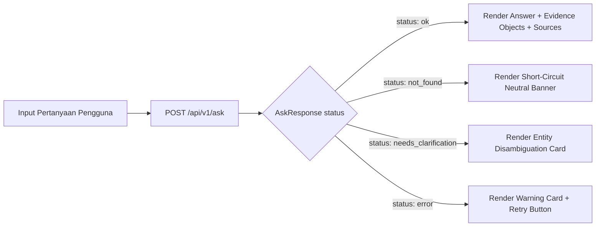

# Spesifikasi UI — Anti-Slop, Tata Letak Padat (Consolidated Hybrid Master Blueprint)

**Versi Dokumen:** 3.6.0 (Consolidated Hybrid Master Blueprint)  
**Tanggal Status:** 2026-09-27  
**Menggantikan:** `07 Ui Spec.md` Draft v2 s.d. v3.5.0  
**Konteks Otoritatif:** Selaras dengan `README.md` dan `docs/01` hingga `docs/12`  

> **Status Implementasi (Sinkronisasi Progress 2026-09-27):**  
> 1. **Database PostgreSQL:** Basis data PostgreSQL **sudah dibuat dan siap pakai**, memuat **dataset prototipe kecil** (~20 publikasi, 40 chunk, 138 author, 107 institusi) pada 9 tabel relasional kanonikal (`publications`, `authors`, `institutions`, `keywords`, `funding`, `pub_author`, `pub_institution`, `publication_references`, `chunks`) untuk validasi end-to-end. Kredensial diamankan secara internal.  
> 2. **Implementasi UI (PLANNED / NOT YET IMPLEMENTED):** Direktori implementasi (`frontend/`, `backend/`, `database/`, `scripts/`, `docker/`, `tests/`) belum ada di repositori. Seluruh antarmuka UI Next.js, komponen React, state management, dan handler API di bawah ini berstatus **PLANNED** dan mendefinisikan spesifikasi antarmuka normatif untuk fase implementasi (Task 11).
> 3. **Sinkronisasi Progress 2026-09-27:** Cleaning Scopus dan cleaned export (`data/*_cleaned.csv`) **DONE**; vector storage ke pgvector (Task 1) **PENDING**.

---

## 1. Tujuan & Filosofi Desain

Dokumen ini mendefinisikan spesifikasi antarmuka pengguna (**Spesifikasi UI**) untuk aplikasi web **Asisten Riset Intelijen**.

Prinsip utama antarmuka ini adalah **"Anti-Slop & High Density"** dengan estetika **Clean White ala Notion / Linear**:
1. **Jujur & Eksplisit**: Tidak ada state visual yang ambigu. Setiap status dari backend API (`POST /api/v1/ask`) — baik `ok`, `not_found`, `needs_clarification`, maupun `error` — memiliki representasi visual yang membeda dan transparan.
2. **Tanpa Dekorasi Berlebih**: Warna digunakan secara hemat dan strictly fungsional (grayscale dominan, 1 warna aksen untuk interaksi, 1 warna sinyal peringatan). Tidak ada shadow besar, gradien, atau elemen neumorphic.
3. **Visualisasi Objek Bukti Terstruktur (`evidence_objects`)**: Metrik kunci (laju pertumbuhan, skor kepakaran, total publikasi) dirender sebagai chip/kartu metrik kompak yang terikat ke bukti sumber naskah.
4. **Kepadatan Informasi Tinggi (Dense Layout)**: Mengabaikan gaya percakapan ala chat-bubble ChatGPT/Claude. Informasi disajikan dalam bentuk panel dua kolom dengan tabel HTML asli, Monospace typography untuk data numerik/SQL, dan section sumber yang dapat diciutkan (*collapsible sources*).

---

## 2. Pemetaan Kontrak API (Frontend ↔ Backend `/api/v1/ask`)

Antarmuka UI terikat secara ketat pada kontrak API v1 (`06 Api Design.md`):



### Pemetaan Field API ke Elemen UI:
- `request_id`: Ditampilkan pada footer Developer Mode dan header error log.
- `status`: Menentukan layout kartu jawaban (`ok`, `not_found`, `needs_clarification`, `error`).
- `route`: Menampilkan Route Badge (`[SQLRoute]`, `[VectorRoute]`, `[GraphRoute]`, `[HybridRoute]`).
- `evidence_objects`: Dirender sebagai panel *Verified Metric Chips* yang menampilkan klaim, metrik, nilai, periode, dan indikator keyakinan.
- `sources`: Dirender pada panel *Collapsible Sources* dengan penanda `source_type` (`sql`, `vector`, `graph`, `analytics`). Format sitasi: `[Judul, Tahun, DOI]` atau `[Judul, Tahun, no-doi]`.
- `filters_ignored`: Catatan transparansi di bawah jawaban jika ada field filter yang tidak diterapkan.
- `answered_via_fallback`: Menambahkan indikator visual `*` pada Route Badge (`[VectorRoute*]`).
- `unverified_citations`: Menampilkan badge peringatan sitasi yang di-strip oleh backend `CitationVerifier`.
- `candidates`: Menampilkan daftar pilihan entitas interaktif untuk klarifikasi pengguna.
- `debug`: Menampilkan panel inspeksi SQL & *latency breakdown* jika `developer_mode: true`.

---

## 3. Token Desain

### 3.1 Warna (Mode Terang Murni — Palet Minimalis)

| Token | Kode Hex | Peruntukan & Aturan Penggunaan |
|---|---|---|
| `bg-base` | `#FFFFFF` | Latar belakang utama aplikasi (selalu putih murni). |
| `bg-subtle` | `#F7F7F5` | Latar panel sekunder (sidebar riwayat, blok SQL, kartu klarifikasi, chip metrik). |
| `bg-hover` | `#F1F1EF` | State hover pada baris tabel, item riwayat, dan tombol. |
| `border-default` | `#E9E9E7` | Seluruh garis pemisah (divider) dan border komponen (1px solid). |
| `border-strong` | `#D9D9D6` | Border komponen aktif, elemen fokus, atau header tabel. |
| `text-primary` | `#171717` | Teks utama jawaban dan judul (hampir hitam murni). |
| `text-secondary` | `#6B6B68` | Subjudul, metadata publikasi, label badge, timestamp. |
| `text-tertiary` | `#9B9B98` | Placeholder input, teks disabled, catatan keterbatasan. |
| `accent` | `#2563EB` | Warna aksen tunggal (Royal Blue): tombol primer, link DOI, fokus ring. |
| `signal-warn` | `#B45309` | Warna teks & border error/peringatan (Amber Brown). |
| `signal-warn-bg` | `#FEF3E2` | Latar belakang tipis untuk banner error (Light Amber). |
| `signal-neutral-bg` | `#F7F7F5` | Latar belakang netral untuk state `not_found`. |

### 3.2 Tipografi

| Token | Famili Font | Ukuran / Tinggi Baris | Pemakaian |
|---|---|---|---|
| `font-sans` | Inter, system-ui | 14px / 1.5 (`text-base`) | Body teks jawaban, label antarmuka, pertanyaan. |
| `font-mono` | JetBrains Mono, monospace | 13px / 1.4 (`text-sm`) | Angka tabel, tahun, DOI, ID publikasi, blok SQL, nilai metrik. |
| `heading-lg` | Inter, system-ui | 16px / 1.3 (Semibold) | Judul panel utama dan pertanyaan aktif. |
| `caption-xs` | Inter, system-ui | 12px / 1.4 (`text-xs`) | Request ID, metadata latensi debug, timestamp. |

---

## 4. Arsitektur Tata Letak (Tata Letak Padat Dua Panel)

```text
┌────────────────────────┬────────────────────────────────────────────────────────────────────────┐
│ Research Intelligence  │  Research Intelligence Assistant                         [Dev Mode ◯]  │
├────────────────────────┼────────────────────────────────────────────────────────────────────────┤
│ + Kueri Baru           │  Q  Bagaimana tren terapi stem cell dan siapa pakar utamanya?          │
│                        ├────────────────────────────────────────────────────────────────────────┤
│ RIWAYAT SESI           │  [HybridRoute]                                                         │
│ ● Tren Stem Cell       │  Terapi Mesenchymal Stem Cell (MSC) mengalami pertumbuhan publikasi    │
│ ○ Top 5 author 2023    │  sebesar 28.4% YoY pada tahun 2023 di Indonesia...                     │
│ ○ Jaringan AI ITB      │                                                                        │
│                        │  ┌─ METRIK TERVERIFIKASI (OBJEK BUKTI) ──────────────────────────┐ │
│                        │  │ • Growth Rate: +28.40% (2023) [Confidence: 100%]                  │ │
│                        │  │ • Top Expert: Dr. A. Rahman (Score: 84.50, H-index: 9)            │ │
│                        │  └───────────────────────────────────────────────────────────────────┘ │
│                        │                                                                        │
│                        │  #   Nama Penulis            Skor Kepakaran   Publikasi   H-index      │
│                        │  1   Dr. A. Rahman           84.50            14          9            │
│                        │  2   Dr. B. Santoso          76.20            11          7            │
│                        │                                                                        │
│                        │  ▸ Sumber Literatur (5)                                                │
│                        │  ▸ Inspeksi Debug & SQL (developer_mode: true)                        │
├────────────────────────┴────────────────────────────────────────────────────────────────────────┤
│  [ Filter ▾ ]  Tanyakan analitik atau kebijakan publikasi...                          [Kirim →] │
└─────────────────────────────────────────────────────────────────────────────────────────────────┘
```

---

## 5. Komponen UI Kunci

### 5.1 Route Badge Component
Menampilkan penanda rute di atas jawaban:
- Teks: `[SQLRoute]` | `[VectorRoute]` | `[GraphRoute]` | `[HybridRoute]`
- Jika `answered_via_fallback: true`, badge menampilkan indikator `[VectorRoute*]` dengan tooltip penjelas.

### 5.2 Panel Objek Bukti Terstruktur (`evidence_objects`)
Menampilkan (render) kartu metrik kompak untuk setiap objek bukti terverifikasi:
- Menampilkan klaim fakta, label metrik, nilai numerik presisi (`font-mono`), periode observasi, dan bar confidence.
- Mengklik objek bukti akan meng-highlight sumber publikasi terkait di panel *Collapsible Sources*.

### 5.3 Collapsible Sources Component (`sources`)
- Header: `▸ Sumber Literatur (N)`, default terbuka jika $N \le 3$, terlipat jika $N > 3$.
- Format Baris Sumber:
  ```text
  [analytics] "Mesenchymal Stem Cell Therapy..." | 2023 | DOI: 10.1016/j.cell.2023.01.002 | Gold Layer
  [vector] "Wharton's Jelly Isolation Protocol..." | 2021 | DOI: no-doi | Silver Layer
  ```
- Badge tipe sumber: `[sql]`, `[vector]`, `[graph]`, `[analytics]`.

### 5.4 Developer Mode Inspector Panel
Menampilkan blok kode SQL/CTE `font-mono`, alasan perutean (routing), serta rincian latensi (latency breakdown) ms (`validation_ms`, `routing_ms`, `retrieval_ms`, `unification_ms`, `synthesis_ms`, `verification_ms`, `total_ms`).

---

## 6. Daftar Periksa Kriteria Penerimaan UI (Kriteria Penerimaan Task 11)

- [ ] **AC-UI-1**: Tata letak padat 2-panel ala Notion/Linear terimplementasi tanpa elemen dekoratif berlebih.
- [ ] **AC-UI-2**: Integrasi `POST /api/v1/ask` mendukung render `evidence_objects` terstruktur.
- [ ] **AC-UI-3**: Badge Rute menampilkan `[SQLRoute]`, `[VectorRoute]`, `[GraphRoute]`, dan `[HybridRoute]`.
- [ ] **AC-UI-4**: Status loading menampilkan tahapan dinamis dan penghitung waktu berjalan (elapsed time counter).
- [ ] **AC-UI-5**: Status `needs_clarification` menampilkan kartu pilihan kandidat entitas interaktif.
- [ ] **AC-UI-6**: Status `not_found` menampilkan (render) banner netral tanpa halusinasi LLM.
- [ ] **AC-UI-7**: Status error menampilkan pesan ramah tanpa kebocoran SQL mentah/traceback.

---

## 7. Matriks Konsistensi Keputusan (Lintas Dokumen)

| Area Keputusan | Keputusan Kanonikal | Dokumen Terkait | Status |
|---|---|---|---|
| **Database** | PostgreSQL 15+ (sudah dibuat & siap pakai, kredensial internal aman) | `01`, `02`, `03`, `04`, `08`, `09`, `10`, `11` | ALIGNED |
| **Penyimpanan vector** | `pgvector` HNSW (`m=16, ef_construction=64`, `vector_cosine_ops`) pada `chunks.embedding vector(1024)` (PLANNED, Task 1) | `02`, `03`, `04`, `05`, `09`, `10`, `12` | ALIGNED |
| **Konvensi penamaan** | 9 tabel relasional kanonikal standar: `publications`, `authors`, `institutions`, `keywords`, `funding`, `pub_author`, `pub_institution`, `publication_references`, `chunks` | `01`, `02`, `03`, `04`, `05`, `06`, `10`, `11`, `12` | ALIGNED |
| **Pembersihan data (cleaning)** | Bronze → Silver via script Python — **DONE** (hasil pembersihan ter-export di `data/*_cleaned.csv`, 9 file; sudah ter-load di 9 tabel Silver) | `01`, `04`, `10`, `12` | ALIGNED |
| **Normalisasi lowercase** | Naratif & kategorikal (`abstract`, `keyword`, `country`, dll.) disimpan full lowercase; tampilan & ID asli dipertahankan; kolom `*_normalized` (`author_name_normalized`, `institution_name_normalized`, `funding_agency_normalized`) disimpan lowercase+trim+strip-punct untuk agregasi/pencarian | `01`, `02`, `04`, `05`, `12` | ALIGNED |
| **Chunking** | Granularitas abstrak per publikasi pada tabel `chunks`, field `chunk_text`, `section = 'title_abstract'` | `03`, `04`, `05`, `12` | ALIGNED |
| **Embedding** | `BAAI/bge-m3` (1024-dim, Float32) via `sentence-transformers`, batch 32–64, dioptimalkan CPU, input `Title: {title}\nAbstract: {abstract}` (PLANNED, Task 1) | `01`, `02`, `03`, `04`, `05`, `09`, `10`, `12` | ALIGNED |
| **Retrieval** | 4-Rute Dinamis: `SQLRoute` (Silver), `VectorRoute` (`chunks.embedding`), `GraphRoute` (Edge Turunan T1–T4), `HybridRoute` (Analitik Gold + Silver) | `01`, `02`, `03`, `05`, `06`, `10`, `11` | ALIGNED |
| **Gerbang similaritas vector** | Ambang kesamaan kosinus dikunci deterministik $\ge 0.65$ untuk model `BAAI/bge-m3`; kueri di bawah ambang batas short-circuit ke `status: not_found` | `02`, `03`, `05`, `06` | ALIGNED |
| **Format sitasi** | Standar deterministik 3-elemen: `[Judul, Tahun, DOI]` jika ada DOI, dan `[Judul, Tahun, no-doi]` jika naskah tanpa DOI | `01`, `05`, `06`, `07` | ALIGNED |
| **Strategi mesin graf** | MVP dikunci menggunakan Recursive CTE Terparameterisasi PostgreSQL (T1–T4); rekomendasi evaluasi pasca-MVP menggunakan Apache AGE pada Fase 9 | `03`, `04`, `09`, `11` | ALIGNED |
| **Konteks RAG** | Pembingkaian `UNTRUSTED DATA`, LLM murni menyintesis narasi & memvalidasi `EvidenceObject`, short-circuit deterministik pada 0 bukti, `CitationVerifier` post-hoc | `02`, `03`, `05`, `06`, `07`, `08` | ALIGNED |
| **Kontrak API** | `POST /api/v1/ask` (`AskRequest` & `AskResponse` dengan `evidence_objects`) + `GET /api/v1/health`. Endpoint `/api/query` resmi SUPERSEDED | `02`, `03`, `05`, `06`, `07`, `10`, `11` | ALIGNED |
| **Dataset prototipe** | Dataset prototipe kecil (~20 publikasi, 40 chunk, 138 author, 107 institusi, 22 kolom naskah) untuk validasi end-to-end lengkap | `01`, `02`, `03`, `04`, `10`, `11`, `12` | ALIGNED |
| **Dataset skala produksi** | Target masa depan untuk ingestion Scopus skala besar (>100K publikasi) dengan pipeline batch otomatis, deduplikasi multi-tier, dan worker async | `01`, `02`, `03`, `04`, `11`, `12` | ALIGNED |

---

## 8. Keputusan Arsitektur Kanonikal

1. **Keputusan Sitasi Tanpa DOI:**
   - *Keputusan:* Format sitasi inline menggunakan pola baku `[Judul, Tahun, DOI]` jika DOI tersedia, dan `[Judul, Tahun, no-doi]` jika publikasi tidak memiliki DOI. Pola ini menjamin regex parser `CitationVerifier` dan parser frontend bekerja deterministik tanpa salah tafsir koma.
2. **Keputusan Ambang Batas Kesamaan Kosinus (`VectorRoute`):**
   - *Keputusan:* Nilai ambang batas kesamaan kosinus dikunci pada $\ge 0.65$ untuk model `BAAI/bge-m3`. Kueri yang menghasilkan nilai $< 0.65$ langsung diarahkan ke `status: not_found`.
3. **Keputusan Mesin Graf Pasca-MVP:**
   - *Keputusan:* MVP menggunakan Recursive CTE Terparameterisasi PostgreSQL (Templat T1–T4) pada tabel edge `institution_collaboration` dan `author_collaboration`. Untuk fase pasca-MVP (Fase 9), sistem menetapkan **Apache AGE** sebagai target evaluasi utama karena terintegrasi langsung sebagai ekstensi PostgreSQL tanpa memerlukan infrastruktur instance database graf terpisah.

---

## 9. Riwayat Perubahan

| Dokumen | Perubahan | Alasan |
|---|---|---|
| `docs/07 UI Spec.md` v3.6.0 | Sinkronisasi Bahasa Indonesia; tanpa perubahan keputusan teknis | Penyelarasan bahasa 2026-09-27 |
| `docs/07 UI Spec.md` v3.5.0 | Menandai cleaning + cleaned export sebagai DONE; vector storage PENDING | Sinkronisasi progress aktual 2026-09-27 |
| `docs/07 UI Spec.md` v3.4.0 | Menyelaraskan komponen UI dan collapsible sources dengan format sitasi `[Judul, Tahun, DOI]` / `[Judul, Tahun, no-doi]` | Penyelarasan format sitasi dan konsistensi parser |
| `docs/07 UI Spec.md` v3.4.0 | Memperbarui Matriks Konsistensi Keputusan dan Riwayat Perubahan | Menjamin konsistensi format dan standarisasi lintas dokumen |
