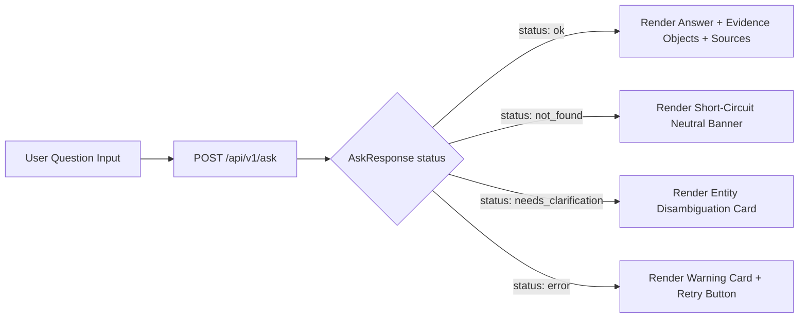

# UI Spec — Anti-Slop, Dense Layout (Consolidated Hybrid Master Blueprint)

**Document Version:** 3.2.0 (Consolidated Hybrid Master Blueprint)  
**Status Date:** 2026-09-28  
**Supersedes:** `07 Ui Spec.md` Draft v2 s.d. v3.1.0  
**Authoritative Context:** Aligned with `README.md` and `docs/00` through `docs/12`  

> **Status Implementasi (Verifikasi Repositori 2026-09-28):**  
> Repositori saat ini hanya berisi dokumentasi perancangan teknis (`README.md` dan `docs/00–12`). Direktori implementasi (`frontend/`, `backend/`, `database/`, `scripts/`, `docker/`, `tests/`) belum ada di repositori. Seluruh antarmuka UI Next.js, komponen React, state management, dan handler API di bawah ini berstatus **PLANNED / NOT IMPLEMENTED** dan mendefinisikan spesifikasi antarmuka normatif untuk fase implementasi (Task 11).

---

## 1. Purpose & Design Philosophy

Dokumen ini mendefinisikan spesifikasi antarmuka pengguna (**UI Specification**) untuk aplikasi web **Research Intelligence Assistant**.

Prinsip utama antarmuka ini adalah **"Anti-Slop & High Density"** dengan estetika **Clean White ala Notion / Linear**:
1. **Jujur & Eksplisit**: Tidak ada state visual yang ambigu. Setiap status dari backend API (`POST /api/v1/ask`) — baik `ok`, `not_found`, `needs_clarification`, maupun `error` — memiliki representasi visual yang membeda dan transparan.
2. **Tanpa Dekorasi Berlebih**: Warna digunakan secara hemat dan strictly fungsional (grayscale dominan, 1 warna aksen untuk interaksi, 1 warna sinyal peringatan). Tidak ada shadow besar, gradien, atau elemen neumorphic.
3. **Visualisasi Objek Bukti Terstruktur (`evidence_objects`)**: Metrik kunci (laju pertumbuhan, skor kepakaran, total publikasi) dirender sebagai chip/kartu metrik kompak yang terikat ke bukti sumber naskah.
4. **Kepadatan Informasi Tinggi (Dense Layout)**: Mengabaikan gaya percakapan ala chat-bubble ChatGPT/Claude. Informasi disajikan dalam bentuk panel dua kolom dengan tabel HTML asli, Monospace typography untuk data numerik/SQL, dan section sumber yang dapat diciutkan (*collapsible sources*).

---

## 2. API Contract Mapping (Frontend ↔ Backend `/api/v1/ask`)

Antarmuka UI terikat secara ketat pada kontrak API v1 (`06 Api Design.md`):



### Pemetaan Field API ke Elemen UI:
- `request_id`: Ditampilkan pada footer Developer Mode dan header error log.
- `status`: Menentukan layout kartu jawaban (`ok`, `not_found`, `needs_clarification`, `error`).
- `route`: Menampilkan Route Badge (`[SQLRoute]`, `[VectorRoute]`, `[GraphRoute]`, `[HybridRoute]`).
- `evidence_objects`: Dirender sebagai panel *Verified Metric Chips* yang menampilkan klaim, metrik, nilai, periode, dan indikator keyakinan.
- `sources`: Dirender pada panel *Collapsible Sources* dengan penanda `source_type` (`sql`, `vector`, `graph`, `analytics`).
- `filters_ignored`: Catatan transparansi di bawah jawaban jika ada field filter yang tidak diterapkan.
- `answered_via_fallback`: Menambahkan indikator visual `*` pada Route Badge (`[VectorRoute*]`).
- `unverified_citations`: Menampilkan badge peringatan sitasi yang di-strip oleh backend `CitationVerifier`.
- `candidates`: Menampilkan daftar pilihan entitas interaktif untuk klarifikasi pengguna.
- `debug`: Menampilkan panel inspeksi SQL & *latency breakdown* jika `developer_mode: true`.

---

## 3. Design Tokens

### 3.1 Warna (Light Mode Murni — Minimalist Palette)

| Token | Hex Code | Peruntukan & Aturan Penggunaan |
|---|---|---|
| `bg-base` | `#FFFFFF` | Latar belakang utama aplikasi (selalu putih murni). |
| `bg-subtle` | `#F7F7F5` | Latar panel sekunder (sidebar riwayat, blok SQL, kartu klarifikasi, chip metrik). |
| `bg-hover` | `#F1F1EF` | State hover pada baris tabel, item riwayat, dan tombol. |
| `border-default` | `#E9E9E7` | Seluruh garis pemisah (divider) dan border komponen (1px solid). |
| `border-strong` | `#D9D9D6` | Border komponen aktif, elemen fokus, atau header tabel. |
| `text-primary` | `#171717` | Teks utama jawaban dan judul (hampir hitam murni). |
| `text-secondary` | `#6B6B68` | Subjudul, metadata publikasi, label badge, timestamp. |
| `text-tertiary` | `#9B9B98` | Placeholder input, teks disabled, catatan keterbatasan. |
| `accent` | `#2563EB` | Warna aksen tunggal (Royal Blue): tombol primer, link DOI, fokus ring. |
| `signal-warn` | `#B45309` | Warna teks & border error/peringatan (Amber Brown). |
| `signal-warn-bg` | `#FEF3E2` | Latar belakang tipis untuk banner error (Light Amber). |
| `signal-neutral-bg` | `#F7F7F5` | Latar belakang netral untuk state `not_found`. |

### 3.2 Tipografi

| Token | Font Family | Ukuran / Line Height | Pemakaian |
|---|---|---|---|
| `font-sans` | Inter, system-ui | 14px / 1.5 (`text-base`) | Body teks jawaban, label antarmuka, pertanyaan. |
| `font-mono` | JetBrains Mono, monospace | 13px / 1.4 (`text-sm`) | Angka tabel, tahun, DOI, ID publikasi, blok SQL, nilai metrik. |
| `heading-lg` | Inter, system-ui | 16px / 1.3 (Semibold) | Judul panel utama dan pertanyaan aktif. |
| `caption-xs` | Inter, system-ui | 12px / 1.4 (`text-xs`) | Request ID, metadata latensi debug, timestamp. |

---

## 4. Layout Architecture (Two-Panel Dense Layout)

```text
┌────────────────────────┬────────────────────────────────────────────────────────────────────────┐
│ Research Intelligence  │  Research Intelligence Assistant                         [Dev Mode ◯]  │
├────────────────────────┼────────────────────────────────────────────────────────────────────────┤
│ + Kueri Baru           │  Q  Bagaimana tren terapi stem cell dan siapa pakar utamanya?          │
│                        ├────────────────────────────────────────────────────────────────────────┤
│ RIWAYAT SESI           │  [HybridRoute]                                                         │
│ ● Tren Stem Cell       │  Terapi Mesenchymal Stem Cell (MSC) mengalami pertumbuhan publikasi    │
│ ○ Top 5 author 2023    │  sebesar 28.4% YoY pada tahun 2023 di Indonesia...                     │
│ ○ Jaringan AI ITB      │                                                                        │
│                        │  ┌─ METRIK TERVERIFIKASI (EVIDENCE OBJECTS) ─────────────────────────┐ │
│                        │  │ • Growth Rate: +28.40% (2023) [Confidence: 100%]                  │ │
│                        │  │ • Top Expert: Dr. A. Rahman (Score: 84.50, H-index: 9)            │ │
│                        │  └───────────────────────────────────────────────────────────────────┘ │
│                        │                                                                        │
│                        │  #   Nama Penulis            Skor Kepakaran   Publikasi   H-index      │
│                        │  1   Dr. A. Rahman           84.50            14          9            │
│                        │  2   Dr. B. Santoso          76.20            11          7            │
│                        │                                                                        │
│                        │  ▸ Sumber Literatur (5)                                                │
│                        │  ▸ Inspeksi Debug & SQL (developer_mode: true)                        │
├────────────────────────┴────────────────────────────────────────────────────────────────────────┤
│  [ Filter ▾ ]  Tanyakan analitik atau kebijakan publikasi...                          [Kirim →] │
└─────────────────────────────────────────────────────────────────────────────────────────────────┘
```

---

## 5. Komponen UI Kunci

### 5.1 Route Badge Component
Menampilkan penanda rute di atas jawaban:
- Teks: `[SQLRoute]` | `[VectorRoute]` | `[GraphRoute]` | `[HybridRoute]`
- Jika `answered_via_fallback: true`, badge menampilkan indikator `[VectorRoute*]` dengan tooltip penjelas.

### 5.2 Panel Objek Bukti Terstruktur (`evidence_objects`)
Merender kartu metrik kompak untuk setiap objek bukti terverifikasi:
- Menampilkan klaim fakta, label metrik, nilai numerik presisi (`font-mono`), periode observasi, dan bar confidence.
- Mengklik objek bukti akan meng-highlight sumber publikasi terkait di panel *Collapsible Sources*.

### 5.3 Collapsible Sources Component (`sources`)
- Header: `▸ Sumber Literatur (N)`, default terbuka jika $N \le 3$, terlipat jika $N > 3$.
- Format Baris Sumber:
  ```text
  [analytics] "Mesenchymal Stem Cell Therapy..." | 2023 | DOI: 10.1016/j.cell.2023.01.002 | Gold Layer
  ```
- Badge tipe sumber: `[sql]`, `[vector]`, `[graph]`, `[analytics]`.

### 5.4 Developer Mode Inspector Panel
Menampilkan blok kode SQL/CTE `font-mono`, alasan routing, serta *latency breakdown ms* (`validation_ms`, `routing_ms`, `retrieval_ms`, `unification_ms`, `synthesis_ms`, `verification_ms`, `total_ms`).

---

## 6. Checklist Kriteria Penerimaan UI (Task 11 Acceptance Criteria)

- [ ] **AC-UI-1**: Layout 2 panel dense ala Notion/Linear terimplementasi tanpa elemen dekoratif berlebih.
- [ ] **AC-UI-2**: Integrasi `POST /api/v1/ask` mendukung rendering `evidence_objects` terstruktur.
- [ ] **AC-UI-3**: Route Badge menampilkan `[SQLRoute]`, `[VectorRoute]`, `[GraphRoute]`, dan `[HybridRoute]`.
- [ ] **AC-UI-4**: State loading menampilkan tahapan dinamis dan counter elapsed time.
- [ ] **AC-UI-5**: State `needs_clarification` menampilkan kartu pilihan kandidat entitas interaktif.
- [ ] **AC-UI-6**: State `not_found` merender banner netral tanpa halusinasi LLM.
- [ ] **AC-UI-7**: State error menampilkan pesan ramah tanpa kebocoran raw SQL/traceback.
