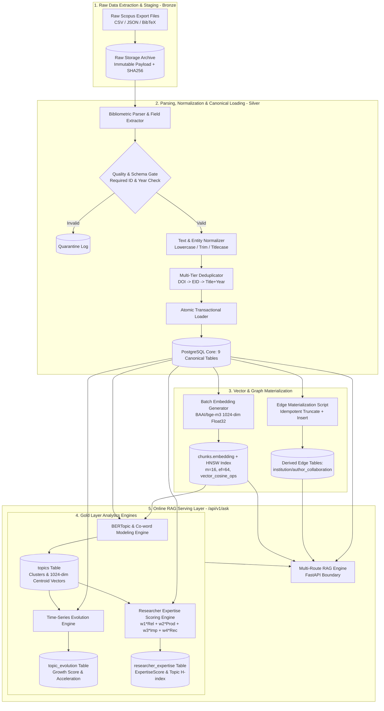

# Data Pipeline & Ingestion Design — Scopus to Research Intelligence (Hybrid Master Blueprint)

**Document Version:** 1.2.0 (Consolidated Hybrid Master Blueprint)  
**Status Date:** 2026-09-28  
**Authoritative Context:** Aligned with `README.md` and `docs/00` through `docs/11`  

> **Status Implementasi & Kesiapan Rekayasa (Verifikasi Repositori 2026-09-28):**  
> Repositori saat ini berada pada tahap perancangan arsitektur (*documentation-only*). Dataset 9 tabel relasional Scopus yang telah dibersihkan dilaporkan telah dimuat pada instance eksternal Supabase PostgreSQL, namun **Task 0 (Audit Skema via `information_schema.columns`) belum dijalankan** dari repositori ini. Pipeline batch embedding (`chunks.embedding vector(1024)` via `BAAI/bge-m3` - Task 1), skrip materialisasi edge table graf (`institution_collaboration`, `author_collaboration` - Task 8), dan komputasi Gold Analytics (`topics`, `topic_evolution`, `researcher_expertise`) berstatus **PLANNED / NOT IMPLEMENTED**. Dokumen ini mendefinisikan arsitektur data pipeline kanonikal, kontrak transformasi, dan strategi ingestion untuk fase eksekusi.

---

## 1. Purpose & Medallion Ingestion Architecture

Dokumen ini mendefinisikan arsitektur **Data Pipeline & Ingestion** yang mentransformasikan data bibliometrik mentah dari **Scopus** menjadi data publikasi ilmiah yang **kanonikal, ternormalisasi, terindeks secara semantik (vektor), siap-graf (*graph-ready*), dan kaya analitik kepakaran (*Gold Analytics Layer*)** untuk mendukung sistem **Research Intelligence Assistant**.

Arsitektur pipeline data distrukturkan ke dalam 3 lapisan Medallion:
1. **Bronze Layer (Raw Staging)**: Penyimpanan arsip berkas mentah ekspor Scopus yang immutable beserta hash integritas SHA-256 dan metadata batch run untuk reproduktibilitas.
2. **Silver Layer (Canonical Relational Storage - 9 Tabel + 2 Edge Tables)**: Sumber kebenaran terstruktur yang telah dibersihkan, dinormalisasi, dan di-deduplikasi (`publications`, `authors`, `institutions`, `keywords`, `funding`, `pub_author`, `pub_institution`, `publication_references`, `chunks`), dilengkapi 2 tabel edge kolaborasi (`institution_collaboration`, `author_collaboration`).
3. **Gold Layer (Analytics & Intelligence - 3 Tabel)**: Pemrosesan analitik tingkat lanjut untuk mengekstrak klaster topik riset (`topics`), evolusi tren temporal (`topic_evolution`), dan skor kepakaran peneliti multi-dimensi (`researcher_expertise`).

---

## 2. Pipeline Overview & End-to-End Flow



---

## 3. Pemrosesan Silver Layer (Pembersihan, Normalisasi, & Deduplikasi)

### 3.1 Aturan Pembersihan & Normalisasi Casing
- **Identifier (PK/FK)**: Casing & format asli dipertahankan (`*_id`, `doi`, `eid`, `grant_number`).
- **Display Text**: Casing asli dipertahankan (`author_name`, `institution_name`, `funding_agency`, `reference_text`).
- **Teks Naratif & Kategorikal**: **Lowercase murni** (`abstract`, `keyword`, `document_type`, `publication_stage`, `country`, `publisher`).
- **Judul Publikasi**: **Titlecase** (`publications.title`).
- **Kolom Agregasi (`*_normalized`)**: **Lowercase + strip whitespace + strip punctuation** (`author_name_normalized`, `institution_name_normalized`, `funding_agency_normalized`).

### 3.2 Strategi Deduplikasi Multi-Tier
1. **Tier 1**: Kesamaan DOI eksak (case-insensitive).
2. **Tier 2**: Kesamaan Scopus EID eksak.
3. **Tier 3**: Kesamaan hash kombinasi Normalized Title + Publication Year.
- *Conflict Resolution*: Metadata record lama diperbarui jika record baru menyediakan atribut yang lebih lengkap, dan `citation_count` diperbarui ke nilai tertinggi (*latest snapshot*).

---

## 4. Pipeline Batch Embedding & Indeks HNSW (Vector Layer)

- **Model:** `BAAI/bge-m3` (Hugging Face / sentence-transformers).
- **Dimensi Vektor:** $1024$ dimensi (*dense vector Float32*).
- **Format Input Teks:**
  ```text
  Title: {title}
  Abstract: {abstract}
  ```
- **Batch Size:** $32$ hingga $64$ chunk per batch (dioptimalkan untuk utilisasi CPU/RAM server).
- **DDL & Indeks HNSW (`pgvector`):**
  ```sql
  CREATE EXTENSION IF NOT EXISTS vector;
  
  ALTER TABLE chunks ADD COLUMN IF NOT EXISTS embedding vector(1024);
  ALTER TABLE chunks ADD COLUMN IF NOT EXISTS embedding_model VARCHAR(64) DEFAULT 'BAAI/bge-m3';
  ALTER TABLE chunks ADD COLUMN IF NOT EXISTS embedding_version VARCHAR(32) DEFAULT 'v1.0';
  
  CREATE INDEX IF NOT EXISTS idx_chunks_embedding_hnsw 
  ON chunks 
  USING hnsw (embedding vector_cosine_ops)
  WITH (m = 16, ef_construction = 64);
  
  ANALYZE chunks;
  ```

---

## 5. Pipeline Materialisasi Edge Graf Kolaborasi

Untuk mendukung kueri relasional jaringan kolaborasi tanpa membebani runtime kueri, script materialisasi idempoten dieksekusi:

```sql
-- Materialisasi Kolaborasi Institusi
TRUNCATE TABLE institution_collaboration;

INSERT INTO institution_collaboration (institution_a, institution_b, weight, via_publication_ids)
SELECT 
    LEAST(pi_a.institution_id, pi_b.institution_id) AS institution_a,
    GREATEST(pi_a.institution_id, pi_b.institution_id) AS institution_b,
    COUNT(DISTINCT pi_a.publication_id) AS weight,
    ARRAY_AGG(DISTINCT pi_a.publication_id::TEXT) AS via_publication_ids
FROM pub_institution pi_a
JOIN pub_institution pi_b 
     ON pi_b.publication_id = pi_a.publication_id
    AND pi_b.institution_id > pi_a.institution_id
GROUP BY 1, 2;

-- Materialisasi Co-authorship Penulis
TRUNCATE TABLE author_collaboration;

INSERT INTO author_collaboration (author_a, author_b, weight, via_publication_ids)
SELECT 
    LEAST(pa_a.author_id, pa_b.author_id) AS author_a,
    GREATEST(pa_a.author_id, pa_b.author_id) AS author_b,
    COUNT(DISTINCT pa_a.publication_id) AS weight,
    ARRAY_AGG(DISTINCT pa_a.publication_id::TEXT) AS via_publication_ids
FROM pub_author pa_a
JOIN pub_author pa_b 
     ON pa_b.publication_id = pa_a.publication_id
    AND pa_b.author_id > pa_a.author_id
GROUP BY 1, 2;
```

---

## 6. Pipeline Analitik Gold Layer (Topic Modeling & Expertise Scoring)

### 6.1 Pipeline Pemodelan Topik & Akselerasi Tren (`topics` & `topic_evolution`)
1. **Ekstraksi Klaster Topik (BERTopic / Co-word)**:
   - Mengelompokkan naskah berdasarkan representasi vektor `chunks.embedding` dan matriks kemunculan bersama kata kunci (*keyword co-occurrence matrix*).
   - Menghasilkan 10 kata kunci representatif per topik (`cluster_keywords`).
   - Menghitung centroid vektor topik (`representation_vector vector(1024)`) sebagai rata-rata naskah anggota klaster.
2. **Perhitungan Metrik Evolusi Temporal (`topic_evolution`)**:
   - Menghitung agregasi publikasi dan sitasi per tahun untuk setiap topik.
   - **Laju Pertumbuhan (Growth Score)**:
     $$\text{GrowthScore}_t = \frac{N_{\text{pubs}, t} - N_{\text{pubs}, t-1}}{\max(1, N_{\text{pubs}, t-1})}$$
   - **Percepatan Sitasi (Citation Acceleration)**:
     $$\text{CitationAcceleration}_t = (\text{Cites}_t - \text{Cites}_{t-1}) - (\text{Cites}_{t-1} - \text{Cites}_{t-2})$$
   - **Klasifikasi Topik Berkembang (`is_emerging`)**: Ditetapkan `TRUE` jika $\text{GrowthScore}_t \ge 0.20$ dan $N_{\text{pubs}, t} \ge 10$.

### 6.2 Pipeline Pemeringkatan Kepakaran Peneliti (`researcher_expertise`)
Menghitung skor kepakaran multi-dimensi per kombinasi penulis dan topik riset:

$$\text{ExpertiseScore} = w_1 \cdot \text{Relevance} + w_2 \cdot \text{Productivity} + w_3 \cdot \text{Impact} + w_4 \cdot \text{Recency}$$

- **Konfigurasi Bobot:** $w_1 = 0.30$ (Relevansi Semantik), $w_2 = 0.25$ (Volume Publikasi Logaritmik), $w_3 = 0.25$ (Field-Weighted Citation Impact), $w_4 = 0.20$ (Kebaruan 3 Tahun Terakhir).
- **Metrik Jaringan & H-Index:** Menghitung `h_index_topic` (h-index khusus publikasi dalam topik tersebut) dan `coauthor_network_size` (derajat sentralitas kolaborator aktif dalam topik).

---

## 7. Kriteria Penerimaan Desain Pipeline (Acceptance Criteria)

- [ ] **AC-PIPE-1**: Arsitektur Medallion (Bronze $\rightarrow$ Silver $\rightarrow$ Gold) didefinisikan secara lengkap dengan pemetaan tabel (§1 & §2).
- [ ] **AC-PIPE-2**: Aturan normalisasi dan pembersihan data Silver selaras dengan `04 Database Schema.md` (§3).
- [ ] **AC-PIPE-3**: Pipeline batch embedding `BAAI/bge-m3` 1024-dimensi dan indeks HNSW (`m=16, ef=64`) terstandarisasi (§4).
- [ ] **AC-PIPE-4**: Prosedur SQL materialisasi idempoten untuk 2 tabel edge kolaborasi graf telah dirumuskan dengan array `via_publication_ids` (§5).
- [ ] **AC-PIPE-5**: Pipeline Gold Layer untuk Topic Modeling (`topics`), Tren Waktu (`topic_evolution`), dan Skor Kepakaran Terbobot (`researcher_expertise`) didefinisikan dengan formula matematis eksplisit (§6).
- [ ] **AC-PIPE-6**: Seluruh respons kueri RAG dipastikan dapat menarik data terverifikasi dari Silver, Edge, dan Gold layer untuk mengisi `EvidenceObject` terstruktur (§2).
